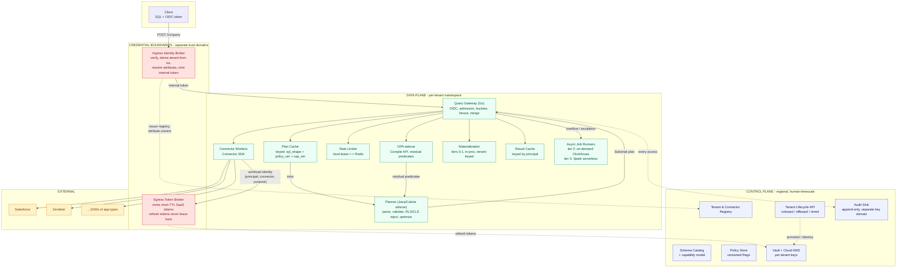

# Universal SQL Across Enterprise Apps - Design (25-minute read)

> This is the condensed, top-level design doc - target read time ~25 minutes. Every decision
> here is backed by full reasoning, rejected alternatives, worked math, and sequence diagrams in
> [`DESIGN_FULL.md`](./DESIGN_FULL.md), which is canonical if the two ever disagree. A
> narrative-style condensed version (fuller prose, still shorter than the full doc) is
> [`DESIGN_LESS.md`](./DESIGN_LESS.md). Start here; go deeper only where you need to.

**The one paragraph.** A federated SQL gateway over Salesforce and Zendesk (generalizing to
1,000s of SaaS app types). Three enforcement layers for entitlements (source ACLs, policy-compiled
RLS/CLS, a runtime lying-connector filter), a four-rung freshness ladder that never spends quota
silently, a four-tier join-execution ladder (in-memory → DuckDB → on-demand ClickHouse → Spark
serverless), and capacity math derived backwards from concurrency, not asserted.

---

## THP requirement coverage

Mapped against the brief's own two categories, so this doc can be checked off directly against
it.

**Functional requirements:**

| Requirement | Addressed by |
|---|---|
| SQL: projection, filters, pagination, optional joins | SQL surface (below) + ADR-007 |
| Entitlements: least-privilege, RLS/CLS from source perms + tenant policy | ADR-002 |
| Real-time: on-demand execution; timeouts and partial results for slow sources | ADR-009 |
| Rate limits: per-app constraints; friendly, actionable messages on exhaustion | ADR-006 |
| Freshness: avoid materially stale data; per-query staleness hints | ADR-005 |
| Admin UX: fast connector onboarding via console/config; versioned connectors | ADR-004; `DESIGN_FULL.md` §7, §10.2 |
| Deployment modes: multi-tenant and single-tenant, no code changes | ADR-008 |

**Non-functional requirements:**

| Requirement | Addressed by |
|---|---|
| Scale: 10M users, 1k QPS, ~100 MB/s | Capacity section (below) |
| Latency SLOs: P50 < 500ms, P95 < 1.5s single-source | Capacity section (below); `DESIGN_FULL.md` §6 |
| Availability: 99.9% monthly + error budget policy | `DESIGN_FULL.md` §6 |
| Autoscaling; cost guardrails | Capacity section (below); `DESIGN_FULL.md` §5.4, §8.4 |
| Rate-limit governance per connector/tenant/user; fairness across tenants | ADR-006 |
| Freshness controls honoring rate limits; configurable per source/class | ADR-005 |
| Infra automation: Terraform, Helm, canary/blue-green + automatic rollback | `DESIGN_FULL.md` §8.1 |
| Security & isolation: storage/compute/network isolation; per-tenant keys; crypto-shred | ADR-010; `DESIGN_FULL.md` §4.2 |
| Compliance: audit logs, access trails, data residency tags | ADR-010; `DESIGN_FULL.md` §4.1, §4.3 |

Every row above that isn't answered by one of the 11 ADRs still has a decision behind it - it
just didn't need a full ADR to record, so it's one line in `DESIGN_FULL.md`'s Remaining
requirements table instead of a full writeup here.

---

## Architecture

Two credential boundaries never touch each other's data: the **Ingress Identity Broker** only
reads the tenant registry; the **Egress Token Broker** only reads Secrets (a user's own
delegated OAuth grant). Full component list, the request-sequence diagram, and the onboarding →
consent → query-time lifecycle diagram: `DESIGN_FULL.md` §2.

---

## MVP status at a glance

Same eleven ADRs below, grouped by how real the prototype's version of each is - not by ADR
number, since "partial" hides very different kinds of partial. Full picture, tests, and screenshots:
`README.md`.

| Lane | What's in it |
|---|---|
| **Built and verified** (real code, real tests, real HTTP round trips) | Go planner + capability classification; RLS/CLS injection + plan-time invariant + runtime verification filter (ADR-002); parameterized, role-isolated plan cache (ADR-003); semi-join rewrite, 505→17 calls (ADR-007); tenant derived from verified `iss`, never a claim (ADR-011); real Prometheus histogram + OTel trace; result cache keyed by principal (ADR-002 addendum) |
| **Partial** (real mechanism, deliberately narrowed scope) | Freshness: rungs 1 & 4 only (ADR-005); rate limits: single-node bucket, 429, async reroute, no Redis lease or fair queue (ADR-006); NDJSON + `SOURCE_TIMEOUT` terminal frame, thin coverage (ADR-009); policy: injection real, OPA mocked; identity: derivation real, signature mocked |
| **Mocked or not built** (infrastructure a reviewer can assume) | Salesforce/Zendesk connectors are mocks (ADR-004); Calcite sidecar deferred to an M1 spike (ADR-001); materialization is an in-memory Go hash join, not real DuckDB (ADR-007); tenant lifecycle API (ADR-008), per-tenant KMS/crypto-shred, and audit trail (ADR-010) - none implemented |
| **Open question** (not decided, not just unbuilt) | `LIMIT`/`OFFSET` - same implementation layer as projection, but adds less value to this MVP's demo scenario, which is likely why the gap wasn't caught earlier; still genuinely undecided past the grammar (ADR-007), not a considered cut; `RESULT_TOO_LARGE` - the guardrail against a skewed join exhausting memory, specified in ADR-007, never implemented - the sharper of the two risks |

The built lane is exactly what a reviewer would otherwise take on faith (security and
correctness mechanisms). The mocked lane is entirely infrastructure - a JVM sidecar, a KMS call,
a Terraform-replacing API - never a security mechanism. That split is deliberate: see "Two
patterns" after the Decision register below.

---

## Decision register

Every contested call, in one table. Full requirement quotes, rejected-alternative reasoning, and
the "why it exists" column's full text are in `DESIGN_FULL.md`'s Requirement Resolution Index.

| ADR | Requirement (trimmed) | Rejected (for the final design) | Built (prototype) |
|---|---|---|---|
| **001** Planner runtime | *"capability discovery, predicate/column pushdown, join plan, cost/freshness hints, spill to materialization"* | • Trino • DataFusion • Steampipe/FDW • Go-native parser • GraalVM Calcite • Spark | **n/a** - in-process Go planner is itself spike evidence |
| **002** Entitlements | *"enforce least-privilege access; RLS/CLS based on source permissions and tenant policy"* | • Post-filter in Go • Inject into compiled Substrait • OPA as blob store • Zanzibar/OpenFGA • Cedar | **Mostly** - injection, invariant, verification real; OPA + delegated OAuth mocked |
| **003** Plan + result cache | *(none - nearest is "cache hit ratios" under sizing math)* | • Plan cache: no cache / key on SQL text / key on `(sql, user)` • Result cache: per-pod only, no shared tier | **Partial** - plan cache real; result cache's shared Redis tier designed, not built |
| **004** Build vs buy | *"capability model, auth/token refresh, pagination, concurrency contracts, standardized error codes"* | • Build all • Buy all (Merge/Nango/Airbyte) | **No** - both connectors mocked |
| **005** Freshness | *"avoid materially stale data; allow per-query staleness hints"* | • Centralized CDC / data lake • `SELECT MAX(updated_at)` probes | **Partial** - rungs 1 & 4 + `max_staleness` |
| **006** Rate limits | *"token buckets/concurrency pools per connector/tenant/user; head-of-line blocking avoidance"* | • In-memory per-pod buckets • Redis on every decision • Envoy ratelimit | **Partial** - single-node bucket, 429, async reroute |
| **007** Joins | *"federated on the fly vs. short-lived materialization"; "spill to materialization when necessary"* | • Container-per-join DuckDB • Naive dual full fetch • Always-on shared ClickHouse • Spark-only from day one | **Partial** - semi-join yes; DuckDB/ClickHouse/Spark tiers designed, none built |
| **008** Tenant lifecycle | *"multi-tenant and single-tenant without code changes"; "off-boarding triggers crypto-shred"* | `terraform apply` per tenant | **No** |
| **009** Streaming | *"support timeouts and partial results for slow sources"* | • Chunked transfer + status code • HTTP trailers | **At risk** |
| **010** Crypto-shred | *"per-tenant keys; automated org off-boarding and crypto-shredding"; "audit logs, access trails"* | • "Instantly destroy the KMS key" • Shred audit under the tenant key | **No** |
| **011** Identity | *"AuthN via OIDC, AuthZ via policy"; "user token -> scopes/roles -> RLS/CLS"* | • Trust token claims • Direct federation • mTLS / client certs | **Partial** - issuer→tenant real, signature mocked |

**Two patterns worth naming.** Every unbuilt ADR (001, 004, 008, 010) maps to a requirement
about *infrastructure* - a planner runtime, a vendor contract, Terraform, a KMS call - while
every fully/mostly built one maps to a requirement about *behaviour under adversarial
conditions*. We built what a reviewer cannot take on faith.

---

## The eleven decisions

**ADR-001 - Planner runtime (Proposed).** Deliberately left open: the required capabilities
(capability discovery, pushdown, join planning) are fixed; the tool is chosen by measurement in
M1. DataFusion is the closest runner-up, rejected on team-capability grounds, not merit.

**ADR-002 - Entitlement enforcement.** Three layers: **L1** object-level authorization, **L2**
policy-compiled RLS/CLS (OPA partial evaluation injects residual predicates into the plan,
tagged `ENFORCED`/`ADVISORY` by connector capability), **L3** source ACLs as a narrowing-only
backstop. A runtime verification filter catches a connector that lies about its own capability -
`enforced_predicate_violations_total` must be zero; non-zero is the alarm. Cache keys are
per-principal, which is correct but costs cache locality (see Section 5.3 below).

**ADR-003 - Caching: plan cache and result cache.** Two related but distinct caches, because
anything derived from policy and cached inherits the policy's version - a naive cache is a
privilege-escalation vector. **Plan cache**: keyed on `(sql_shape_hash, tenant_id,
policy_version, policy_shape_hash, connector_capability_version, role_set_hash)`, Redis-backed
shared tier, fully built. **Result cache**: keyed by `(principal, table, columns, filters)` -
not staleness, so the same entry gets re-evaluated against different staleness budgets on
different calls - shared Redis tier designed but not built in the prototype.

**ADR-004 - Connector strategy: build vs buy.** 1,000s of app types cannot be hand-built in six
months. Split by whether pushdown quality determines the SLO: build where per-field pushdown and
delegated auth matter; buy (unified-API vendor) for the long tail where it doesn't.

**ADR-005 - Freshness: watermark capability ladder.** See the ladder table below. Core rule: a
freshness probe **spends rate-limit quota** and is charged to the same bucket as a data fetch -
freshness that silently consumes quota is a quota leak with good PR, not freshness control.

**ADR-006 - Rate limiting and multi-tenant fairness.** Three layers: token buckets per
`(connector, tenant, user)`, Redis-backed and leased in slices to each pod (steady state costs no
RTT); concurrency semaphores per connector and per tenant (bounds in-flight work, the actual
protection for a source); bounded fair queues with weighted dequeue (semaphores alone don't stop
a tenant queuing behind its own backlog). Redis outage fails closed to the last known local
lease - fail-open risks a connector-wide ban, a cross-tenant outage.

**ADR-007 - Join strategy: a four-tier escalation ladder.** See the ladder table below.

**ADR-008 - Tenant lifecycle: Terraform vs. Control Plane API.** Terraform owns static
infrastructure; a Control Plane API owns tenant lifecycle (onboard/offboard/shred), because
`terraform apply` per tenant doesn't scale past a handful of customers and can't gate
crypto-shredding on plan/apply timing.

**ADR-009 - Streaming, timeouts, and partial results.** NDJSON with a terminal metadata frame
(status, `freshness_ms`, `rate_limit_status`, `trace_id`, `partial`) - chunked transfer alone
can't surface a mid-stream failure once the HTTP status is already sent. Streaming applies to
single-source pushdown only; joins, sorts, and aggregation are blocking and cannot stream.

**ADR-010 - Keys, crypto-shredding, and the audit conflict.** Per-tenant KEK/DEK envelope
encryption. "Instantly destroy the KMS key" is a myth (KMS enforces a 7-30 day deletion window);
the real instant action is **disable + revoke grants**, which makes every DEK unwrappable within
seconds. The conflict: shredding a tenant also shreds the audit trail proving we handled their
data correctly. Resolution: audit records live in a separate key domain, with tenant-identifying
fields tokenized rather than tenant-key-encrypted, so the trail survives while re-association
with a named individual doesn't.

**ADR-011 - Identity, tenant derivation, attribute resolution.** Never trust `tenant_id` from a
token claim - anyone who can mint a token can assert a forged one. Verify signature via
per-issuer JWKS, derive tenant from the verified `iss`, resolve attributes per-attribute from
their declared authoritative owner (which may be the IdP or a source system), then exchange for
one normalized internal token every downstream component reads identically. Cost: we now operate
an issuer - our own signing-key rotation, JWKS publication, and blast radius become our problem.

---

## The two capability ladders

**Freshness (ADR-005) - a four-rung ladder, declared per connector:**

| Rung | Mechanism | Cost | Delete-safe |
|---|---|---|---|
| 1 | Native `ETag` / `If-Modified-Since` conditional request | 1 call, 304 on hit | Yes |
| 2 | Change/event feed or cursor API | 1 call | Yes |
| 3 | `updated_after` filter + 1-row sorted fetch as watermark | 1 call | No - pair with periodic full refresh |
| 4 | None - TTL only | 0 calls | No |

**Joins (ADR-007) - a four-tier escalation ladder, routed by a cost-based cardinality estimate at
plan time, never by table count:**

| Tier | What fits / doesn't fit | How it solves it |
|---|---|---|
| **0. Single-table** | Fits: no join at all. Doesn't fit: 2+ tables → tier 1 | Straight connector fetch, no local engine invoked |
| **1. DuckDB (in-process, any join)** | Fits: working set stays within the gateway pod's shared memory. Doesn't fit: exceeds it → `RESULT_TOO_LARGE`, or suggest `Prefer: respond-async` | Explicit `memory_limit`, per-tenant-encrypted ephemeral temp dir, reset every query; semi-join rewrite minimizes what's loaded |
| **2. ClickHouse (on-demand, async)** | Fits: exceeds gateway-pod ceiling, within one (larger) node's comfort. Doesn't fit: exceeds one node → tier 3 | Fresh single-tenant instance per job, free to spill to local disk (no SLO to protect); destroyed after the job - no per-tenant key needed |
| **3. Spark serverless** | Fits: needs real distributed shuffle. Doesn't fit: nothing technical - cost is the only backstop | Managed serverless job, ephemeral executors, one tenant per job; output to Parquet on S3, per-tenant SSE-KMS |

Tiers 0-1 share the gateway pod's memory budget (below); tier 2 is a separately-sized node; tier
3 has no memory ceiling, only a cost one. The semi-join rewrite's reduction equals join-key
selectivity on the probe side, and nothing else - our worked fixture (500 accounts, 50,000
tickets, 2.4% selectivity) falls 505→17 calls (29.7x).

---

## Capacity: derived backwards, not asserted

**Baseline.** 100 MB/s / 1,000 QPS → ~100 KB average result payload. Query mix: 30% cache hit
(20ms), 55% single-source pushdown (270ms), 15% cross-app join (600ms). Weighted mean **W ≈ 245
ms**. By Little's Law, **L = 1,000 × 0.245 ≈ 245 concurrent in-flight queries**.

**Derived sizing** (gateway pod fleet only - tiers 0-1 of the join ladder; tiers 2-3 are
provisioned independently, per job, and don't appear here):

| Resource | Size |
|---|---|
| Gateway pods | **20-24 pods**, 3 AZs, N+1 per AZ (memory derived below) |
| Planner sidecars | **4-6 pods** - floored by HA, not load; cache saves ~2-3x, not an order of magnitude |
| Connector concurrency | **~750 concurrent outbound**, per-connector semaphore |
| Materialization memory | **~23 GB fleet-wide**, capped at 8 joins/pod (2 GB) |
| Result/freshness cache | **~2-8 GB fleet-wide** - a range, not a point estimate |
| Redis | Single 3-node cluster, vastly under-utilized (~500 ops/s) |
| Network | Budget **2 Gbps** sustained |

**Gateway pod size, worked backwards.** 8 joins/pod × 256 MB = 2 GB materialization + ~0.4 GB
result-cache slice + ~0.1 GB connection overhead ≈ 2.5 GB live heap. Go's GC wants ~2x live heap
to avoid thrashing → 5 GB. Container/OS overhead (~15%) → 5.75 GB derived minimum. Targeting 72%
utilization (28% headroom for burst/GC variance) → **5.75 / 0.72 ≈ 8 GB** - the existing 8 GB
figure is therefore an output of this chain, not an assertion checked against it after the fact.

**The sensitivity that actually matters.** The 30% cache hit ratio is the weakest number here -
ADR-002's per-principal keying means it degrades as users-per-tenant grows. At 10% hit ratio,
connector call volume rises to ~1,200/s and the binding constraint stops being our fleet and
becomes vendor rate limits. This is the single most important number to measure in M2.

---

## Everything else, briefly

- **SQL surface**: `SELECT` with projection/filter/one equi-join/`ORDER BY`/`LIMIT`/`OFFSET`;
  conjunctive `WHERE` only. Full grammar: `DESIGN_FULL.md` §1.4.
- **Security & isolation**: TLS everywhere, mTLS between services, per-tenant KMS keys,
  namespace-per-tenant, STRIDE threat model with named pen-test targets. Full detail:
  `DESIGN_FULL.md` §4.
- **SLOs**: Gateway 99.9% monthly (excludes upstream source faults); P50 < 500ms / P95 < 1.5s
  single-source; P95 < 4s cross-app join (separate SLI). Full detail: `DESIGN_FULL.md` §6.
- **Error vocabulary**: `RATE_LIMIT_EXHAUSTED`, `STALE_DATA`, `ENTITLEMENT_DENIED`,
  `SOURCE_TIMEOUT`, `RESULT_TOO_LARGE`, `RESIDENCY_VIOLATION`, `SCHEMA_DRIFT`, and more, each with
  a `Retry-After` where relevant and async guidance. Full detail: `DESIGN_FULL.md` §7.
- **Deployment**: Terraform + Helm, canary/blue-green with automatic rollback on SLO regression;
  multi-AZ with optional multi-region; incident runbooks for rate-limit floods, connector auth
  failures, cache stampedes. Full detail: `DESIGN_FULL.md` §8.
- **Six-month plan**: EM + 3 backend + 1 infra + 1 security + 1 QA + 0.5 PM + 0.5 DX; M1-M6 with
  measurable exit criteria; a two-week validation sprint before any architecture work; risk
  register with nine named risks and numeric triggers. Full detail: `DESIGN_FULL.md` §10.
- **Least-confident decisions**: the planner runtime, per-principal caching vs. hit ratio, the
  build-vs-buy split, token exchange vs. direct federation, and `LIMIT`/`OFFSET` - each with the
  metric that would flip it. Full detail: `DESIGN_FULL.md` §11.
