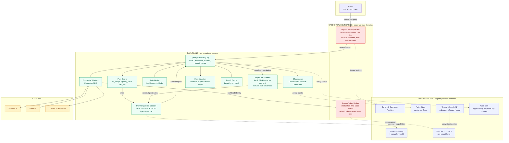

# Universal SQL Across Enterprise Apps — Design

**Status:** Proposed | **Scenario:** Salesforce (accounts) ⋈ Zendesk (tickets) | **Read time:** ~25 min

> Condensed from [`DESIGN_FULL.md`](./DESIGN_FULL.md), which is canonical — worked derivations,
> full rejected-alternative reasoning, and all 16 diagrams live there. This doc carries every
> decision and every number, with the prose trimmed to what each argument needs.

**In one paragraph.** SQL in, rows out, executed on demand against live SaaS APIs under the
calling user's own source-side permissions. Three enforcement layers for entitlements, a
four-rung freshness ladder that never spends quota silently, a four-tier join-execution ladder
(in-process → DuckDB → on-demand ClickHouse → Spark serverless), and capacity math derived
backwards from concurrency rather than asserted.

---

## 1. THP requirement coverage

Every requirement in the brief, what answers it, and how real that answer is in the prototype.
Eleven of these needed a contested call recorded as an ADR; the rest are answered by a section.
What each ADR *rejected* is in [§14](#14-rejected-alternatives-by-decision), kept out of this
table so it stays scannable.

### Functional

| Requirement | Addressed by | Built in MVP? |
|---|---|---|
| SQL: projection, filters, pagination, optional joins | [§3](#3-sql-surface), [ADR-007](#adr-007--join-strategy-a-four-tier-escalation-ladder) | **Yes** — except `LIMIT`/`OFFSET`, see [§13](#13-decisions-we-are-least-confident-about) item 5 |
| Query Planner: capability discovery, pushdown, join plan, cost/freshness hints, spill to materialization | [ADR-001](#adr-001--planner-runtime-proposed) | **n/a** — in-process Go planner is itself spike evidence |
| Entitlements: least-privilege; RLS/CLS from source permissions + tenant policy | [ADR-002](#adr-002--entitlement-enforcement-the-briefs-hardest-requirement) | **Mostly** — injection, invariant, verification real; OPA + delegated OAuth mocked |
| AuthN via OIDC, AuthZ via policy; user token → scopes/roles → RLS/CLS | [ADR-011](#adr-011--identity-tenant-derivation-attribute-resolution) | **Partial** — issuer→tenant real, signature mocked |
| Connector SDK: capability model, auth/token refresh, pagination, concurrency contracts, error codes | [ADR-004](#adr-004--connector-strategy-build-vs-buy) | **No** — both connectors mocked |
| Real-time: on demand; timeouts + partial results for slow sources | [ADR-009](#adr-009--streaming-timeouts-partial-results) | **Partial** — NDJSON terminal frame, thin coverage |
| Rate limits: per-app constraints; friendly, actionable exhaustion messages | [ADR-006](#adr-006--rate-limiting-and-multi-tenant-fairness) | **Partial** — single-node bucket, `429`, async reroute |
| Freshness: avoid materially stale data; per-query staleness hints | [ADR-005](#adr-005--freshness-watermark-capability-ladder) | **Partial** — rungs 1 & 4 + `max_staleness` |
| Caching *(implied — nearest is "cache hit ratios" under sizing math)* | [ADR-003](#adr-003--caching-plan-cache--result-cache) | **Partial** — plan cache real; result cache's shared tier designed |
| Materialization: short-lived tables for joins/aggregations, lifecycle ≤ N min, encrypted per tenant | [ADR-007](#adr-007--join-strategy-a-four-tier-escalation-ladder) | **Partial** — semi-join real; DuckDB/ClickHouse/Spark tiers designed |
| Admin UX: onboard connectors quickly via console/config; connectors versioned | [ADR-004](#adr-004--connector-strategy-build-vs-buy), [§12.3](#123-milestones) M6 | **No** |
| Deployment modes: multi-tenant and single-tenant without code changes | [ADR-008](#adr-008--tenant-lifecycle-terraform-vs-control-plane-api) | **No** |
| Error vocabulary + `Retry-After` + async guidance | [§8](#8-error-vocabulary) | **Yes** |

### Non-functional

| Requirement | Addressed by | Built in MVP? |
|---|---|---|
| Scale: 10M users, peak ~1k QPS, ~100 MB/s | [§6](#6-capacity-and-performance) | **Load-tested at 500 req/s**, 0 failures |
| Latency SLOs: P50 < 500 ms, P95 < 1.5 s single-source | [§6](#6-capacity-and-performance), [§7](#7-slos-and-error-budget) | **Measured** in prototype |
| Availability 99.9% monthly + error budget policy | [§7](#7-slos-and-error-budget) | Design only |
| Autoscaling without manual intervention; cost guardrails | [§6.5](#65-autoscaling-backpressure-overload), [§10.4](#10-deployment-and-operations) | **No** |
| Rate-limit governance per connector/tenant/user; fairness across tenants | [ADR-006](#adr-006--rate-limiting-and-multi-tenant-fairness) | **Partial** — **no per-tenant dimension**, the real fairness gap |
| Freshness controls honoring rate limits; configurable per source/class | [ADR-005](#adr-005--freshness-watermark-capability-ladder) | **Yes** — probes charge the same bucket as fetches |
| Infra automation: Terraform, Helm/k8s, canary/blue-green + automated rollback | [§10](#10-deployment-and-operations) | **No** |
| Security & isolation: storage/compute/network; per-tenant keys; crypto-shred | [ADR-010](#adr-010--keys-crypto-shredding-and-the-audit-conflict), [§9](#9-security-isolation-compliance) | **No** |
| Compliance: audit logs, access trails, data residency tags | [ADR-010](#adr-010--keys-crypto-shredding-and-the-audit-conflict), [§9](#9-security-isolation-compliance) | **No** — no access log exists |
| Threat model (STRIDE) + mitigations; pen-test readiness | [§9](#9-security-isolation-compliance) | Design only |
| Sizing math for 1k QPS: concurrency, latency percentiles, cache hit ratios | [§6](#6-capacity-and-performance) | **Measured** — hit ratio, see README |
| Backpressure; overload protection | [§6.5](#65-autoscaling-backpressure-overload) | **No** |
| DR/BCP: multi-AZ, RPO/RTO targets | [§10.2](#10-deployment-and-operations) | **No** |
| Runbooks: rate-limit floods, connector auth failures, cache stampedes | [§10.3](#10-deployment-and-operations) | Design only |
| Observability: OTel traces, Prometheus metrics, structured logs | [§11](#11-observability) | **Yes** — real histogram + real trace |
| Six-month plan: team, milestones, acceptance criteria, risks, budget | [§12](#12-six-month-execution-plan) | n/a — plan |
| Bonus: cost levers, chaos plan, predicate-pushdown creativity | [§10.4](#10-deployment-and-operations), [§12.3](#123-milestones) M6, [ADR-007](#adr-007--join-strategy-a-four-tier-escalation-ladder) | **Semi-join built** (29.7× reduction) |

**The pattern worth naming.** Every ADR that is unbuilt ([001](#adr-001--planner-runtime-proposed),
[004](#adr-004--connector-strategy-build-vs-buy),
[008](#adr-008--tenant-lifecycle-terraform-vs-control-plane-api),
[010](#adr-010--keys-crypto-shredding-and-the-audit-conflict)) maps to a requirement about
*infrastructure* — a planner runtime, a vendor contract, Terraform, a KMS call. Every built one
maps to a requirement about *behaviour under adversarial conditions*. **We built what a reviewer
cannot take on faith.**

---

## 2. Assumptions and non-goals

| # | Assumption | Why it matters | If false |
|---|---|---|---|
| **A1** | Connectors expose per-user delegated OAuth, not just service accounts | Source ACLs are the primary entitlement substrate ([ADR-002](#adr-002--entitlement-enforcement-the-briefs-hardest-requirement)) | Fall back to service-account + mirrored permission graph — materially worse |
| **A2** | Average result payload ~100 KB (100 MB/s ÷ 1k QPS) | Drives egress, buffer, materialization sizing | Re-derive [§6](#6-capacity-and-performance) entirely |
| **A3** | ~70% of queries are single-source with full pushdown | The P95 < 1.5 s SLO is scoped to these | SLO renegotiated per query class |
| **A4** | Connector p95 200–800 ms; long tail exceeds 2 s | Drives timeout, partial-result, async design | Timeout budget shifts |
| **A5** | Tenants tolerate seconds-to-minutes staleness | Makes caching viable at all | Hit ratio → 0; quota pressure rises sharply |

**Non-goals for v1:** DML, DDL, window functions, CTEs, subqueries, cross-tenant queries, joins
wider than two sources, and anything requiring a persistent copy of customer data.
Materialization is ephemeral by construction.

---

## 3. SQL surface

```sql
SELECT <projection>
FROM <connector>.<table> [ JOIN <connector>.<table> ON <equi-predicate> ]
WHERE <conjunctive predicates>
[ ORDER BY <col> [ASC|DESC] ]
[ LIMIT n ] [ OFFSET n | CURSOR '<opaque>' ]
```

- Conjunctive `WHERE` only.
- Cross-source disjunctions rejected at plan time with `UNSUPPORTED_PREDICATE` — **a full scan of
  a SaaS API is a quota incident, not a slow query.**
- `LIMIT`/`OFFSET` parse but are not executed — see [§13](#13-decisions-we-are-least-confident-about), item 5.

---

## 4. Architecture

**Plane separation rule:** anything in the per-request latency path is data plane. The planner is
per-request, therefore data plane.

| Control plane (human timescale) | Data plane (request timescale) |
|---|---|
| Tenant & connector registry | Query Gateway (tier 0–1 materialization + result cache in-process) |
| Schema catalog, connector versions | Query Planner (Calcite sidecar) |
| Policy store (authoring, versioning) | Policy Decision sidecar (OPA, partial eval) |
| Secrets & KMS key lifecycle | Connector workers |
| Rate-limit *policy* definitions | Rate-limit *enforcement* (token buckets) |
| Audit sink, residency tags | Async job runners (tier 2: ClickHouse; tier 3: Spark) |



**Two credential boundaries, never touching each other's data:**

| | Ingress Identity Broker | Egress Token Broker |
|---|---|---|
| Direction | Inbound — who is calling us | Outbound — who we call *as* |
| Reads from | Control plane (tenant registry, role mapping) | Secrets (user's own delegated grant) |
| Produces | Normalized internal token | Short-TTL SaaS access token, memory-only |
| ADR | 011 | 002 |

Neither one's compromise exposes what the other holds.

**Tiers 0–1 are in-process; tiers 2–3 are separate compute** — but on-demand per escalated
query, not a standing fleet, so neither adds an always-on row above.

---

## 5. The eleven decisions

### ADR-001 — Planner runtime *(Proposed)*

- **Deliberately left open.** Required capabilities are fixed; the tool is chosen by measurement in M1.
- **Closest runner-up:** DataFusion — rejected on *team capability*, not merit (no Rust depth).
- **Substrait as the plan IR** is what keeps the runtime swappable — a large part of why it was chosen.

### ADR-002 — Entitlement enforcement *(the brief's hardest requirement)*

| Layer | What it does | Whose | Denies with |
|---|---|---|---|
| **L1** Object-level authz | May this principal touch this connector/table/column *at all*? Pre-plan, at admission. Source ACLs know nothing of our product surface, so this cannot be delegated downward. | Ours | `ENTITLEMENT_DENIED` — names the object, never the policy reason (that leaks policy) |
| **L2** RLS/CLS compiled into plan | OPA **Compile API** partial evaluation returns *residual conditions* over named columns; Calcite injects them as `Filter` (RLS) and `Project` (CLS) nodes before Substrait compilation. **This is the literal answer to "document how policies are compiled into query plans."** | Ours | Filtered rows / masked columns |
| **L3** Source ACLs | Connector calls carry the user's own delegated grant, so Salesforce sharing rules and Zendesk group restrictions are enforced by the vendor, current by construction. **Narrows only — never widens.** | Vendor's | Vendor's own response |

**Capability vocabulary** — declared per `(table, column, operator)`; `=` may be `ENFORCED` while
`LIKE` on the same column is not. These are claims *we* make and prove with conformance tests,
**never** values a connector self-reports at runtime.

| Label | Meaning | Pushed? | Local filter expects to drop |
|---|---|---|---|
| `ENFORCED` | Source *will* apply it; no violating row can return | Yes | **Zero rows** — non-zero ⇒ connector diverged ⇒ fail closed |
| `ADVISORY` | Usually reduces volume; not trusted for correctness | Yes, as volume optimization | Some rows — normal |
| *absent* | No filter exists | No | As many as needed |

- **Pushdown safety rule.** A security predicate may be pushed **only** to `ENFORCED`; anything
  else is retained as a local residual filter, never dropped.
- **Why not push security predicates to `ADVISORY`?** Safe against *under*-filtering (which we
  catch); **not** safe against *over*-filtering — an `ADVISORY` source dropping rows the user was
  entitled to see is silently incomplete, undetectable without a control fetch.
- **The verification filter (runtime, not plan-time).** The invariant catches *planner* bugs, not
  a connector that declares `ENFORCED` then ignores it — that plan satisfies the invariant
  perfectly. So we re-apply every `PUSHED_ENFORCED` security predicate locally after fetch.

### ADR-003 — Caching: plan cache + result cache

Anything derived from policy and then cached inherits the policy's version — **a naive plan cache
is a privilege-escalation vector.**

| | Plan cache | Result cache |
|---|---|---|
| Keyed on | `(sql_shape_hash, tenant_id, policy_version, policy_shape_hash, connector_capability_version, role_set_hash)` | `(principal, table, columns, filters)` — **not** `max_staleness`, so one entry is re-evaluated against different budgets per call |
| Tier | Per-pod + shared Redis | Per-pod built; **shared Redis tier designed, not built** |
| Fleet saving | ~2–3×, not an order of magnitude | Cuts connector quota spend directly |
| Why it really exists | Correctness (policy-version isolation), not just latency | Quota, not latency |

### ADR-004 — Connector strategy: build vs. buy

- 1,000s of app types **cannot** be hand-built in six months; schema drift alone would consume the team.
- **Split by whether pushdown quality determines the SLO:** build the ~10–20 where per-field
  pushdown and delegated auth matter; buy (unified-API vendor) the long tail where they don't.
- Both tiers sit behind the **same Connector SDK interface** and pass the **same conformance suite**.
- The SDK is a **wire contract**, not a compiled Go interface — connectors deploy and version
  independently of the gateway's release cycle.

### ADR-005 — Freshness: watermark capability ladder

| Rung | Mechanism | Cost | Delete-safe |
|---|---|---|---|
| **1** | Native `ETag` / `If-Modified-Since` conditional request | 1 call, 304 on hit | ✅ |
| **2** | Change/event feed or cursor API (e.g. Zendesk incremental exports) | 1 call | ✅ |
| **3** | `updated_after` filter + 1-row sorted fetch as watermark | 1 call | ❌ — pair with periodic full-refresh floor |
| **4** | None — TTL only | 0 calls | ❌ |

- **Quota accounting.** A rung-1/2/3 probe **spends a rate-limit token**, charged to the same
  bucket as a data fetch and visible in `rate_limit_status`. *Freshness that silently consumes
  quota is a quota leak with good PR, not freshness control.*
- **`max_staleness` semantics:** within TTL → serve cached · outside TTL → probe at best rung ·
  probe unchanged → serve cached, reset TTL · probe changed or rung-4 → live fetch · probe would
  exceed budget → `STALE_DATA` with actual age, so the **caller** decides rather than us guessing.

### ADR-006 — Rate limiting and multi-tenant fairness

| Layer | Mechanism | Solves |
|---|---|---|
| 1 | Token buckets per `(connector, tenant, user)` — Redis-backed, leased in slices to each pod, reconciled async | Cumulative budget; steady state costs no RTT |
| 2 | Concurrency semaphores per connector **and** per tenant | Bursts — what actually protects a source |
| 3 | Bounded fair queues + weighted dequeue + admission control | Head-of-line blocking; semaphores alone still let a tenant queue behind its own backlog |

- **Redis failure policy: fail closed** to the last known local lease. Fail-open risks a
  connector-wide ban — a cross-tenant outage — which is strictly worse than throttling one tenant.
- **Overflow:** `429` + `Retry-After` + a message naming the connector, window, and the async
  option. With `Prefer: respond-async`, the query is enqueued and returns `202` + poll URL.
- **Accepted cost:** leasing wastes some budget (~85–90% utilization); lease size trades
  utilization against Redis load.

### ADR-007 — Join strategy: a four-tier escalation ladder

Routed by a **cost-based cardinality estimate at plan time** — never table count, never a runtime
"try small, retry bigger" loop.

| Tier | What fits / doesn't fit | How it solves it |
|---|---|---|
| **0. Single-table** | • Fits: no join at all<br>• Doesn't: 2+ tables → tier 1 | • Straight connector fetch, no local engine invoked |
| **1. DuckDB** (in-process, any join) | • Fits: working set within the gateway pod's shared memory<br>• Doesn't: exceeds it → `RESULT_TOO_LARGE`, or suggest `Prefer: respond-async` if tier 2 fits | • Explicit `memory_limit`, per-tenant-encrypted ephemeral temp dir, reset every query<br>• Semi-join rewrite minimizes what's loaded<br>• Nothing survives the request — nothing to shred |
| **2. ClickHouse** (on-demand, async) | • Fits: exceeds pod ceiling, within one larger node<br>• Doesn't: exceeds one node, or needs distributed shuffle → tier 3 | • Fresh single-tenant instance per job, free to spill to local disk (no SLO to protect)<br>• Destroyed after the job — no per-tenant key needed |
| **3. Spark serverless** | • Fits: needs real distributed shuffle<br>• Doesn't: nothing technical — cost is the only backstop | • Managed serverless job (EMR/Databricks/Dataproc), ephemeral executors, one tenant per job<br>• Output → Parquet on S3 with per-tenant SSE-KMS |

**Three resource boundaries, not four arbitrary tiers:** pod memory (0–1, shared) → node memory
(2, independently sized) → cost, not memory (3).

- **Semi-join rewrite** (tier 1's optimization): fetch the smaller side, push its join keys into
  the larger side as an `IN` predicate. **The reduction equals join-key selectivity on the probe
  side, and nothing else** — fixture: 500 accounts, 50,000 tickets, 2.4% selectivity → **505 → 17
  calls (29.7×)**. At low selectivity it saves nothing and adds chunking overhead.
- **Why in-process for tier 1:** container cold start alone can consume the entire 1.5 s budget.
- **Why on-demand for tier 2:** an always-on shared ClickHouse recreates the rate-limiter's
  noisy-neighbour problem and idles between jobs.
- **Why Spark for tier 3:** ClickHouse's `GLOBAL JOIN` degenerates to "one side must fit
  everywhere"; Spark's shuffle-based join scales by adding executors.
- **"Spill to materialization" — which reading?** *Fall back to a materialized intermediate* — yes,
  tier 1. *Spill to disk mid-join* — **no for tiers 0–1** (trades a fast failure for a slow one).
  Tiers 2–3 have no completion SLO, so that argument doesn't carry over — they spill freely, but
  the disk-handling is the vendor engine's problem, not ours to build.
- **Same-connector joins get no special treatment** — SOQL relationship subqueries are real
  unexploited capability, rejected because the SDK contract would then carry a second per-connector
  notion of "which join shapes push down" for 1,000s of apps that mostly have no equivalent.
- **The 2-table cap is a *planner* limit, not a ladder limit.** All three engines are N-way
  capable; N-way is a planner project (join ordering, multi-way cardinality estimation).

### ADR-008 — Tenant lifecycle: Terraform vs. Control Plane API

- **Terraform owns static infrastructure; a Control Plane API owns tenant lifecycle.**
- `terraform apply` per tenant doesn't scale to hundreds of customers, makes off-boarding latency
  a function of a plan/apply cycle, and **crypto-shredding cannot be gated on Terraform state.**
- `/global-control-plane` + `/shared-data-plane` are Terraform. `/tenant-resources` is Terraform
  **only for single-tenant** deployments. Multi-tenant onboarding — namespace, KMS key, quota,
  policy binding, residency tag — is API-driven and completes in **seconds**.
- Both modes run the *same* modules and Helm charts, parameterized; only Terraform variables differ.
- **Accepted cost:** two provisioning paths to keep behaviourally identical ⇒ needs a conformance
  test asserting a tenant provisioned each way is indistinguishable.

### ADR-009 — Streaming, timeouts, partial results

- **Problem:** chunked transfer streams rows early, but once bytes are on the wire the HTTP status
  is committed — a mid-stream `SOURCE_TIMEOUT` cannot surface as an error status. HTTP trailers are
  inconsistently supported by intermediaries.
- **Decision: NDJSON with a terminal metadata frame** carrying status, `freshness_ms`,
  `rate_limit_status`, `trace_id`, `partial: true|false` with per-source detail. A truncated
  stream without that frame is a **failure**, not a short result.
- **Two execution paths, stated plainly:** *streaming* — single-source pushdown, no blocking
  operator; *buffered* — joins, `ORDER BY`, aggregation, post-residual filtering all block.
  **Claiming "we stream results as they arrive" is wrong for every query with a join or a sort.**
- Timeouts budget top-down: request → per-source → per-page, so a slow page cannot consume the
  whole request.

### ADR-010 — Keys, crypto-shredding, and the audit conflict

- **Two-level envelope encryption:** per-tenant **KEK** in cloud KMS wrapping per-object **DEKs**.
- **"Instantly destroy the KMS key" is wrong.** AWS KMS enforces a **7–30 day** waiting period
  (GCP comparable). What you *can* do instantly is **disable the KEK + revoke all grants** — every
  DEK becomes unwrappable and all ciphertext unreadable within seconds; destruction completes
  async. Same effect, correct mechanism — the compliance claim doesn't survive review otherwise.
- **The conflict nobody mentions:** crypto-shredding destroys a tenant's data, but the same brief
  demands audit logs that **survive** off-boarding.
- **Resolution:** audit lives in a **separate key domain**, tenant-identifying fields **tokenized**
  rather than tenant-key encrypted. Off-boarding destroys the token↔identity mapping — the trail
  survives as a complete record of *what happened*; re-association with a named individual doesn't.
- **Materialization adds no new shred surface:** tiers 0–1 hold nothing past the request; tiers 2–3
  are single-tenant and destroyed at teardown; tier 3's Parquet output uses the standard envelope.
- **Accepted cost:** the audit key domain is a residual footprint after shredding. Break-glass
  needs two-person approval and is itself audited.

### ADR-011 — Identity, tenant derivation, attribute resolution

**Admission is three steps, then an exchange:**

1. **Verify** — signature against **JWKS pinned per registered issuer**; validate `aud`, `exp`,
   `nbf`; confirm `iss` maps to exactly one tenant.
2. **Derive tenant from the verified `iss`** — **never from a claim.**
3. **Resolve attributes** — roles from the tenant's group→role mapping; other attributes from the
   authoritative owner **declared per attribute**, which may be the IdP *or a source system*
   (territory lives in the CRM, not the directory).

Then **exchange** for a token *we* mint, carrying one normalized claim contract — OPA, planner,
connector workers, and audit all read one shape regardless of Okta/Entra/Ping/homegrown.

**Why reading claims directly is wrong:**

| Failure | Why |
|---|---|
| `tenant_id` as a claim is a **cross-tenant read** | Anyone who can mint a token — including a customer's own IdP admin — can assert `tenant_id: t_competitor`, and OPA will faithfully evaluate it. Tenant must come from the **signature envelope**, not the payload. |
| Group claims are unreliable at enterprise scale | Entra emits `groups` as object GUIDs, and beyond ~200 groups omits the list entirely, substituting a Graph pointer. **Breaks for precisely the largest customers.** |
| Custom claims are rarely present | `region` needs per-customer IdP configuration before onboarding — contradicts fast onboarding. |
| Claims cannot be revoked | A baked-in claim stays true until expiry; removing someone from a group leaves access intact. |

**Accepted costs:** authorization staleness becomes an explicit SLO (60 s attribute-cache TTL,
published, alerted, synchronously invalidatable) · source-resolved attributes spend that source's
quota, so they get their own budget line · directory outage degrades to cache, then **fails
closed** with `PRINCIPAL_UNRESOLVED` · +10–30 ms on miss · `role_set_hash` derives from resolved
attributes, so **attribute cache invalidation *is* plan cache invalidation** · **we now operate an
issuer** — key rotation, JWKS publication, and our own signing key's blast radius become ours.

---

## 6. Capacity and performance

### 6.1 Baseline

100 MB/s ÷ 1,000 QPS = **~100 KB average payload** (A2).

| Query class | Share | Mean service time W |
|---|---|---|
| Cache hit | 30% | 20 ms |
| Single-source, pushdown, plan-cache hit | 55% | 270 ms (gw 5 + OPA 3 + bind 1 + connector p50 250 + merge 10) |
| Cross-app join | 15% | 600 ms (parallel fanout ~450 + DuckDB ~100 + merge) |

Weighted mean **W ≈ 245 ms** → by **Little's Law** (`L = λ × W`):
**L = 1,000 × 0.245 ≈ 245 concurrent in-flight queries.**

### 6.2 Derived sizing

> **Scope: gateway pod fleet only — tiers 0–1.** Tiers 2–3 are provisioned per escalated job,
> outside this fleet; nothing here bounds their footprint.

| Resource | Derivation | Size |
|---|---|---|
| **Gateway pods** | I/O-bound Go, ~100 QPS/pod at 4 vCPU; memory derived below | **20–24 pods**, 3 AZs, N+1 per AZ |
| **Planner sidecars** | Only misses reach it: 10% × 1,000 = 100 plans/s; Calcite ~25 ms → L = 2.5 | **4–6 pods** — floored by HA, not load. Uncached would be ~10–12; the cache saves ~2–3×, **not** an order of magnitude |
| **Connector concurrency** | 0.55×1000 + 0.15×2×1000 + ~10% probes ≈ **935 calls/s**; at p95 0.8 s → L = 748 | **~750 concurrent outbound**, per-connector semaphore |
| **Materialization memory** (tiers 0–1) | 150 QPS × 0.6 s = 90 concurrent × 256 MB | **~23 GB fleet-wide**; capped 8 joins/pod (2 GB) |
| **Result/freshness cache** | 700 misses/s × 60 s window = 21k–42k live entries × 100–200 KB | **~2–8 GB fleet-wide** (a range, not a point estimate) |
| **Redis** | Lease reconciliation, not per-request: 24 pods × 20 buckets × 1 Hz | **~500 ops/s** — single 3-node cluster, vastly under-utilized |
| **Network** | 100 MB/s egress ≈ 800 Mbps + comparable ingest | Budget **2 Gbps** sustained |

**Two memory pools, not one.** For a cache-miss join the same rows briefly exist in both, so they
are **additive: ~25–31 GB combined.**

| | Materialization (23 GB) | Result cache (2–8 GB) |
|---|---|---|
| Holds | Working memory for an *active* join — both sides plus hash intermediates | Past fetch results for a *future* request |
| Lifecycle | Torn down after ~0.6 s | Lives until `max_staleness` (~60 s) |
| Applies to | Only the 15% join share | All traffic |
| Purpose | Compute a result | Avoid re-doing work |

### 6.3 Gateway pod size — worked backwards, not asserted

1. **K = 8 max concurrent joins/pod** — a design choice: too small needs more pods for join
   capacity; too large lets a join burst starve everything else. → **2 GB** reserved.
2. Pods for join concurrency: ⌈90 / 8⌉ = **12**.
3. Pods for QPS: 1,000 / 100 = **10**.
4. **Binding constraint: max(12, 10) = 12** — join concurrency, not QPS. Both sit under the 20–24
   range, so the headline doesn't change; *which constraint binds* does.
5. Peak live heap: 2 GB + ~0.4 GB (cache slice) + ~0.1 GB (stacks, pools) ≈ **2.5 GB**.
6. GC headroom (`GOGC=100` wants ~2× live heap): **5 GB**.
7. Container/OS/sidecar overhead ~15%: **5.75 GB derived minimum**.
8. Target 72% utilization (28% headroom, applied up front): 5.75 ÷ 0.72 ≈ **8 GB**.

**8 GB is an output of this chain, not an assertion checked after the fact.** Steps 5–6 are the
planning assumptions worth re-verifying with real data; step 8's headroom target is the only
genuinely arbitrary choice, and is labelled as one.

### 6.4 The sensitivity that actually matters

The 30% hit ratio is the **weakest** number here — [ADR-002](#adr-002--entitlement-enforcement-the-briefs-hardest-requirement)'s per-principal keying means it
degrades as users-per-tenant grows.

| Hit ratio | Mean W | Concurrency L | Connector calls/s |
|---|---|---|---|
| 30% (planned) | 245 ms | 245 | ~935 |
| 10% (pessimistic) | 308 ms | 308 | ~1,200 |
| 0% (worst case) | 320 ms | 320 | ~1,300 |

**Concurrency is tolerant — it moves 30%. Connector call volume is not**, and connector quota is a
hard external ceiling we cannot autoscale past. At 10%, the binding constraint stops being our
fleet and becomes vendor rate limits. **The single most important number to measure in M2.**

**A percentile trap worth stating.** At 90% plan-cache hit ratio, *the miss population is the P95* —
the 95th-percentile request is by definition a miss, so planner latency lands in the SLO
undiminished. Keeping the planner out of P95 needs ≥95% hit, realistically ~98%. **Hit-ratio
targets set against mean latency will silently fail a percentile SLO.**

### 6.5 Autoscaling, backpressure, overload

- **HPA on concurrency** (in-flight per pod), **not CPU** — the workload is I/O-bound and CPU is a
  lagging signal.
- Scale-out at queue-depth p95 > 50 ms; scale-in with a 10-min stabilization window against thrash.
- Backpressure propagates inward: connector semaphore saturation → fair queue → admission control → `429`.
- Overload sheds the **newest** low-priority work first — shedding a query that already burned
  connector quota wastes that quota twice.

---

## 7. SLOs and error budget

| SLI | Target | Scope |
|---|---|---|
| Gateway availability | **99.9% monthly** (~43 min) | Excludes upstream source faults |
| Latency, single-source pushdown | **P50 < 500 ms, P95 < 1.5 s** | As specified |
| Latency, cross-app join | **P95 < 4 s** | Separate SLI ([ADR-007](#adr-007--join-strategy-a-four-tier-escalation-ladder)) |
| Freshness accuracy | 99% within declared `max_staleness` | Per connector rung |

**The SLO boundary.** We depend on OPA, Redis, Postgres, a JVM sidecar, and third-party APIs
often less available than 99.9% — a naive serial-dependency calculation makes 99.9% unachievable.
So **upstream source faults are excluded** and surfaced as typed errors naming the source: our SLI
measures whether *we* correctly accepted, planned, authorized, and reported — not whether
Salesforce was up. **Internal dependencies are not excluded**, which is why Redis fails closed to
local leases and the plan cache degrades to direct planning rather than erroring.

**Error budget:** <50% → normal velocity · >50% → no non-critical query-path config changes ·
>75% → feature freeze · exhausted → freeze + written review. Warmup exclusions capped at 0.1% of
requests and audited monthly so they can't become a loophole.

---

## 8. Error vocabulary

| Code | HTTP | Meaning | Message must contain |
|---|---|---|---|
| `RATE_LIMIT_EXHAUSTED` | 429 | Budget spent for a connector/tenant/user | Connector, window, reset time, `Retry-After`, async instructions |
| `STALE_DATA` | 200 | Served outside `max_staleness`; probe would exceed budget | Actual age, why, how to force live fetch |
| `ENTITLEMENT_DENIED` | 403 | Policy or source ACL denied | Which resource — **never** why in policy terms |
| `SOURCE_TIMEOUT` | 200 + terminal frame | A source exceeded its budget | Which source, partial status, what returned |
| `UNSUPPORTED_PREDICATE` | 400 | Plan would require a full scan | Which predicate, suggested rewrite |
| `RESULT_TOO_LARGE` | 400 | Materialization would exceed guardrail | Estimated cardinality, suggested narrowing |
| `CONNECTOR_AUTH_FAILED` | 502 | Token refresh failed / grant revoked | Which connector, re-consent link |
| `SCHEMA_DRIFT` | 409 | Source schema changed under a pinned version | Field, old vs new, version to upgrade to |
| `PRINCIPAL_UNRESOLVED` | 503 | Attribute resolution failed, cache expired — fail closed | Which attribute, owning system, retry guidance |
| `RESIDENCY_VIOLATION` | 403 | Plan would cross a residency boundary | Which tag, which step |

Every response — success or failure — returns `freshness_ms`, `rate_limit_status`, `trace_id`.
**Errors are actionable by construction: each names *what to do*, not just what broke.**

---

## 9. Security, isolation, compliance

**STRIDE:**

| Threat | Vector | Mitigation |
|---|---|---|
| **Spoofing** | Forged tokens; a customer IdP admin asserting `tenant_id: t_competitor` | Per-issuer JWKS pinning; **tenant from verified `iss`, never a claim**; mTLS with SPIFFE identities between all internal services |
| **Tampering** | Modified plan in transit; policy bundle substitution | Plans over mTLS gRPC only; OPA bundles signed and verified before load; Terraform state locked per-env |
| **Repudiation** | Tenant disputes a cross-system access | Append-only audit: principal, tenant, connector, table, predicate digest, `policy_version`, **`attribute_source` + `attribute_resolved_at`** (without these you can reconstruct *that* a decision was made, not *why*), residency tag, `trace_id` — in a separate key domain so it survives off-boarding |
| **Information disclosure** | RLS bypass via dropped predicate; cross-tenant cache bleed; log leakage | The `ENFORCED`/residual invariant; `policy_shape_hash` + `role_set_hash` in cache keys; predicate **digests not literals** in logs; per-tenant KMS; NetworkPolicy isolation |
| **Denial of service** | Fanout amplification; cache stampede; a tenant exhausting a shared budget | Admission control + bounded fair queues; plan complexity limits + `RESULT_TOO_LARGE`; singleflight on cache fill; per-tenant budgets |
| **Elevation of privilege** | Stale plan carrying superseded policy; connector token reuse across users | Policy-version invalidation with 30 s TTL backstop; delegated tokens scoped per principal, never cached across principals; two-person break-glass, itself audited |

- **Pen-test targets** (highest value, hand these to a tester first): plan cache key collision ·
  residual-filter bypass via a lying capability declaration · audit completeness across off-boarding.
- **Isolation:** namespace per tenant with default-deny `NetworkPolicy` · per-tenant KMS keys ·
  per-tenant storage prefixes with SSE-KMS · optional single-tenant clusters · TLS everywhere,
  mTLS between services.
- **Residency:** every tenant carries a tag, enforced at **job placement**, **materialization**
  (temp storage bound to an in-region volume), and **audit routing**. A plan that would cross a
  boundary is rejected **at plan time** with `RESIDENCY_VIOLATION`, not caught at execution.

---

## 10. Deployment and operations

**10.1 IaC / CD.** Terraform modules (`/global-control-plane`, `/shared-data-plane`,
`/tenant-resources`); Helm charts identical across modes. **Argo Rollouts** canary 5 → 25 → 50 →
100%, each step gated on a Prometheus analysis template. Auto-rollback on P95 > 1.5 s, error rate
> 1%, **or `ENTITLEMENT_DENIED` rate deviating from baseline** — that last one is a *correctness*
canary, not a performance one, and it's the one worth having.

**10.2 DR / BCP:**

| Component | Strategy | RPO | RTO |
|---|---|---|---|
| Control plane (Postgres) | Multi-AZ + cross-region async replica; PITR | 5 min | 30 min |
| Data plane | Stateless; multi-AZ active/active, redeploy from image | 0 | < 10 min |
| Materialization | Ephemeral by design — nothing to recover | N/A | N/A |
| Audit sink | Cross-region replicated, append-only | **0** (synchronous) | 15 min |
| Secrets / KMS | Cloud-managed multi-region; break-glass documented | 0 | < 5 min |

Region strategy is **active/passive** for v1 — active/active is deferred because per-tenant
residency tags make global routing a *compliance* problem, not just a traffic problem.

**10.3 Runbooks.**

| Incident | Detect | Act |
|---|---|---|
| **Rate-limit flood** | `rate_limit_rejections` spike on one connector | Identify tenant via per-tenant counters → reduce that lease slice → escalate to vendor if the budget itself is wrong |
| **Connector auth failure** | `CONNECTOR_AUTH_FAILED` spike | Distinguish expired refresh (re-consent) / revoked grant (tenant action) / vendor outage. **Never auto-retry a revoked grant** — it accelerates lockout |
| **Cache stampede** | Connector calls/s spikes with flat QPS | Singleflight should prevent it; if it fires the cause is usually synchronized TTL expiry → jitter, then find why keys aligned |
| **Off-boarding verification** | Scheduled attestation | DEKs destroyed · KEK disabled · grants revoked · jobs cancelled · caches invalidated · audit tokens unmapped |

**10.4 Cost guardrails.** Attributed per tenant per query (connector calls, egress bytes,
materialization GB-seconds, planner CPU-ms); monthly budget alerting at 50/80/100%; at 100% the
tenant is **throttled to a reduced lease, not cut off**. **Levers by impact:** (1) raise cache hit
ratio — but it fights [ADR-002](#adr-002--entitlement-enforcement-the-briefs-hardest-requirement), the real tension; (2) semi-join rewrites; (3) freshness rung
upgrades turning fetches into 304s; (4) async reroute moving peak into troughs.

---

## 11. Observability

**Traces (OTel)** — one span per stage, so a single trace answers "where did the time go":

`gateway.admission` → `policy.compile` → `plan.cache` → `plan.build` → `ratelimit.reserve` →
`connector.fetch` *(one child per source; tagged connector, version, page count, 304-or-not)* →
`residual.filter` → `join.execute` → `response.emit`

**`connector.fetch` is the span that matters** — it's what proves the SLO is dominated by external
latency rather than our own overhead.

**Metrics (Prometheus)** — two of these deserve separate attention:

| Metric | Expected value | Why |
|---|---|---|
| `residual_filter_rows_dropped` | **Non-zero is normal** | The cost of the `ADVISORY` path |
| `enforced_predicate_violations_total` | **Must be zero** | Non-zero ⇒ a connector's real behaviour diverged from its declared capability. **This is the alarm.** |

Plus: `query_duration_seconds` (by class, tenant) · `connector_request_duration_seconds` ·
`plan_cache_hit_ratio` · `rate_limit_budget_remaining` · `entitlement_denials_total` ·
`freshness_age_seconds` · `materialization_memory_bytes` · `attribute_cache_age_seconds`.

**`result_cache_hit_ratio` is derived, not stored** — from
`result_cache_requests_total{tenant, principal, connector, outcome}` via PromQL, so every consumer
picks its own window rather than inheriting ours. Per-`principal` labelling is viable at prototype
cardinality only; at 10M users production drops that label (while keeping principal in the cache
*key* — the two need not match) and samples instead.

**Logs.** Structured, `trace_id` on every line, **predicate digests never literals** — query
predicates contain customer data.

---

## 12. Six-month execution plan

### 12.1 First two weeks — validate, unblock, decide. No architecture.

| Day | Action | Why it's first |
|---|---|---|
| 1–2 | Confirm **delegated per-user OAuth** end-to-end against Salesforce + Zendesk sandboxes | A1 underpins [ADR-002](#adr-002--entitlement-enforcement-the-briefs-hardest-requirement). If it fails, the entitlement model changes shape and M1 scope is wrong |
| 3–4 | Sample **query-shape repetition** from existing telemetry | This is the [§6.4](#64-the-sensitivity-that-actually-matters) number. Every capacity and cost figure moves with it |
| 5 | Confirm team reality — hired vs. open req | M1 scope is fiction until this is known |
| 6–7 | **Book the external security review for M6 now** | 6–8 week lead time. Booked in M3 is already late |
| 8–10 | Open vendor conversations: rate-limit ceilings, unified-API pricing | Quota is an external ceiling. Lead time is commercial, not technical |
| 11–14 | Walking skeleton in CI, conformance suite as the first test | Establishes the seam that scales to 1,000 connectors before anyone writes connector #3 |

**How decisions get made after this doc.** Any engineer opens an ADR; two days for written
comment, then the owning engineer decides — EM decides only ties or cross-team cost. **Expect to
reopen:** 001, 004, 005. **Would defend hard:** 002, 011 — security invariants, where
relitigating mid-build costs more than any design gain.

### 12.2 Team shape

| Role | FTE | Primary ownership |
|---|---|---|
| Engineering Manager | 1 | Delivery, cross-team dependencies, vendor negotiation |
| Backend | 3 | (1) Gateway + rate limiting (2) Planner + policy compilation (3) Connector SDK + Egress Token Broker |
| Infrastructure | 1 | Terraform, Helm, Argo, autoscaling, DR |
| Security | 1 | Threat model, key lifecycle, off-boarding, pen-test readiness |
| QA | 1 | Conformance suite, load testing, chaos |
| Product | 0.5 | Connector prioritization, admin UX, error copy |
| DX | 0.5 | SDK docs, quickstart, SQL surface docs |

**Split by seam, not feature** — so the `ENFORCED`/`ADVISORY` contract has an owner on *both*
sides from day one. It's the interface most likely to rot.

### 12.3 Milestones

| M | Focus | Exit criteria (measurable) |
|---|---|---|
| **M1** | SDK v0; 2 connectors; entitlement skeleton; identity broker; `SELECT/WHERE/LIMIT`; rate-limit guardrails | Live single-tenant demo; conformance passes both connectors; **a forged `tenant_id` claim is ignored, tenant resolved from `iss`**; invalid signature rejected *before* tenant derivation |
| **M2** | Planner + pushdown; plan cache; **per-pod result cache**; freshness rungs 1–3; NDJSON single-source; per-tenant KMS; Tenant Lifecycle API v0; crypto-shred disable+revoke; token exchange | **P95 < 1.8 s**; **plan cache hit > 95%**; **`result_cache_hit_ratio` measured against real traffic — the most important output of M2**; tenant onboarded via API in < 10 s; offboarding disables KEK within seconds |
| **M3** | Policy DSL via OPA partial eval; async overflow; full error vocabulary; audit trail; first buy-tier connector | **RLS/CLS: 0 leaks across 50 adversarial cases**; plan-time invariant *and* runtime verification filter both tested; `enforced_predicate_violations_total` fires against a deliberately lying connector; buy-tier passes the same conformance suite |
| **M4** | Autoscaling; materialization **tiers 0–1 only**; Helm/Terraform complete; DR basics | **1k QPS sustained 60 s** within SLO; join P95 < 4 s; `RESULT_TOO_LARGE` fires at guardrail; a slow join source returns `SOURCE_TIMEOUT` outright, not a partial |
| **M5** | Multi-tenant hardening; fairness; **result cache's shared Redis tier**; audit/alerts; cost guardrails | **Tenant A at 10× budget doesn't degrade tenant B's P95 by >10%**; hit ratio holds across a pod restart; cost attribution within 5%; off-boarding attestation passes |
| **M6** | GA criteria; chaos drills; security review; onboarding playbook | Chaos (Redis loss, 429 flood, planner pod loss) degrades gracefully; external review with no criticals; **a connector onboarded by someone outside the team using only the docs** |

**Sequencing rationale.** Entitlements (M3) follow the planner (M2) because policy compiles *into*
plans — building policy first means building it twice. Tenant lifecycle and crypto-shred land in
M2, not M5, because M5's own exit criteria already assume off-boarding attestation exists. The
riskiest measurement (hit ratio) is pulled to M2 because it can invalidate the capacity model.
**[ADR-007](#adr-007--join-strategy-a-four-tier-escalation-ladder)'s tiers 2–3 appear in no milestone on purpose** — designed, not scheduled; building
either before M4 measures tier-1's real `RESULT_TOO_LARGE` rate would be guessing at an unmeasured
problem.

### 12.4 Risk register

| Risk | L | I | Mitigation | Owner | Trigger |
|---|---|---|---|---|---|
| **Result cache hit ratio far below 30%** | High | High | Measure in M2, not M5; fallbacks: tenant snapshots, negotiated quota, semi-join rewrites | EM | < 15% in M2 |
| Connector capability variability | High | Med | Capability model degrades to residual filtering; tiers visible in UX | BE(3) | > 30% of predicates land `ADVISORY` |
| Quota exhaustion / vendor ban | Med | High | Fail-closed leases; per-tenant budgets; vendor relationships owned by EM | EM | Any ban, or budget > 80% sustained |
| Schema drift breaking pinned connectors | High | Med | Versioned connectors; `SCHEMA_DRIFT`; nightly contract tests | BE(3) | Any drift reaching production |
| JVM sidecar dominates tail latency | Med | Med | Plan cache; pre-warm; attribute the latency first | BE(2) | Sidecar > 15% of P95 |
| Delegated OAuth unavailable on key connectors (A1) | Med | High | Service-account fallback + mirrored policy; promotes the Zanzibar option | Security | ≥ 2 of 10 built connectors lack it |
| Customer IdP variability blocks onboarding | High | Med | Attribute resolution independent of claim contents | Security | Any tenant needing an unmappable attribute |
| Single-tenant operational load | Med | Med | Conformance test that both provisioning paths produce identical tenants | Infra | > 5 single-tenant customers |
| Tier-1 `RESULT_TOO_LARGE` rate forces [ADR-007](#adr-007--join-strategy-a-four-tier-escalation-ladder) tier 2 before GA | Med | Med | Not built by default; pull into M5/M6 if triggered — on-demand, so no standing cost until then | BE(1) | Fires on > 5% of cross-app joins in M4 |

### 12.5 Budget

~24 gateway pods (4 vCPU/8 GB), 6 planner pods, 3-node Redis, multi-AZ Postgres with cross-region
replica, 2 Gbps egress, plus unified-API vendor per-call fees. ~$4–5k/month compute, ~$1k
observability, and **egress dominating everything else** — 100 MB/s sustained ≈ 260 TB/month ≈
$13–23k, but at a realistic 20% duty cycle ≈ $3–5k. Call it **~$12–20k/month excluding the vendor
fee**. Excludes tiers 2–3 (on-demand, no standing line until the risk above triggers).

**The number that matters isn't the total** — egress *and* vendor calls both scale with cache miss
rate, so [§6.4](#64-the-sensitivity-that-actually-matters) sets the budget as well as the architecture. A hit-ratio miss is a cost overrun and
a capacity problem simultaneously.

---

## 13. Decisions we are least confident about

| # | Decision | Would flip if |
|---|---|---|
| 1 | **Planner runtime** (001+003) — formally deferred; DataFusion rejected on team capability, not merit. The plan cache exists to make a sidecar viable, so a low hit ratio wouldn't mean "tune the cache," it would mean [ADR-001](#adr-001--planner-runtime-proposed) was wrong | Hit ratio < 95% sustained, or sidecar > 15% of P95 |
| 2 | **Per-principal caching vs. hit ratio** (002 ↔ [§6.4](#64-the-sensitivity-that-actually-matters)) — delegated tokens give correct, always-current entitlements essentially free, but destroy cache locality. **The single most consequential unknown in the design** | `result_cache_hit_ratio` < 15% in M2 |
| 3 | **Build-vs-buy split** (004) — the 10–20/long-tail line is a judgment call with no data yet | > 25% of tenant queries hit long-tail connectors and suffer measurably, or vendor pricing exceeds build cost at our volume |
| 4 | **Token exchange vs. direct federation** (011) — exchange gives one claim contract everywhere at the cost of an extra hop and operating our own issuer. Chosen for the 1000s-of-app-types case; at 10 customers it would be over-built | Exchange > 10% of P50, or a compliance regime forbids re-issuing identity |
| 5 | **`LIMIT`/`OFFSET`** (007) — genuinely undecided, not just unbuilt. Same implementation layer as projection but less MVP value, which is likely why it wasn't caught. Pushdown is a clean win single-source; pushing into a cross-app join is unsound, so `LIMIT` gives the join path **zero** cost relief however it's built. **The bigger gap isn't `LIMIT` — it's that `RESULT_TOO_LARGE` was specified and never implemented** | `LIMIT`/`OFFSET` requested, or a skewed join causes an incident |

---

## 14. Rejected alternatives, by decision

What each ADR turned down, and why in one line. Full steelman cases for every option — including
ones argued at length before being dropped — are in
[`REJECTED_ALTERNATIVES.md`](./REJECTED_ALTERNATIVES.md).

| ADR | Rejected | Why not |
|---|---|---|
| [**001** Planner](#adr-001--planner-runtime-proposed) | • Trino<br>• DataFusion<br>• Steampipe/FDW<br>• Go-native parser<br>• GraalVM-native Calcite<br>• Spark | Trino on connector model + credential scoping; **DataFusion is the closest runner-up, rejected on team capability, not merit**; Steampipe/FDW has no policy-injection hook; a hand-rolled Go parser re-implements a solved problem; GraalVM-native Calcite is immature for this surface; Spark is a batch scheduler, never a candidate at a 500 ms P50 |
| [**002** Entitlements](#adr-002--entitlement-enforcement-the-briefs-hardest-requirement) | • Post-filter in Go<br>• Inject into compiled Substrait<br>• OPA as a blob store<br>• Zanzibar / OpenFGA<br>• Cedar | Post-filtering means rows leave the source before being discarded — the leak *plus* wasted quota; Substrait uses positional field refs, so rewriting a compiled plan fails silently under column reordering; OPA-as-blob-store wastes OPA (the planner would re-implement Rego); Zanzibar is better for *mirroring* permission graphs, but A1 means nothing needs mirroring — **revisit hard if A1 breaks**; Cedar is conceptually right (residual-to-SQL is its own motivating example) but both partial evaluators sit behind experimental flags |
| [**003** Caching](#adr-003--caching-plan-cache--result-cache) | • Plan cache: none<br>• Plan cache: key on SQL text alone<br>• Plan cache: key on `(sql, user)`<br>• Result cache: per-pod only, no shared tier<br>• Result cache: sticky routing instead of a shared store | No cache re-plans every request *and* loses the correctness property; keying on SQL text alone lets a plan built under one policy version serve another — **the privilege-escalation vector**; keying on `(sql, user)` fixes that but destroys hit ratio; per-pod-only means N pods do N duplicate fetches of the same rows; sticky routing needs intelligent query routing no ADR designs, and rebalances badly on scale events |
| [**004** Build vs buy](#adr-004--connector-strategy-build-vs-buy) | • Build all<br>• Buy all (Merge / Nango / Airbyte) | 1,000 connectors against unversioned vendor APIs is not a six-month program — schema drift alone would consume the team; buying all normalizes away per-field pushdown and per-user delegated auth, the two things the SLO and [ADR-002](#adr-002--entitlement-enforcement-the-briefs-hardest-requirement) depend on |
| [**005** Freshness](#adr-005--freshness-watermark-capability-ladder) | • Centralized CDC / data lake<br>• `SELECT MAX(updated_at)` probes | A cross-tenant lake violates on-demand federated execution and complicates crypto-shredding — *per-tenant* bounded snapshots survive as the quota-hostile-connector escape hatch; `MAX(updated_at)` assumes SaaS REST APIs accept SQL (they don't) and is **blind to hard deletes**, so a deleted record stays cached indefinitely |
| [**006** Rate limits](#adr-006--rate-limiting-and-multi-tenant-fairness) | • In-memory per-pod buckets<br>• Redis on every decision<br>• Envoy ratelimit service | Per-pod buckets make the effective limit N × configured under autoscaling — the failure mode is the connector **banning our API key**, a cross-tenant outage; Redis on every decision adds an RTT to every request and creates shared fate; Envoy is solid but doesn't model per-connector budgets shared across sync *and* async paths |
| [**007** Joins](#adr-007--join-strategy-a-four-tier-escalation-ladder) | • Naive dual full fetch<br>• Container-per-join DuckDB<br>• Always-on shared ClickHouse<br>• Spark-only from day one<br>• Disk spill in tiers 0–1<br>• Native same-source join pushdown (SOQL subqueries) | Dual full fetch is 505 calls vs. 17 on our fixture, and only competitive at poor selectivity where the semi-join loses too; container-per-join cold start alone can eat the 1.5 s budget; an always-on shared ClickHouse recreates the noisy-neighbour problem and idles between jobs; Spark-only pays distributed-shuffle overhead for jobs that are mostly "pod-ceiling-plus-a-bit"; disk spill inside the SLO trades a fast failure for a slow one; SOQL subqueries are real unexploited capability, rejected because the SDK contract would carry a second per-connector notion of "which join shapes push down" for 1,000s of apps that mostly have no equivalent |
| [**008** Tenant lifecycle](#adr-008--tenant-lifecycle-terraform-vs-control-plane-api) | • `terraform apply` per tenant onboard/offboard | Doesn't scale to hundreds of customers; makes off-boarding latency a function of a plan/apply cycle; **crypto-shredding cannot be gated on Terraform state** |
| [**009** Streaming](#adr-009--streaming-timeouts-partial-results) | • Chunked transfer + status code<br>• HTTP trailers | Once bytes are on the wire the status is committed, so a mid-stream `SOURCE_TIMEOUT` can't surface as an error status; trailers solve it on paper but are inconsistently supported by intermediaries |
| [**010** Crypto-shred](#adr-010--keys-crypto-shredding-and-the-audit-conflict) | • "Instantly destroy the KMS key"<br>• Shred the audit trail under the tenant key | KMS enforces a 7–30 day destruction window — instant destruction isn't an API that exists; shredding audit under the tenant key destroys the very record proving we handled that tenant's data correctly, which is the obligation that must *survive* off-boarding |
| [**011** Identity](#adr-011--identity-tenant-derivation-attribute-resolution) | • Trust `tenant_id` / `roles` from token claims<br>• Direct federation<br>• mTLS / client certificates | Trusting claims makes `tenant_id` forgeable by any IdP admin — **a cross-tenant read**; direct federation is viable and simpler (**kept as the fallback** for tenants who require it) but pushes per-IdP claim quirks into OPA, the planner, and audit forever; mTLS has wrong ergonomics for end users and carries no attributes |
