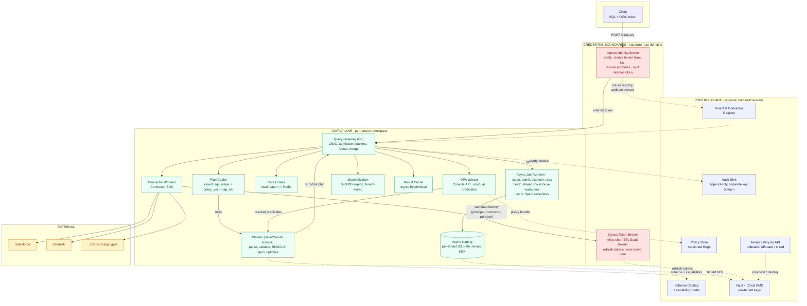
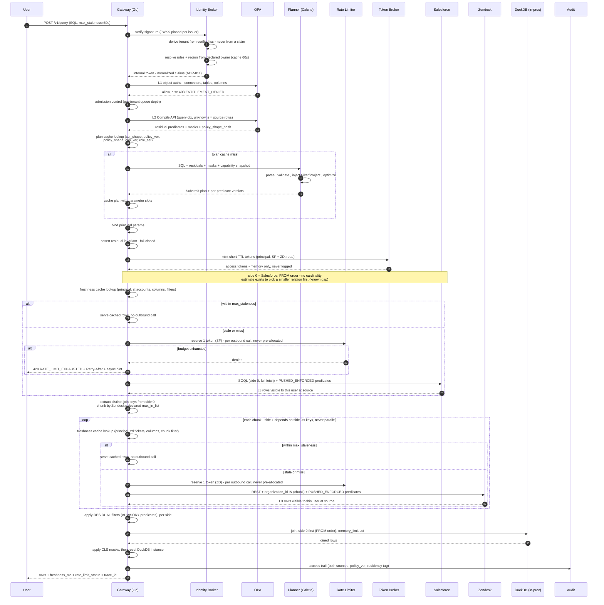
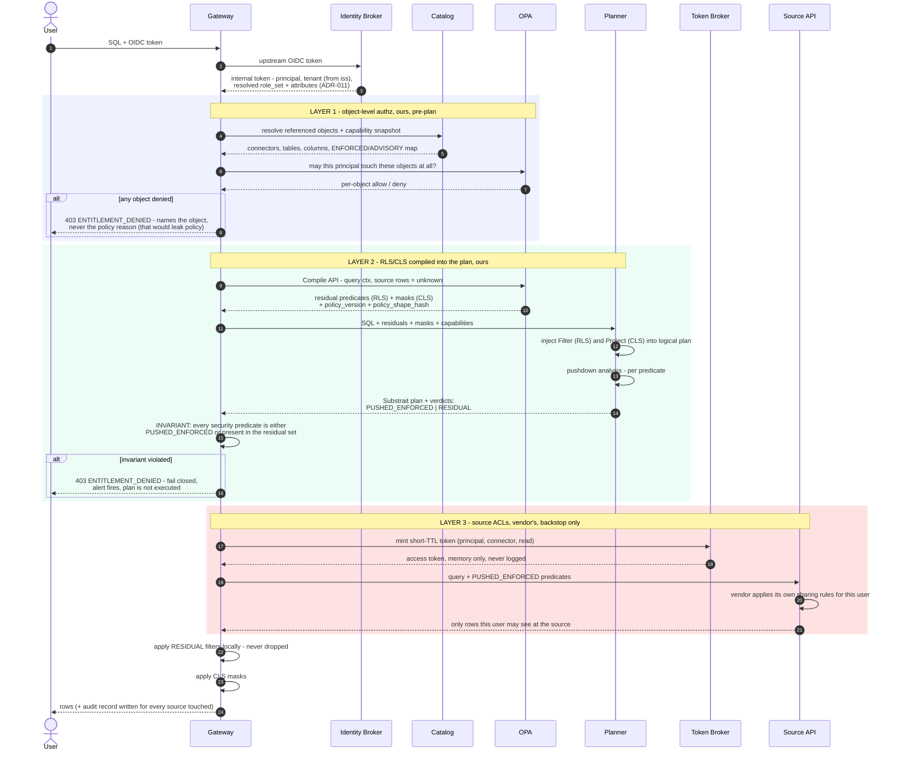
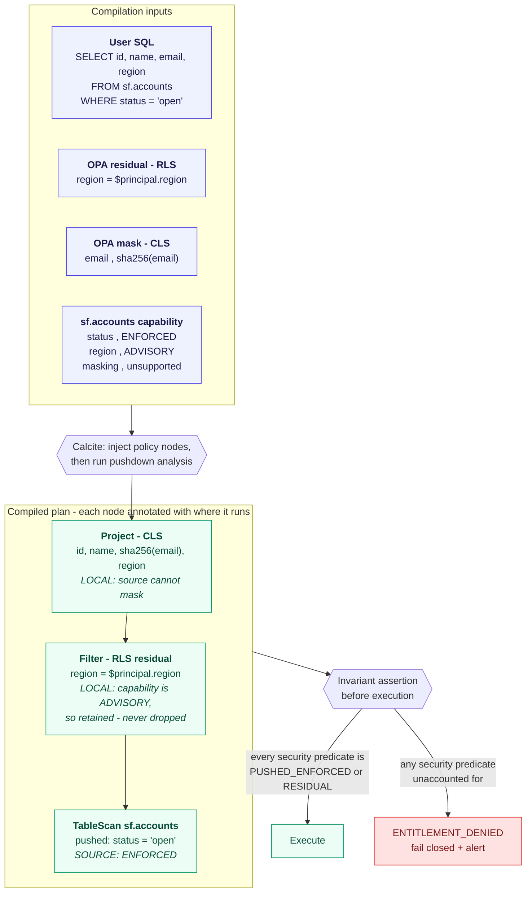
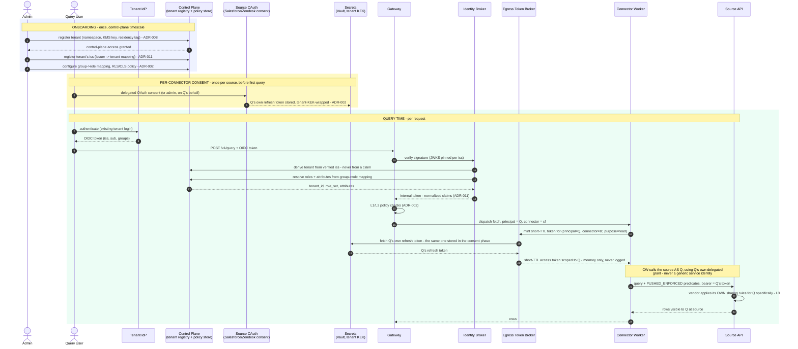

# Universal SQL Across Enterprise Apps - High-Level Design

**Scenario implemented in prototype:** Salesforce (accounts) JOIN Zendesk (tickets)

> This document is the design deliverable. It states the architecture, then records the
> ten decisions that were genuinely contested as ADRs with the options rejected and the
> costs accepted. The requirement resolution index follows immediately below; the six-month
> plan is Section 10. Where a decision is uncertain, Section 11 says so and names the metric
> that would change it.

---

## 0. Executive summary

*If you read one page, read this one.*

**Problem.** SQL across 1000s of SaaS apps, executed live against source APIs on behalf of
the calling user, under that user's own permissions. 10M users, 1k QPS, P95 < 1.5 s, hard
multi-tenancy.

**The five decisions that carry the design.**

1. **Entitlements are three layers, ours first** (ADR-002). Object authz at admission, tenant
 policy compiled into the plan, source ACLs as a backstop that can only ever *narrow*.
2. **Policy compiles into the plan** via OPA partial evaluation - residuals become `Filter`
 and `Project` nodes before compilation, never post-filtering (ADR-002).
3. **Tenant is derived from the verified issuer, never from a claim** (ADR-011). A trusted
 `tenant_id` claim is a cross-tenant read.
4. **Joins are semi-join rewrites first**, ephemeral in-process DuckDB second, with their own
 SLO (ADR-007).
5. **Terraform owns static infra; an API owns tenant lifecycle** (ADR-008). `terraform apply`
 per tenant doesn't scale to hundreds of customers, and its plan/apply cycle has no latency
 bound tight enough to gate crypto-shredding (ADR-010), which has to complete in seconds.

**The one number I would measure first.** `result_cache_hit_ratio` against distinct principal
count. Per-user delegated tokens make entitlements correct essentially for free, but force
per-principal cache keys and collapse locality. The capacity model assumes 30%; at 10%,
**connector quota rather than our fleet becomes the binding constraint**, and quota is not
something we can autoscale past. This is measured in M2, not discovered in M5. See Section 5.3.

**Three decisions I would reverse on evidence.**

| Decision | Flip when |
|---|---|
| Planner runtime (ADR-001) - **left open on purpose**, decided by an M1 spike | Criteria and date are in the ADR; the prototype's Go planner is already evidence |
| Per-principal caching (ADR-002) | `result_cache_hit_ratio` < 15% -> tenant snapshots or a mirrored permission graph |
| Ingress token exchange (ADR-011) | Exchange > 10% of P50 -> direct federation |

**What I deliberately did not build, and why.** Crypto-shredding, the Calcite sidecar,
distributed rate limiting, and token exchange are designed but not prototyped - none is
observable at two connectors and one node, and all four are infrastructure rather than the
mechanisms this design actually stakes a claim on. The prototype instead proves the three
things a reviewer cannot assume: that the residual invariant catches a lying connector, that
the plan cache does not leak across roles, and that the semi-join rewrite cuts probe calls
~30x. Scope was chosen to maximise proof per hour, not surface area.

**Where to spend ten minutes:** Section 5.3 (the risk the whole capacity model rests on), ADR-002
(entitlements, and the two diagrams in it), Section 11 (what I am least sure of).

---

## Requirement Resolution Index

Two parts. The **Decision register** below covers the eleven contested calls, each with the
requirement that forced it, the alternatives rejected, and whether the prototype builds it.
**Remaining requirements**, below that, covers everything else the brief asks for that did not
require a decision worth recording.

### Decision register

*Canonical. The README carries the same table with requirement quotes trimmed to their
operative clause; if these diverge, this one is correct.*

| ADR | Requirement (verbatim) | Why it exists | Rejected (for the final design) | Built (prototype) |
|---|---|---|---|---|
| [**001**](#adr-001---planner-runtime-and-placement) Planner **(PROPOSED)** | *"Query Planner: capability discovery, predicate/column pushdown, join plan, cost/freshness hints, spill to materialization when necessary."* (the cardinality estimate feeding this comes from whatever planner [ADR-001](#adr-001---planner-runtime-and-placement) settles on; the spill decision and its mechanism are both [ADR-007](#adr-007---join-strategy-a-four-tier-escalation-ladder)) | Something must turn SQL into a capability-aware pushdown plan; the choice fixes runtime, latency floor, and plan IR. **Deliberately left open** - the required capabilities are fixed, the tool is chosen by measurement in M1. | • Trino<br>• DataFusion<br>• Steampipe/FDW<br>• Go-native parser<br>• GraalVM-native Calcite<br>• Spark | **n/a** - prototype uses an in-process Go planner, which is itself spike evidence |
| [**002**](#adr-002---entitlement-enforcement-mechanism-and-placement) Entitlements | *"enforce least-privilege access; row/column-level security (RLS/CLS) based on source permissions and tenant policy"*; *"Document how policies are compiled into query plans."* | The brief's hardest requirement; three layers, partial evaluation, `ENFORCED`/`ADVISORY`, and verification all fall out of it. | • Post-filter in Go<br>• Inject into compiled Substrait<br>• OPA as blob store<br>• Zanzibar/OpenFGA<br>• Cedar | **Mostly** - injection, invariant, verification real; OPA + delegated OAuth mocked |
| [**003**](#adr-003---caching-plan-cache-and-result-cache) Plan + result cache | *(no direct requirement - nearest is "cache hit ratios" under sizing math)* | Anything derived from policy and then cached inherits the policy's version; a naive plan cache is therefore a privilege-escalation vector. Also amortizes planning **if** [ADR-001](#adr-001---planner-runtime-and-placement) stays expensive. | • Plan cache: no cache<br>• Plan cache: key on SQL text alone<br>• Plan cache: key on `(sql, user)`<br>• Result cache: per-pod only, no shared tier<br>• Result cache: sticky routing without a shared store | **Partial** - plan cache real; result cache's shared Redis tier designed, not built |
| [**004**](#adr-004---connector-strategy-build-vs-buy) Build vs buy | *"Connector SDK: capability model (tables/fields/ops/limits), auth/token refresh, pagination, concurrency contracts, standardized error codes."*; *"you may reference merge.dev/categories"* | 1000s of app types cannot be hand-built in six months; splitting by whether pushdown determines the SLO is the call the brief invites. | • Build all<br>• Buy all (Merge/Nango/Airbyte) | **No** - both connectors mocked |
| [**005**](#adr-005---freshness-watermark-capability-ladder) Freshness | *"avoid materially stale data vs. sources; allow per-query staleness hints"*; *"Freshness controls honoring rate limits"* | Freshness must not spend the quota queries need, and SaaS change-detection varies too widely for one mechanism. | • Centralized CDC / data lake<br>• `SELECT MAX(updated_at)` probes | **Partial** - rungs 1 & 4 + `max_staleness` |
| [**006**](#adr-006---rate-limiting-and-multi-tenant-fairness) Rate limits | *"token buckets/concurrency pools per connector/tenant/user; backoff and budget allocation; async overflow path"*; *"head-of-line blocking avoidance"* | Quota is a hard external ceiling shared across tenants; one tenant must not spend another's budget or queue behind its own backlog. | • In-memory per-pod buckets<br>• Redis on every decision<br>• Envoy ratelimit | **Partial** - single-node bucket, 429, async reroute |
| [**007**](#adr-007---join-strategy-a-four-tier-escalation-ladder) Joins | *"Clearly document join strategy: federated on the fly vs. short-lived materialization."*; *"spill to materialization when necessary"* (mechanism) | Cross-app joins are the product's reason to exist but cannot be pushed to any single source. | • Container-per-join DuckDB<br>• Naive dual full fetch<br>• Always-on shared ClickHouse cluster<br>• Spark-only from day one, skipping ClickHouse | **Partial** - semi-join yes; DuckDB, ClickHouse, and Spark tiers designed, none built |
| [**008**](#adr-008---tenant-lifecycle-terraform-vs-control-plane-api) Tenant lifecycle | *"multi-tenant and single-tenant supported without code changes"*; *"org off-boarding triggers crypto-shred and job cancellation"* | Both deployment modes and instant off-boarding cannot hold if onboarding runs through `terraform apply`. | `terraform apply` per tenant | **No** |
| [**009**](#adr-009---streaming-timeouts-and-partial-results) Streaming | *"support timeouts and partial results for slow sources"* | Once bytes are on the wire the HTTP status is committed, so partial results need a format that can report failure after success began. | • Chunked transfer + status code<br>• HTTP trailers | **At risk** |
| [**010**](#adr-010---keys-crypto-shredding-and-the-audit-conflict) Crypto-shred | *"per-tenant keys; automated org off-boarding and crypto-shredding"*; *"audit logs, access trails"* | Off-boarding must render data unreadable immediately despite KMS destruction delays, which collides with the audit retention the same brief demands. | • "Instantly destroy the KMS key"<br>• Shred audit under the tenant key | **No** |
| [**011**](#adr-011---identity-tenant-derivation-and-principal-attribute-resolution) Identity | *"AuthN via OIDC, AuthZ via policy (OPA or embedded engine)"*; *"user token -> scopes/roles -> RLS/CLS"* | Policy needs principal attributes, and reading them from claims makes `tenant_id` forgeable and roles unreliable at enterprise scale. | • Trust token claims<br>• Direct federation<br>• mTLS / client certs | **Partial** - issuer->tenant real, signature mocked |

**Two patterns worth naming.** [ADR-003](#adr-003---caching-plan-cache-and-result-cache)'s
plan-cache half is the only entry with no requirement behind it, and it is fully implemented,
while [ADR-001](#adr-001---planner-runtime-and-placement) - the decision it partly serves - is
not. That is deliberate rather than inconsistent: its *latency* justification depends on an
expensive planner, but its *correctness* justification does not. Policy-derived caching is a
bug class this same ADR now also applies to its own result-cache half (designed, not yet
built) and to
[ADR-011](#adr-011---identity-tenant-derivation-and-principal-attribute-resolution)'s attribute
cache, and the plan cache is simply the cheapest place to make that principle visible and
testable first. And every
unbuilt ADR ([001](#adr-001---planner-runtime-and-placement),
[004](#adr-004---connector-strategy-build-vs-buy),
[008](#adr-008---tenant-lifecycle-terraform-vs-control-plane-api),
[010](#adr-010---keys-crypto-shredding-and-the-audit-conflict)) maps to a requirement about
*infrastructure* - a planner runtime, a vendor contract, Terraform, a KMS call - while every
fully built one maps to a requirement about *behaviour under adversarial conditions*. That is
the scope argument in one glance: we built what a reviewer cannot take on faith.

### Remaining requirements

Covered by the design but not requiring a recorded decision.

| Requirement | Where addressed |
|---|---|
| SQL: projection, filters, pagination, `ORDER BY`, optional joins | [Section 1.4](#14-sql-surface-v1) |
| Admin UX: fast connector onboarding; connectors versioned | Section 7 (`SCHEMA_DRIFT`), [Section 10.2](#102-milestones) M6 |
| Scale: 10M users, 1k QPS, 100 MB/s | [**Section 5**](#5-capacity-and-performance-sizing) |
| Latency SLOs P50 / P95 | [Section 5](#5-capacity-and-performance-sizing), [**Section 6**](#6-slos-error-budget-and-the-slo-boundary) |
| Availability 99.9% + error budget policy | [**Section 6**](#6-slos-error-budget-and-the-slo-boundary) |
| Autoscaling; cost guardrails | [Section 5.4](#54-autoscaling-backpressure-overload), [Section 8.4](#84-cost-guardrails) |
| Infra automation: Terraform, Helm, canary/blue-green + automatic rollback | [**Section 8.1**](#81-iac-and-cd) |
| Security: storage / compute / network isolation | [Section 4.2](#42-isolation) |
| Compliance: audit logs, access trails, data residency tags | [Section 4.1](#41-threat-model-stride), [**Section 4.3**](#43-data-residency) |
| Threat model (STRIDE) + mitigations; pen-test readiness | [**Section 4.1**](#41-threat-model-stride) |
| Sizing math for 1k QPS; concurrency; cache hit ratios | [**Section 5**](#5-capacity-and-performance-sizing) |
| Backpressure; overload protection | [Section 5.4](#54-autoscaling-backpressure-overload) |
| DR / BCP; multi-AZ; RPO / RTO | [**Section 8.2**](#82-dr--bcp) |
| Runbooks: rate-limit floods, connector auth failures, cache stampedes | [**Section 8.3**](#83-runbooks) |
| Metadata catalog (Postgres + migrations) | [Section 2.1](#21-plane-separation), [Section 8.2](#82-dr--bcp) |
| Secrets & keys: Vault + KMS, rotation, break-glass | [Section 4.2](#42-isolation), [ADR-010](#adr-010---keys-crypto-shredding-and-the-audit-conflict) |
| Observability: OTel traces, Prometheus metrics, structured logs | [**Section 9**](#9-observability) |
| Error vocabulary + `Retry-After` + async guidance | [**Section 7**](#7-error-vocabulary-and-ux) |
| Six-month plan: team, milestones, acceptance criteria, risks, budget | [**Section 10**](#10-six-month-execution-plan) |
| Bonus: cost levers, chaos plan, predicate-pushdown creativity | [Section 8.4](#84-cost-guardrails), [Section 10.2](#102-milestones) M6, [ADR-007](#adr-007---join-strategy-a-four-tier-escalation-ladder) (semi-join rewrite) |

---

## 1. Scope, assumptions, and non-goals

### 1.1 What we are building

A federated query layer. SQL in, rows out, executed on demand against live SaaS APIs on
behalf of the calling user, under that user's own source-side permissions.

### 1.2 Assumptions we are making explicit

The brief fixes four numbers - **10M users, ~1k QPS peak, ~100 MB/s, and P95 < 1.5 s for
single-source pushdown queries** - and then asks for *"sizing math for 1k QPS: concurrency limits,
connector latency percentiles, cache hit ratios."* Every input that math needs beyond those four is
ours. The **Source** column separates them, so a reviewer can tell at a glance which numbers are
checkable against the brief and which are judgment calls a measurement could overturn. Four of the
six below are invented; that is not a defect, since the brief demands arithmetic it deliberately
does not supply inputs for - but it should be visible rather than implied.

| # | Assumption | Source | Why it matters | If false |
|---|---|---|---|---|
| A1 | Connectors expose per-user delegated OAuth, not just service accounts | **Assumed** - the brief says entitlements derive from "source permissions and tenant policy" but never says how those permissions are reached | Source-side ACLs are our primary entitlement substrate (ADR-002) | Fall back to service-account + mirrored permission graph; materially worse (Section 11) |
| A2 | Average result payload ~ 100 KB | **Derived** - 100 MB/s / 1k QPS, both given | Drives egress, buffer, and materialization sizing (Section 5) | Re-derive Section 5 entirely |
| A3 | The P95 < 1.5 s SLO covers **single-source pushdown queries only**; cross-app joins carry a separate 4 s SLI | **Given** - the brief scopes its SLO in exactly those words. What the brief does *not* give is how traffic splits between the classes, which is A6 | Without the scope, one slow query class consumes the error budget for all of them | SLO must be renegotiated per query class |
| A4 | Connector p95 latency 200-800 ms; a long tail of sources exceed 2 s | **Assumed** - the brief asks for "connector latency percentiles" and supplies none | Drives timeout, partial-result, and async design (ADR-009) | Timeout budget shifts |
| A5 | Tenants tolerate seconds-to-minutes staleness for most query classes | **Assumed** - the brief requires "avoid materially stale data vs. sources" without defining *materially* | Makes caching viable at all (ADR-005) | Cache hit ratio -> 0, cost and quota pressure rise sharply |
| A6 | Query mix is **~30% result-cache hit / 55% single-source / 15% cross-app join** | **Assumed, and the most load-bearing assumption in this document** - the brief names no mix, and the sizing math it asks for cannot begin without one | Every figure in Section 5 is weighted by it. The 15% join share alone sets K=8, pod count (ceil(90/8) = 12, which is the *binding* constraint, not QPS) and the ~23 GB materialization term; the 30% hit ratio is what Section 5.4 calls the weakest number in the section | Re-derive Section 5 entirely - the same blast radius as A2 |

### 1.3 Non-goals for v1

DML, DDL, window functions, CTEs, subqueries, cross-tenant queries, joins whose ON clause
references a table appearing later in the FROM clause, and anything requiring a persistent copy of customer data. Materialization is
ephemeral by construction (ADR-007, ADR-010).

### 1.4 SQL surface (v1)

```sql
SELECT <projection>
FROM <connector>.<table> [ JOIN <connector>.<table> ON <equi-predicate> ]
WHERE <conjunctive predicates>
[ ORDER BY <col> [ASC|DESC] ]
[ LIMIT n ] [ OFFSET n | CURSOR '<opaque>' ]
```

Conjunctive `WHERE` only. Disjunctions across sources are rejected at plan time with
`UNSUPPORTED_PREDICATE` rather than silently degraded into a full scan - a full scan of a
SaaS API is a quota incident, not a slow query.

---

## 2. Architecture

### 2.1 Plane separation

The split follows the standard control/data plane rule: **anything in the per-request
latency path is data plane.** The planner is per-request, therefore data plane. The
control plane holds state that changes at human timescales - registries, catalogs,
policies, secrets, audit.

| Control plane (human timescale) | Data plane (request timescale) |
|---|---|
| Tenant & connector registry | Query Gateway (tier 0-1 materialization + result cache run in-process here) |
| Schema catalog, connector versions | Query Planner (Calcite sidecar) |
| Policy store (authoring, versioning) | Policy Decision sidecar (OPA, partial eval) |
| Secrets & KMS key lifecycle | Connector workers |
| Rate-limit *policy* definitions | Rate-limit *enforcement* (token buckets) |
| Audit sink, residency tags | Async job runners (tier 2: shared ClickHouse cluster; tier 3: Spark serverless) |

**All four join tiers are data plane - the split below is about provisioning, not plane.**
Tiers 0-1 (DuckDB, in-process) run inside the Query Gateway pods that are already in this table;
they add no new row and no new fleet, because their memory is already part of the gateway pod
budget Section 5.2 derives. Tiers 2-3 (ClickHouse, Spark) are real, separate compute, but
standing compute driven by the async job runner (ADR-007): a warm ClickHouse cluster and a
serverless Spark account, both fed by S3 staging. They appear as their own data-plane row rather
than folded into the gateway pods, and their resource footprint sits outside Section 5.2's gateway
pod sizing, which counts only tiers 0-1.

**One deliberate exception.** The **Egress Token Broker** sits in neither plane. By the rule
above it is data plane - it is in the egress path - but it holds refresh tokens, which must
never reach data-plane workloads (ADR-002). We therefore run it as its own trust domain with
its own identity, authorization, and audit, and keep it off the hot path by caching minted
short-TTL tokens in worker memory. Calling this out rather than filing it under one plane or
the other is the honest treatment: it is a credential boundary, not a scaling boundary.

### 2.2 Component topology



### 2.3 Request sequence - the cross-app join path

Layer markers `L1` / `L2` / `L3` refer to the three authorization layers defined in ADR-002.



Five steps carry most of the security weight and are easy to miss on a first read: the
**L1 object check before planning**, the **`policy_shape` and `role_set` components of the
plan cache key**, the **residual invariant assertion after parameter binding**, the
**local application of RESIDUAL filters** for predicates the connector could not enforce, and
the **per-chunk freshness check** that lets a stale-but-cached side skip its outbound call
entirely. ADR-002 expands the authorization layers; the diagrams there show the deny paths this
one omits. ADR-005 and ADR-007 expand the freshness and semi-join mechanics only sketched here.

---

## 3. Architecture Decision Records

Each ADR lists the options that were actually in contention, the decision, the **costs we
accept** (not costs we claim to have neutralized), and the signal that would make us
revisit. Ordered by how close the runner-up came. The rejection reasoning below is kept to
what's needed to justify the decision that follows it - the full steelman case for every
rejected option, including the ones this section only summarizes, is in
`REJECTED_ALTERNATIVES.md`.

---

### ADR-001 - Planner runtime and placement

**Status:** PROPOSED - deferred to a two-week spike in M1 | **Contested:** high

*This is the one decision in the document I am not prepared to fix before writing code. The
required capabilities are settled; the tool that provides them is not. Committing now would be
a guess dressed as a decision.*

**Context.** We need parse -> validate -> capability-aware pushdown -> optional join
reorder, and the plan must carry RLS/CLS structurally (ADR-002). Planning sits inside a
500 ms P50 budget.

**Required capabilities** (firm - any candidate must provide all five):

1. Per-predicate pushdown verdicts against a declared capability map, distinguishing
   `ENFORCED` from `ADVISORY` (ADR-002 depends on this and nothing else here matters without it)
2. Residual tracking that preserves security-predicate provenance through optimization
3. Injection of filter and projection nodes into the logical plan *before* serialization
4. A serializable plan form, for the cache key and the audit trail (ADR-003)
5. p99 planning under 30 ms for the v1 SQL surface

**Options.**

| Option | Case for | Why not chosen |
|---|---|---|
| **Trino / Starburst** | Mature federation, huge connector library, real cost-based optimizer, and a `SystemAccessControl` SPI that has provided `getRowFilters` and `getColumnMask` since release 331 (2020) - plus a first-class OPA access-control plugin that returns mask expressions from Rego. Row/column security is genuinely solved here. | Targets JDBC/object-storage sources, not SaaS REST APIs - the connector model, catalog-scoped credentials, and shared-worker-pool isolation all fight this design (A1, per-tenant economics). |
| **Steampipe / Postgres FDW** | Exactly this product category - SQL over SaaS APIs via foreign data wrappers, and it already exists | Single-tenant by construction, with no per-predicate `ENFORCED`/`ADVISORY` contract - the primitive ADR-002 is built on. |
| **Apache DataFusion (Rust)** | Extensible rule-based optimizer, native Substrait, no JVM, no GC, no network hop | **Closest runner-up** - rejected on team-capability grounds, not technical merit; a defensible reversal (Section 11). |
| **Go-native parser (vitess / pg_query_go / tidb)** | Single runtime, no hop | Gives an AST, not an optimizer - we'd own capability-aware pushdown and residual-predicate correctness ourselves, the security-critical part (ADR-002). |
| **Calcite in-process via GraalVM native-image** | No hop, no JVM warmup | Native-image's closed-world compilation conflicts with Calcite's reflection - but only if the *executor* needs it too. An open spike question, not a settled rejection. |
| **Apache Spark** | - | Batch scheduler - never a candidate at a 500 ms P50 budget. |

**Decision (leading candidate - not yet fixed).** Calcite as an out-of-process sidecar, gRPC
transport, **Substrait** plan IR, fronted by a parameterized plan cache (ADR-003). Run it in a
pre-warmed JVM and move only when a measurement says to - the spike's job is to confirm the five
required capabilities above are met and planning latency is in budget, not to pick a favourite.
The prototype ships with an in-process Go planner instead: sufficient for the v1 surface, and
itself evidence for the **Go-native parser** row above.

**Attribution before migration.** "Switch to DataFusion" is not one decision, it is two with very
different costs. Swapping the sidecar's runtime removes GC from the tail but **keeps the hop**;
DataFusion only delivers in-process planning if the gateway is Rust too, which is a data-plane
rewrite. So we instrument first and let the dominant contributor choose the remedy:

| Dominant contributor to planning latency | Remedy | Cost |
|---|---|---|
| Plan cache miss rate | Fix the cache key, warm it, widen parameterization | Cheap |
| Planning CPU inside the sidecar | Trim the rule set, add pods | Cheap |
| gRPC transport | Co-locate, batch | Medium |
| GC pauses in the tail | Tune, or swap the sidecar runtime | Medium |
| The hop itself, irreducible | One language for the whole data plane | Expensive |

Only the last row justifies removing Go, and it is the least likely: a gRPC round trip on
loopback carrying a few-KB plan is sub-millisecond, against a query whose connector call is
~250 ms. The probable finding is that neither runtime is the constraint and cache hit ratio is
the lever - which is what Section 5.3 concludes from the other direction.

**This is coupled to the data-plane language, and the spike must treat them as one decision.**
The gateway is Go: goroutine-per-source fanout, `context` cancellation that maps directly onto
ADR-009's timeout cascade, fast cold start for concurrency-based autoscaling, and a hiring pool
that a six-month plan depends on. But DataFusion is Rust, so "in-process, no hop" is only true
if the *gateway* is also Rust. From Go the options are a Rust sidecar (the same hop as Calcite,
minus the JVM), Go-to-Rust FFI (cgo, and worse), or rewriting the data plane. An earlier draft
of this ADR credited DataFusion with "no second runtime" - that was wrong, and it materially
raises the cost of the option otherwise closest to winning.

**Cold start is not the thing to optimize here.** It matters for components that scale
reactively, and the planner sidecar barely scales - behind a high plan-cache hit ratio it serves
a small fraction of requests from a handful of pods sized by availability rather than load. The
component that scales on demand is the gateway, and that is Go. Long-lived pre-warmed planner
pods with a warm spare make cold start a non-issue. The JVM ecosystem has several startup and
warmup mitigations if that assumption turns out to be wrong; we would evaluate them then rather
than design around them now.

**Decided by:** end of M1, by the planner owner, on spike evidence.

**Consequences we accept.**
- Two runtimes in the build, the image, and the on-call rotation. Real recurring cost - and one
  that DataFusion does *not* avoid unless the whole data plane moves to Rust.
- **The GC argument is weaker than it looks.** We specify ZGC below, whose pause profile is
  comparable to Go's, and Go is itself garbage-collected. Criticizing the JVM for GC from a GC'd
  language is not an argument we should lean on; the plan cache is the real mitigation.
- Extra hop adds ~2-5 ms at P50 and a worse tail. JVM GC pauses land **directly** in the
 request path - the sidecar is synchronous, so "Go isolates us from GC" is false. The
 plan cache is what actually bounds this, reducing GC exposure to cache-miss traffic
 (target <=10%). We size the JVM for throughput-with-bounded-pause (ZGC) accordingly.
- Cold pods plan slowly. We pre-warm on startup with a synthetic plan set and exclude the
 first N requests per pod from SLO accounting, documented in the error budget policy (Section 6).
- Substrait does not cover every Calcite rel node. Uncovered plans fall back to a private
 extension type - knowingly incurred debt, capped at two extensions.

**Revisit if.** Plan cache hit ratio < 95% sustained; sidecar contributes > 15% of P95;
we need a third extension type, we hire Rust depth (-> DataFusion).

---

### ADR-002 - Entitlement enforcement: mechanism and placement

**Status:** Accepted | **Contested:** high

**Context.** Least-privilege, RLS/CLS derived from *both* source permissions and tenant
policy, computed at plan time.

**Options.**

| Option | Why not chosen |
|---|---|
| **Post-filter results in Go** (as the *strategy*: push nothing, fetch everything, filter locally) | Rows leave the source and enter memory before being discarded - the leak, plus wasted quota. Rejected as the default only; the bounded `ADVISORY` exception is monitored via `residual_filter_rows_dropped` (Section 9). |
| **Inject into the compiled Substrait plan in Go** | Substrait uses positional field references; rewriting a compiled binary plan by position fails silently under column reordering. |
| **OPA as a policy blob store** - fetch rules, hand them to the planner | Wastes OPA - the planner would have to interpret Rego semantics itself, duplicating the engine. |
| **Zanzibar-style (OpenFGA / SpiceDB)** | Better for *mirroring* source permission graphs, but A1 (source ACLs enforce themselves) means nothing needs mirroring - for now. Revisit hard if A1 breaks. |
| **Cedar** | Conceptually validated by Cedar's own RFC 0095 (residual-to-SQL is its motivating example); rejected on maturity - both partial evaluators are behind experimental feature flags. Revisit when `tpe` stabilizes. |

**Decision.** Three layers. Layers 1 and 2 are ours and are enforced unconditionally;
layer 3 is the source's and is a backstop, not a substitute.

1. **Tenant policy compiles into the plan** via OPA's **Compile API (partial evaluation)**.
 We send query context with source rows marked *unknown*; Rego returns **residual
 conditions** - a boolean expression over named columns. Calcite translates residuals
 into `Filter` (RLS) and masks into `Project` (CLS) nodes before Substrait compilation.
 This is the literal answer to "document how policies are compiled into query plans."
2. **Object-level authorization at the gateway**, before planning: may this principal query
 this connector, these tables, these columns at all? Denied at admission with
 `ENTITLEMENT_DENIED`. Source ACLs cannot express this - they know nothing about our
 product's surface - so it cannot be delegated downward.
3. **Source permissions apply natively as a final backstop.** Connector calls carry the
 user's own delegated grant, so Salesforce sharing rules and Zendesk group restrictions
 are enforced by the vendor, current by construction, and we never reimplement a vendor's
 ACL semantics. This *narrows* what layers 1-2 already allowed; it never widens it.

**Where each layer denies, and what it says when it does.**



Layer 3 can only ever **narrow** what layers 1 and 2 already permitted. It is never the
reason a row is allowed - only ever an additional reason a row is withheld. Connectors on
the service-account fallback have no layer 3 at all, and the design is unchanged for them
because layers 1 and 2 were never optional.


**Token custody - what the data plane actually holds.**

The user's client never sees or sends a SaaS token. Clients authenticate to us with OIDC
only. Delegated grants are obtained through a consent flow, and **refresh tokens live in
the control plane's secrets layer (Vault, wrapped by the tenant KEK) and never enter the
data plane.**

At egress, the connector worker calls an **egress token broker** with its workload identity
(mTLS/SPIFFE) and a request for `(principal, connector, purpose)`. The broker mints or
returns a **short-TTL access token** held in memory only, never written to disk, never
placed in a plan, a cache key, a trace attribute, a log line, or a response. Redaction is
enforced in the logging and tracing middleware rather than by convention. Consent requests
read-only scopes, minimized per connector.

The stronger variant, which we take for the highest-risk connectors: the worker does not
receive the bearer token at all - it hands the request to the broker, which attaches
credentials and performs the call. The gateway process then never holds a live SaaS
credential in any form.

**The capability vocabulary.** Declared per **(table, column, operator)** - `=` on a column
may be `ENFORCED` while `LIKE` on the same column is not. These are claims *we* make about a
connector and prove with conformance tests, **never** values a connector self-reports at
runtime, which would be trivially spoofable.

| Label | Meaning | Pushed? | Local filter expects to drop |
|---|---|---|---|
| `ENFORCED` | Source *will* apply it; no violating row can return | Yes | **Zero rows** - non-zero means the connector diverged from its declaration => fail closed |
| `ADVISORY` | Usually reduces volume; not trusted for correctness (e.g. an eventually-consistent search index) | Yes, as a volume optimization | Some rows - normal |
| *absent* | No filter exists | No | As many as needed |

The local filter is present in all three cases. **What differs is how many rows it is expected
to drop**, which is why Section 9 carries two metrics rather than one: one must be zero, the other
must not.

**The pushdown safety rule.** Connector capabilities declare each predicate as
`ENFORCED` or `ADVISORY`. A security predicate may be pushed down **only** to `ENFORCED`.
Anything else is retained as a **residual filter applied locally** - never dropped. The
planner emits a per-node pushdown verdict; the Gateway asserts every security predicate is
either pushed-to-ENFORCED or present in the residual set, and fails closed with
`ENTITLEMENT_DENIED` if that invariant breaks.

*Why not push security predicates to `ADVISORY` connectors as an optimization while keeping
the local filter?* It would be safe against **under**-filtering, which is the dominant failure
mode. It is not safe against **over**-filtering: an `ADVISORY` source that drops rows the user
was entitled to see produces a silently incomplete result, and we cannot detect that without a
control fetch. Under-filtering we catch; over-filtering we would not. We take the bandwidth
cost and keep the certainty. Plan-time injection alone guarantees
nothing; this invariant is what makes the guarantee real.

**The verification filter - a second, runtime mechanism.** The invariant above is a *static,
plan-time* check: it catches planner bugs. It does **not** catch a connector that declares a
predicate `ENFORCED` and then ignores it - such a plan satisfies the invariant perfectly,
because the predicate was legitimately pushed to a target that claimed to enforce it. The lie
is only visible in the rows that come back. We therefore re-apply every `PUSHED_ENFORCED`
**security** predicate locally after fetch. A trustworthy connector drops zero rows; any
non-zero count means the connector's behaviour has diverged from its declared capability, and
we fail closed rather than serve. Cheap for equality predicates.

**"Lying connector" understates the common case, which is our own code.** A vendor is unlikely
to misrepresent its API. What is likely is one of these, all equally plausible:

- Our connector sends `?region=EMEA` where the API expects `?filter[region]=EMEA`, and most
  REST frameworks **silently ignore unknown query parameters** and return the unfiltered set.
- A filter is honoured alone but dropped when combined with another parameter.
- Null or case semantics differ from our assumption.
- A minor API version changes behaviour without erroring.

In every case the symptom is identical: an RLS filter that appears pushed, does nothing, and
leaks the full table with a 200. Verification is therefore an assertion that the predicate we
believe we pushed actually took effect - closer to a bounds check than to a trust control.

**The cost is a column width, not a row count.** Verification adds the predicate column to a
projection of rows we were already fetching. When pushdown works, that is a few bytes per row.
When it fails, the row volume dwarfs it and is the thing we are trying to detect. That
asymmetry - near-zero cost, total-leak failure - is why this is unconditional rather than
sampled. A cheaper alternative exists and was considered: prove filter behaviour in connector
conformance tests at onboarding and nightly, then trust in production. It catches our-code
bugs at introduction but is blind to vendor-side drift between runs, so we run it *in addition
to* verification rather than instead of it.

This yields two metrics with very different meanings, and conflating them hides the attack:

| Metric | Expected value | Meaning |
|---|---|---|
| `residual_filter_rows_dropped` | non-zero, steady | Normal cost of the `ADVISORY` path |
| `enforced_predicate_violations_total` | **must be zero** | A connector lied. Page immediately. |

**Over-projection is a consequence of both paths.** A local predicate can only be evaluated
against a column that is present, so the scan projects the union of the user's output columns,
every column referenced by a local predicate or mask, and the join keys - then the top
`Project` trims back. This applies to `ENFORCED` predicates too, because the verification
filter re-applies them locally. Sampling is not an option: verifying a fraction of requests
means a lying connector succeeds on the remainder. Two failure modes follow, and both fail
closed:

- The user's own source token cannot read the predicate column - Salesforce field-level
  security can hide it - so neither filtering nor verification is possible. Checked at
  connector onboarding by asserting every policy-referenced column is readable by the
  least-privileged role the policy applies to.
- A masked column used in a predicate is fetched raw, filtered on raw, then masked on output -
  correct, but the unmasked value transits our memory and is logged as an instance of the same
  bounded weakness as the `ADVISORY` path.

**The result cache key, precisely - and why it can't be looser.** "Keyed by principal" above
is not a rounding-error simplification; the key must carry both tenant and principal, not just
the fetch signature (table, requested columns, bound filter values):

```
(tenant_id, principal_id, connector, table, sorted output columns, sorted bound filter values)
```

Our own RLS/CLS do **not** need this - a residual filter is re-applied on every read regardless
of cache state, hit or miss, so sharing a cache entry across two principals with the same
*role* never leaks past our own layers 1-2. The reason principal, specifically, must be in the
key is **layer 3**: with per-user delegated OAuth (A1), the source applies its *own* sharing
rules using the calling principal's own token, and those rules can differ per user for an
identical query - e.g. Salesforce record-ownership sharing, which is per-user, not per-role.
Layer 3 "can only narrow" what layers 1-2 already allowed (above), and a cache keyed coarser
than principal silently defeats that narrowing in both directions: a broader-access principal's
cached rows served to a narrower one is a real information-disclosure bug through the cache,
not through the plan. A `role_set_hash`-style key (ADR-003's approach for the *plan* cache)
is not sufficient here, precisely because it is: the plan cache can key on role because our own
RLS/CLS is role-derived and deterministic, but layer 3 answers to the individual, not the role.
`tenant_id` has to be explicit too - a single gateway process's cache is not implicitly
tenant-scoped, and two tenants' distinct source-connector instances (e.g. two different
Salesforce orgs) must never collide on the same `(table, columns, filters)` string.

**Consequences we accept.**
- **Credential blast radius.** Even with the broker, the data plane is the component that
 causes SaaS calls to happen on behalf of many users. A compromised worker cannot exfiltrate
 refresh tokens, but during the compromise window it can request short-TTL tokens for
 principals with active sessions and issue calls under them. We accept this and bound it:
 short TTLs, per-purpose scoping, workload attestation on every broker call, anomaly
 detection on broker request rate per workload, and a broker-side kill switch. It is worth
 being clear that this risk is *not* introduced by delegated tokens - the service-account
 alternative concentrates it into one omnipotent credential instead of many least-privilege
 ones. Per-user delegation is better on per-credential privilege and worse on credential
 count. We prefer the former.
- **Caching collapses.** Per-user tokens mean the result cache must be keyed by principal,
 so hit ratio falls roughly with users-per-tenant. This pushes load onto connectors and
 straight into the rate-limit budget. **This is the central tension in the whole system**
 - entitlements, freshness, cache, and quota are one problem, not four. Section 5 sizes it.
- Token refresh volume scales with users, not tenants. The broker owns refresh and backoff.
- Some connectors do not support delegated tokens. Those fall back to service-account +
 explicit mirrored policy, flagged in the catalog and visibly degraded in admin UX. For
 those connectors layer 3 is absent entirely, so layers 1-2 carry the full weight - which
 is exactly why they are not optional.
- Residual local filtering costs CPU and memory on rows we then discard.

**How a policy actually becomes plan nodes.** Worked example with one of each outcome -
a predicate the source will enforce, a predicate it will not, and a mask it cannot express:



The case worth studying is `region`. It is a **security** predicate, and the connector
declares it `ADVISORY` - so pushing it down would be unsafe, but dropping it would be a
data leak. It is therefore pushed *nowhere* and retained as a local `Filter` above the scan.
The cost is that the source returns more rows than the user may see and we discard the
excess. That is the price of correctness against a connector we cannot trust to filter, and
it is why `residual_filter_rows_dropped` is a metric in Section 9 rather than an implementation
detail: a sudden change in it means a connector's real behaviour has diverged from its
declared capability.

**Why masking is a `Project` node and never a pushdown target.** The capability model declares
a per-table `masking` field for symmetry with the predicate-pushdown model, but for the
connector category this design actually targets - 1,000s of SaaS REST APIs - genuine
source-side masking capability is the exception, not something to plan around. What these APIs
commonly expose is field-level security: a field is visible or it isn't, a binary the residual-
column-hygiene path already handles (a hidden predicate column fails closed, see the
Requirement Resolution Index). A
response shape where an unprivileged caller gets a *redacted* value instead of no value at all
is a database primitive (SQL Server Dynamic Data Masking, Snowflake masking policies, BigQuery
column-level security) or an enterprise add-on (Salesforce Shield's encrypted fields showing a
masked string to callers without "View Encrypted Data") - not a default REST API behavior, and
Zendesk has no equivalent at all. So CLS masking is unconditionally a gateway-side `Project`
transformation in this design; a catalog entry claiming a connector *can* mask is closer to a
configuration error than a real pushdown opportunity, and the capability field is validated as
an assertion (must be `unsupported` in v1) rather than branched on.

**What the prototype enforces (not deferred).** All three layers are exercised end-to-end
with mocked sources: a mock IdP issues the OIDC token; a mock consent flow yields delegated
grants held by a broker stub; one RLS rule and one column mask compile into the plan; object
-level authz rejects an out-of-scope table at admission. The test that matters most is the
**lying-connector test** - a mock source that declares a predicate `ENFORCED` and then
ignores it. The *plan-time invariant will pass* here; it is the **runtime verification
filter** that must catch it, drive `enforced_predicate_violations_total` above zero, and fail
closed. A prototype that only proves the happy path proves nothing about entitlements.

**Revisit if.** >=30% of connectors lack delegated OAuth; per-principal cache hit ratio
< 20%, we need cross-user shared caching for cost reasons (-> Zanzibar mirror).

---

### ADR-003 - Caching: plan cache and result cache

**Status:** Accepted | **Contested:** medium

Two different caches, one shared architectural principle: both need a two-tier topology
(per-pod local + shared Redis) to survive autoscaling and rolling deploys without resetting
hit ratio to zero exactly when load is highest. Treated as one ADR because the topology
decision is identical even though what each cache holds, and why, is completely different.

#### Plan cache

**Context.** ADR-001's latency argument depends entirely on a high cache hit ratio, and a
plan carries policy. Those two facts conflict.

**Options.**
- **No plan cache** - safe, but pays JVM planning on every request; the sidecar becomes
 indefensible.
- **Global cache keyed by SQL text only** - **security defect**: a plan built under a
 privileged user's policy would be served to an unprivileged one. Rejected outright.
- **Cache keyed by (sql, user)** - safe, but hit ratio ~ 0 at 10M users.
- **Parameterized cache** <- CHOSEN

**Decision.** Cache the DAG with **parameter slots** (`WHERE region = $principal.region`)
and bind principal context at execution. Key:

```
(sql_shape_hash, tenant_id, policy_version, policy_shape_hash,
 connector_capability_version, role_set_hash)
```

**Why every component is load-bearing.** Parameterization solves the *value* dimension only -
each other component closes a gap that leaves open:

- If a tenant adds a new column mask, the DAG is *structurally* wrong and binding fresh values
  won't save you - hence `policy_shape_hash`.
- Two roles with different policy structure need different plan shapes - hence `role_set_hash`.
- Connector capability changes alter which predicates are `ENFORCED`, invalidating pushdown
  verdicts - hence `connector_capability_version`.

Policy writes in the control plane publish an invalidation event; we also bound staleness with
a short TTL as a backstop against missed events.

**Parameterization covers *two* kinds of value, and missing the second is a live bug.** The
example above (`WHERE region = $principal.region`) is a *policy* residual, and those were
resolved lazily from the start. Ordinary **user literals** need identical treatment for a reason
that is easy to miss: `sql_shape_hash` deliberately normalizes literals away, so
`status='open'` and `status='closed'` are the *same* key by design. That is the point - it is
what makes the hit ratio survive real traffic - but it silently obligates the plan body to hold
a `$param.N` slot rather than the literal, re-extracted per request (`plan.ExtractParams`) and
bound at execution (`exec.resolveValue`) alongside the principal attributes.

Bake the literal into the plan instead and the cache serves whichever request built it, to every
later request of that shape. The failure has three properties that make it particularly nasty:
it never appears on the first request; it needs a *warm* cache, so it strengthens exactly as the
cache does its job; and it is invisible to a test suite that never issues two same-shaped
queries with different values in sequence. Ours didn't, and 36 passing tests missed it - a load
run that varied a `WHERE` value found it. Now pinned by
`TestPlanCacheHitsOnSameShapeDifferentValue` (`internal/plancache`), which asserts both halves:
the two shapes share a cache key, *and* the second execution sends its own literal to the
connector. Resolution fails closed on a missing or out-of-range slot rather than comparing
against an empty string, which would silently match or silently drop every row depending on data.

**What this cache is actually for - and what it is not.** No requirement asks for plan
caching; it exists because ADR-001 put a JVM planner in the request path, and without
amortization that choice cannot pay for itself. Ranked honestly:

1. **Tail-latency containment** - GC pauses and pathological plans hit only the miss
   population.
2. **Audit determinism** - a cached plan is a stable hashable artifact, and its hash in the
   audit trail proves what executed under which `policy_version`.
3. **Fleet cost** - worth ~2-3x, not the order of magnitude an earlier draft claimed.

It is *not* a meaningful mean-latency optimization: ~25 ms of a ~270 ms query is ~9%.

**Topology.** Two tiers: a per-pod LRU (no RTT, but cold on every scale-out) backed by a
shared Redis tier holding the serialized Substrait blobs (a few KB each, ~1 ms). Without the
shared tier, autoscaling events and rolling deploys reset hit ratio to zero exactly when
load is highest.

**Consequences we accept.**
- **Attribute cache invalidation is plan cache invalidation.** `role_set_hash` derives from
 attributes resolved by the identity broker (ADR-011), not from token contents. A role change
 must invalidate both caches or a stale plan carries stale entitlements.
- **The key fights the cache.** Every component of the key exists for correctness, and every
 component multiplies cardinality. ADR-003's security requirements are the direct cause of
 its own worst-case hit ratio. There is no version of this key that is both safe and small.
- Cache key cardinality grows with distinct role sets, not users - acceptable, but a tenant
 with pathological per-user roles degrades toward the `(sql, user)` case.
- Caching adds a failure mode that not caching does not have: a stale plan carrying a
 superseded policy is a security bug, not a slow query. This is why invalidation is
 event-driven with a TTL backstop rather than TTL alone.
- Hit ratio is a function of **workload shape**, which is unmeasured. Saved dashboards repeat
 and cache well; ad-hoc analyst SQL does not.
- Invalidation is eventually consistent within the TTL window. A policy *tightening* could
 therefore be up to TTL late. We set TTL to 30 s for that reason and treat policy
 tightening as a control-plane operation with an explicit synchronous flush option.

**Revisit if.** Hit ratio **< 95%** (the P95 trap in Section 5.2 - the old 90% trigger was set
against mean latency and would not have protected the percentile SLO), a tenant exceeds N
distinct role sets, any incident traced to invalidation lag.

#### Result cache

**Context.** ADR-005 governs *when* a cached fetch is considered stale; it says nothing about
*where* the cache physically lives. Left unstated, the default is per-pod-only - and a fleet
of 20-24 Gateway pods behind a load balancer with no cache-key-aware routing means the same
`(principal, table, columns, filters)` key can be independently missed and cached on multiple
pods at once. That is the identical failure mode the Plan cache section above already exists
to prevent, just never stated for this second cache.

**Options.**
- **Per-pod only, no shared tier** - simplest, but silently understates memory and overstates
  hit ratio: every pod that independently misses the same key both spends a redundant
  connector call and holds a redundant copy, and every autoscale or rolling-deploy event
  resets the fleet's effective hit ratio to zero, same as the Plan cache without Redis.
- **Sticky routing** (consistent hashing on the cache key, no shared store) - avoids
  duplication without new infrastructure, but couples the load balancer to the cache key's
  shape and creates hot-pod risk for any single popular query.
- **Shared Redis tier, same shape as the Plan cache** <- CHOSEN

**Decision.** Two tiers, mirroring the Plan cache exactly: a thin per-pod LRU (fast path, no
RTT) backed by a shared Redis tier holding the cached rows, keyed exactly as ADR-002's
addendum specifies (principal-scoped, not just table/columns/filters). A miss on the local
tier checks Redis before falling back to a genuine live fetch - only the genuine-miss path
spends rate-limit quota (ADR-006), so a request another pod already cached does not cost a
second outbound call just because it landed on a different pod.

**Why this wasn't optional, once checked.** Without a shared tier, the ~2-8 GB fleet-wide
estimate and the hit-ratio numbers in Section 5.2/5.3 both understate reality - fragmentation
across pods means more live entries and a lower real hit ratio than a single-pod model
predicts, in the same direction (and for the same reason) as the failure mode this ADR's
Plan cache section already solved.

**Combined Redis load, now that a third workload rides the same cluster.** Section 5.2's
Redis row previously counted only rate-limit lease reconciliation (~500 ops/s) - already
incomplete, since it never included the Plan cache's own Redis traffic. All three workloads
together: rate-limit leases (~500/s) + Plan cache local-tier misses (10% x 1,000 = 100/s) +
Result cache local-tier misses (70% x 1,000 = 700/s) ~ **~1,300 ops/s combined**, still a
small fraction of a 3-node cluster's real capacity, but a number that should replace "vastly
under-utilized" as an assertion with an actual combined figure.

**Consequences we accept.**
- Result cache entries (rows) are larger than Plan cache entries (a compiled shape), so
  Redis's own memory footprint - not just Gateway pod memory - now carries part of the 2-8 GB
  estimate; each pod's local slice shrinks accordingly rather than holding the full range.
- Same failure mode the Plan cache already accepts: eventual consistency between a pod's
  local tier and Redis means a request can be served from a local entry that is technically
  staler than Redis's own copy, bounded by keeping the local tier's TTL short relative to
  Redis's.
- One Redis cluster now serves three purposes (rate limiting, Plan cache, Result cache)
  rather than three separate pieces of infrastructure - cheaper to operate, but an incident
  affecting Redis now has a wider blast radius across previously-independent concerns.

**Revisit if.** Combined Redis ops become a significant fraction of the cluster's real
capacity rather than the small one assumed here; local-tier/Redis staleness skew causes a
`STALE_DATA`-class incident; the combined three-workload cluster needs to split rather than
share.

---

### ADR-004 - Connector strategy: build vs. buy

**Status:** Accepted | **Contested:** high

**Context.** The target is 1,000s of app types. The prompt itself points at merge.dev.
An engineering lead's job is to answer whether we build this.

**Options.** Build all, buy all (Merge / Nango / Paragon / Airbyte), hybrid.

**Decision.** Hybrid, split by whether pushdown matters.

- **Build** (~10-20 connectors): the ones where predicate pushdown, delegated OAuth,
 per-endpoint rate-limit semantics, and watermark support determine whether we hit our
 SLOs at all. Salesforce, Zendesk, Jira, GitHub, Google Workspace, Slack, Notion.
- **Buy** the long tail via a unified-API vendor behind our own Connector SDK interface,
 so the vendor is an implementation detail of one `Connector` implementation.

**Why not buy everything.** Unified-API vendors normalize away per-field pushdown and
per-user delegated auth - both load-bearing here (ADR-002, Section 5).

**Why not build everything.** 1,000 connectors against unversioned vendor APIs is not a
six-month program - it is the whole company.

**Deployment and versioning.** The Connector SDK is a wire contract (gRPC, or the plain
HTTP+JSON shape the prototype's `HTTPSource` already speaks to its mocks), not a compiled-in
language interface - a connector is its own deployable service, in whichever language fits,
registered in the control-plane catalog. This is what makes "connectors are versioned" and fast
onboarding (both required) actually true: a new or updated connector never requires rebuilding
the gateway, and the promotion gate - the connector conformance suite, run against the deployed
service through its public contract - is the same regardless of who authored the connector.

**Consequences we accept.**
- The wire-protocol boundary adds a network hop per connector call, a control-plane registry
 tracking connector versions, and a per-connector deploy pipeline instead of one gateway
 release train - real operational surface, accepted because it's what makes independent
 connector onboarding and versioning possible at all.
- Two connector tiers with different capability ceilings, visible in admin UX and in the
 catalog. Long-tail connectors advertise fewer `ENFORCED` predicates and therefore do
 more residual local filtering and have looser SLOs.
- Vendor dependency: pricing, rate limits, and outages become ours. Mitigated only by the
 SDK boundary, which makes replacement possible - not free.
- Per-connector cost accounting must span both tiers for the cost guardrails in Section 8.

**Revisit if.**
- Vendor per-call pricing exceeds build cost at our volume; >25% of tenant queries hit
 long-tail connectors and suffer for it.
- Connector count and update cadence stay low enough (near the ~10-20 build tier) that the
 RPC boundary is overhead without payoff - a compiled-in registration would be simpler.

---

### ADR-005 - Freshness: watermark capability ladder

**Status:** Accepted | **Contested:** medium

**Context.** Avoid materially stale data, honour `max_staleness`, and do it *without*
burning the rate-limit budget - the constraint that makes this hard.

**Options rejected.**
- **Centralized streaming lake / CDC into our own store.** Violates on-demand federated
 execution and complicates crypto-shredding (ADR-010). Only the cross-tenant centralized
 lake is rejected - per-tenant bounded snapshots remain available for quota-hostile
 connectors, under the same tenant key and shred path.
- **`SELECT MAX(updated_at)` probes.** Withdrawn from an earlier draft - SaaS REST APIs
 don't accept SQL, and update-timestamp watermarks are blind to **hard deletes**, so a
 deleted record stays visible in cache indefinitely.

**Decision.** A four-rung capability ladder, declared per connector in the catalog.

| Rung | Mechanism | Cost | Delete-safe |
|---|---|---|---|
| 1 | Native `ETag` / `If-Modified-Since` conditional request | 1 call, 304 on hit - the probe *is* the fetch, so it never doubles | Yes |
| 2 | Change/event feed or cursor API (e.g. Zendesk incremental exports), maintained as a replica rather than probed per query | 0 calls per query once synced; replication runs on its own schedule | Yes, only if the feed emits explicit delete events |
| 3 | `updated_after` filter + 1-row sorted fetch as a watermark | 1 call if unchanged; 2+ calls if changed (the probe, then a full live fetch) | **No** - pair with a periodic full-refresh floor |
| 4 | None - TTL only | 0 calls | No |

**Quota accounting.** A rung-1 or rung-3 probe **spends a rate-limit token**. It is charged to
the same bucket as a data fetch and appears in `rate_limit_status`. Freshness that
silently consumes quota is not freshness control; it is a quota leak with good PR. Rung 2
doesn't spend a token per query at all - its cost is a background replication job, on its own
schedule, not charged to any single request.

**`max_staleness` semantics:**
- Within TTL -> serve cached, `freshness_ms` set.
- Outside TTL -> probe at the connector's best rung.
- Probe result unchanged -> serve cached and reset TTL.
- Probe result changed, or the connector is rung-4 -> live fetch.
- A probe that would exceed budget -> `STALE_DATA` with the actual age, so the caller decides
  rather than us guessing.

**Rung 1 depends on what the source actually supports.** Checked against the two vendors this
design targets, not assumed. GitHub returns ETags on list endpoints and a 304 doesn't count
against the rate limit. Salesforce is different: its REST API only supports conditional
requests on single Account records, never on the `/query` resource SOQL results come back
through. So for `sf.accounts`, rung 1 isn't usable at all - the gateway needs ETags on query
results, and Salesforce doesn't offer that. Zendesk's ticket-list support is unconfirmed.

**Rung 2 is a different kind of component, not a fourth probe.** Rungs 1, 3, and 4 all work
the same way: check how old the cached entry is, maybe send one probe, then either serve the
cached rows or fetch live. A change feed doesn't fit that shape - its natural use is keeping
one full local copy of a table continuously up to date, independent of any specific query, and
then answering any filtered query from that copy with no extra calls. That's a background
replicator per connector, not another branch inside the per-query cache the other three rungs
share.

A rung-2 replica also can't be shared across principals. ADR-002's L3 layer sends every
connector call under the calling principal's own delegated token, so the source enforces that
principal's own sharing rules - Salesforce record ownership, Zendesk group restrictions. A
replica built with one principal's token only reflects what that principal can see. Using it
to answer a different principal's query would either leak rows the second principal's own
access wouldn't return, or hide rows they should see. So each principal needs their own
replica - real reuse across that principal's own different queries, but never one shared copy
for everyone.

**Consequences we accept.**
- Rung-3 and rung-4 connectors can serve data that omits deletions for up to the full-refresh
 interval. This is disclosed in the catalog and surfaced per query in `freshness_ms`.
- Probes consume budget that could have served queries; under pressure we degrade to
 TTL-only and say so via `STALE_DATA` rather than silently.
- The cache never holds a join result, only single tables. `freshness.Source` wraps each
 connector separately, so every fetch - a plain scan, a join's first side, or one semi-join
 probe chunk - is cached on its own, keyed by that one table's `(principal, columns, filters)`.
 The join itself happens afterward, once every side has already come back, and that merged
 result is never cached. One side effect: each side of a join ages on its own clock, so one
 side's cached rows might be fresh while another's are close to the staleness limit - each
 side stays within its own budget individually, but the two sides together aren't guaranteed
 to reflect the same moment in time.

**Revisit if.** Deletion-visibility complaints from any tenant; probe traffic > 15% of
connector budget.

---

### ADR-006 - Rate limiting and multi-tenant fairness

**Status:** Accepted | **Contested:** medium

**Options.**
- **In-memory per-pod buckets** (an earlier draft's choice) - **wrong.** With N autoscaled
 pods the effective limit is N x configured. The failure mode is the connector banning our
 API key, which is a cross-tenant outage.
- **Redis on every decision** - correct but adds an RTT to every request and creates
 shared fate with Redis.
- **Envoy ratelimit service** - solid, but doesn't model per-connector budgets that must be
 shared across async and sync paths.
- **Local lease <-> Redis reconciliation** <- CHOSEN

**Decision.** Three enforcement layers.

1. **Token buckets** per `(connector, tenant, user)` - Redis-backed budgets, leased in
 slices to each pod and reconciled asynchronously. Steady state costs no RTT.
2. **Concurrency semaphores** per connector and per tenant - bounds in-flight work, which
 is what actually protects a source.
3. **Bounded fair queues + admission control** - per-tenant queues with weighted fair
 dequeue, plus load shedding at depth. Semaphores alone do not prevent head-of-line
 blocking; a tenant still queues behind its own backlog. The real constraint is not
 goroutines but **upstream connector concurrency**, so the semaphore is the scarce
 resource and the queue is how we allocate it fairly.

**Redis failure policy - stated deliberately.** On Redis unavailability we **fail closed to
the last known local lease** and do not issue new budget. Fail-open risks a connector-wide
ban that affects every tenant; fail-closed degrades gracefully to whatever each pod already
holds. Queries beyond the lease get `RATE_LIMIT_EXHAUSTED` with `Retry-After`.

**Overflow.** `429` + `Retry-After` + a message naming the connector, the window, and the
async option. With `Prefer: respond-async` the query is enqueued to job runners and returns
`202` with a poll URL.

**Consequences we accept.** Leasing means budget utilization is imperfect - a pod holding
an unused lease slice wastes it, so we run at ~85-90% of true budget. Lease size is a tuning
knob trading utilization against Redis load.

**Revisit if.** Utilization < 80%; any connector ban incident; queue wait dominates P95.

---

### ADR-007 - Join strategy: a four-tier escalation ladder

**Status:** Accepted | **Contested:** medium

**Decision.** Every join routes through one of four tiers, chosen by a cost-based estimate at
plan time - the planner's cardinality/working-set estimate for that specific join, never table
count, and never a runtime "try small, retry bigger on failure" loop.

| Tier | What fits and what doesn't fit | How it solves it |
|---|---|---|
| **0. Single-table (no join)** | • Fits: every query with no join at all<br>• Doesn't fit: anything with two or more tables → tier 1 | • Straight connector fetch + pushdown, returned as the response<br>• No local engine invoked - nothing to combine, nothing to hold beyond one request |
| **1. DuckDB (in-process, any join)** | • Fits: any inner equi-join, N-way (four tables and three links are tested end to end), whose estimated working set stays within the gateway pod's shared memory budget<br>• Doesn't fit: estimate exceeds that budget → `RESULT_TOO_LARGE`, or if it would fit tier 2, suggest `Prefer: respond-async` | • **One instance per query, not one shared per pod**: `memory_limit` binds a database instance's buffer manager, not a connection, so this is what makes Section 6.3's K x 256 MB a real per-join ceiling rather than a single pool 90 joins divide between<br>• **`threads` capped low**: DuckDB parallelises within a query, and K concurrent joins each claiming a core oversubscribes the pod. The vectorised execution model still wins single-threaded<br>• **Bulk-loaded through DuckDB's appender, never row-at-a-time**: the appender writes into DuckDB's internal data chunks and flushes per vector, so the cgo boundary is crossed per chunk rather than per row or per `INSERT` statement. Arrow is the alternative, but ingesting through it requires an `array.RecordReader` - `apache/arrow-go` as a dependency, to describe data that is entirely `VARCHAR`<br>• Explicit `memory_limit`, per-tenant-encrypted ephemeral temp dir, reset after every query<br>• The semi-join rewrite (below) decides how much data actually has to be loaded, which keeps most joins cheap enough to never need to escalate<br>• Nothing survives past the request - nothing to crypto-shred |
| **2. ClickHouse (warm pool, async)** | • Fits: estimate exceeds the gateway-pod ceiling but stays within what one (larger) node can hold **in memory**<br>• Doesn't fit: estimate exceeds one node's memory, or the join genuinely needs distributed shuffle → tier 3 | • A warm pool running **one job at a time per node** - not an instance per job, not concurrent tenants<br>• **Strictly in-memory, like tier 1** - external sort/aggregation disabled, so the ceiling stays a number the planner can estimate against<br>• Input staged as Parquet on S3 under a per-tenant prefix, SSE-KMS with the tenant's KEK; nothing reaches local disk, so that staged input is the whole shred surface (ADR-010) |
| **3. Spark serverless (async)** | • Fits: estimate exceeds single-node comfort - genuinely needs distributed shuffle<br>• Doesn't fit: nothing, technically - the only remaining limit is cost | • Managed serverless job (EMR Serverless / Databricks job clusters / Dataproc Serverless); ephemeral executors, one tenant per job<br>• Shuffle spill lives on ephemeral executor disk, destroyed at teardown; the job's output goes to Parquet on S3 with per-tenant SSE-KMS - the same mechanism ADR-010 uses everywhere else |

**Three resource boundaries, not four arbitrary tiers.** Tiers 0 and 1 share the gateway pod's
memory budget (Section 5.2's ~23 GB materialization pool, ~8 GB pod size) - they run in the same
process, not separately provisioned infrastructure. Tier 2 is bounded by whichever single node
the shared ClickHouse cluster runs on, sized independently of gateway pods since it
isn't sharing memory with request-handling. Tier 3 has no memory ceiling at all; cost is the only
backstop.

**Same-connector joins get no special treatment.** The capability model expresses per-table
predicate pushdown (`ENFORCED`/`ADVISORY` on `(table, column, op)`) and nothing about join
pushdown, so `sf.accounts JOIN sf.opportunities` gets the identical tier treatment as a
cross-app join - two independent scans, combined at whichever tier the estimate lands on. This
leaves real capability on the table: Salesforce's own API (SOQL) supports relationship
subqueries, a genuine native join pushdown for same-source joins we do not exploit. Rejected for
v1 because it would mean the capability model - and the connector SDK contract every connector
must implement - carries a second, per-connector notion of "which join shapes can this source
push down," on top of per-predicate pushdown. That is real scope for a model built to generalize
across 1,000s of app types, most of which have no equivalent to SOQL subqueries at all.
**Revisit if** a small set of same-source joins dominate query volume enough to justify a
connector-specific fast path.

**Tier 1's internal optimization: the semi-join rewrite.** Fetch the smaller side first, then
push its join keys into the larger side as an `IN` predicate. Applies when the larger connector
accepts an `IN` list of workable length. **Two different reductions, and conflating them is easy.** The *call* reduction is
`(K+1) / (1 + ceil(K/M))` - K distinct build-side join keys, M the probe table's declared
`max_in_list` - which is driven by chunking rather than selectivity, and asymptotes to M: you
can never beat one call per M keys. The *row* reduction is `1/s`, s being the fraction of probe
rows whose join key is in the build set, and that one is selectivity alone. Selectivity decides
whether the rewrite is worth doing; M decides how far the call count can fall once it is. In our worked fixture - 500 accounts, 50,000 open tickets, 2,500 of them
matching - the 500 distinct join keys chunk into 3 probe calls at the catalog's declared
`max_in_list` of 200, so total calls fall **501 -> 4 (125x)** - which is what the formula above
gives for K=500, M=200, and what the running gateway measures. The row reduction on the same
fixture is 2,500 matched of 50,000, i.e. **20x**. At low selectivity
the rewrite saves nothing and adds chunking overhead; with a large build side, chunk count alone
can exceed straight pagination; and where a connector's quota is calls-per-second rather than
bandwidth, chunking can be a net loss. The v1 decision rule uses build-vs-probe cardinality as a
proxy for selectivity, which is exactly the wrong proxy in the low-selectivity case. Once the
catalog carries statistics we would make it adaptive: probe the first chunk, measure the actual
hit rate, and abandon the rewrite if it is poor.

**Why in-process and not a container per join, for tier 1.** Container cold start alone can
consume the entire 1.5 s P95 budget. Rejected.

**Why ClickHouse over DuckDB for tier 2, why a warm pool rather than an instance per job, and why
it stays in memory.** ClickHouse is a server, with a lifecycle and a footprint that made it wrong for tier 1 - we
need a join engine we can create and destroy in milliseconds inside the sync request. Tier 2 has
no such constraint, since async carries no completion SLO.

An earlier draft concluded from that that tier 2 should provision a fresh single-tenant instance
per job, reasoning about idle cost and multi-tenant contention. That reasoning never checked the
arrival rate, and the arithmetic refutes it. At the risk register's own trigger - `RESULT_TOO_LARGE`
on >5% of cross-app joins - escalations run ~7.5/s; 5% of *all* traffic would be 50/s. Against a
10-30 s startup (container, schema creation, data load), Little's Law gives **75-1,500 instances
permanently mid-provision**. That is a fleet either way, and one paying a cold start on every job
that had already been escalated for being too big.

So tier 2 is a **warm pool running one job at a time per node**, and it stays **strictly in
memory** - external sort and aggregation disabled, ClickHouse's `MEMORY_LIMIT_EXCEEDED` mapped onto
`RESULT_TOO_LARGE` and escalation to tier 3. Two consequences follow. Serialization is what makes
the node single-tenant for the job's duration: concurrent tenants would co-mingle rows in one
process heap, which no S3 prefix or key separates, and a restart between jobs clears it. It costs
little, since a tier-2 job is defined as one exceeding the pod ceiling and so monopolizes a node
regardless. And keeping tier 2 in memory preserves the one rule running through the whole ladder
below tier 3 - fit in memory or escalate - which also keeps the tier-2/tier-3 boundary estimable at
plan time, because a hard memory ceiling is a number the cardinality estimate can compare against
and "node RAM plus however much disk" is not. Tier 2's value was never the disk beneath it: it is
the ~1,000x jump from tier 1's 256 MB `memory_limit` to a memory-optimized node's hundreds of
gigabytes. Compute fairness still comes from the per-tenant semaphores and weighted fair queues
ADR-006 specifies for connector concurrency - the same shape of problem, one scarce shared resource
allocated across tenants, so the same mechanism applies. Serialization does pin node count to
concurrent job count, so tier 2 stops being economical well before tier 3 does; that governs
whether tier 2 is provisioned at all - which the risk register's trigger already gates - and never
how an individual query is routed.

**Where the executor interface stops, and why.** `exec.JoinEngine` - the seam that lets the
in-process merge be either the cgo-free Go hash join or an embedded DuckDB - takes
`[]connector.Row` in and returns `[]connector.Row` out. Every row therefore has to fit the
gateway's Go heap, and tiers 2-3 exist precisely because the working set does not. Routing to
tier 2 through that interface would require first doing the thing tier 2 avoids.

Three further properties invert at the same boundary. The call is synchronous, where tiers 2-3 are
202-and-poll with no completion SLO. The result materialises in memory, where a tier-3 result can
exceed the whole pod. And `JoinInput` carries a SQL alias but no tenant, which staging needs for
the per-tenant S3 prefix and KEK (ADR-010). Widening a single interface across both would force
tier 1 to pay job-submission overhead for a ~100 ms merge, or tier 2 to hold a request thread for
minutes - a lowest-common-denominator abstraction serving neither.

Tiers 2-3 therefore get a *second* interface rather than a wider one: `Submit(tenant, staged,
links) -> JobID` with `Poll(JobID)`, and the tier router chooses. The split is cheap because two
things carry across unchanged. The **join graph** is one: `plan.Link` holds indices into the side
list rather than node pointers, so the same object describes the work whether DuckDB, ClickHouse
or Spark executes it - and a future cost-based reorderer rewrites indices without touching any
executor. The **fetch cascade** is the other: tiers 2-3 still fetch each side filtered, still get
the semi-join reduction that decides how much is staged at all, and only then write Parquet
instead of merging. The single signature change that split needs is a sink -
`fetchSides(..., sink RowSink)`, an in-memory collector for tier 1 and a Parquet writer for
tiers 2-3 - because at tier-3 scale one side alone may not fit in memory.

**Why Spark for tier 3, and not just a bigger ClickHouse node.** ClickHouse's cluster mode is
built for scatter-gather aggregation; a genuine large-large distributed join needs `GLOBAL JOIN`
(broadcast the smaller side to every shard), which degenerates back to "one side must fit
everywhere" - the same assumption tier 1's semi-join already makes, just replicated. Spark's
shuffle-based join is built for exactly the case ClickHouse struggles with: the working set
scales by adding executors, not by fitting on one node.

**Consequences we accept.**
- **Joins get their own SLO.** The P95 < 1.5 s target is scoped by the requirements to
 single-source predicate-pushdown queries. Cross-app joins on tiers 0-1 target **P95 < 4 s** and
 are reported as a separate SLI; tiers 2-3 have no completion SLO at all, by design. Silently
 folding joins into the headline SLO would be dishonest measurement.
- **"Spill to materialization" - which reading.** The requirement admits two:
  - *Fall back from federated execution to a materialized intermediate* - yes, that is tier 1
    above, and it is the reading we take.
  - *Spill to disk when memory is exhausted mid-join*, in the database-systems sense - **no,
    deliberately, for tiers 0-2.** For tiers 0-1, spilling inside a 1.5 s/4 s budget trades a fast
    failure for a slow one - the latency argument alone is sufficient there. The answer to memory
    exhaustion at this level is rejection, not disk.

    **Tiers 2-3 have no completion SLO, so that latency argument doesn't carry over - and it would
    be dishonest to reuse it there.** Tier 2 nevertheless stays in memory, for a different reason:
    a hard memory ceiling is a number the plan-time cardinality estimate can compare against, and
    "node RAM plus however much disk, at unpredictable speed" is not - so letting tier 2 spill
    would blur the tier-2/tier-3 boundary this ADR routes on. Tier 2's value is the ~1,000x jump
    from tier 1's 256 MB `memory_limit` to a memory-optimized node, not the disk beneath it, so
    disabling external sort and aggregation costs it almost nothing. **Tier 3 is the ladder's only
    spilling tier** - shuffle spill on ephemeral executor disk, plus real output written to Parquet
    on S3. It doesn't reintroduce the "second execution-engine capability" cost this ADR was
    originally avoiding, because the disk-handling is the vendor engine's problem, not ours.
- Memory guardrails mean a join whose estimate exceeds the tier-1 ceiling is **rejected or
 rerouted, not spilled in-process**: `RESULT_TOO_LARGE` with the offending cardinality estimate
 and a suggested narrowing, or - if the estimate would fit tier 2's larger, independently-sized
 ceiling - a suggested `Prefer: respond-async` instead of a hard rejection. This only raises the
 ceiling, it doesn't remove it: an estimate too large even for tier 3 is still rejected on cost
 grounds, and every reroute is a suggestion the caller opts into, never an automatic switch of
 execution mode they didn't ask for.
- **Crypto-shred differs by tier, spelled out per-tier in the table above** (full treatment in
 ADR-010): tiers 0-2 hold nothing on local disk at all - tier 1 is in-process, tier 2 runs
 strictly in memory. What tiers 2-3 leave is the staged input on S3 under a per-tenant prefix
 encrypted with that tenant's KEK, with tier 3's output written back the same way, so one envelope
 covers both directions; tier 3's ephemeral executor disk is the ladder's only spill surface and
 dies with the job.
- Materialization at any tier beyond 0 moves data into our compute layer: egress cost, and a
 residency obligation (Section 4.3) that federated execution avoids.


**Scope: what is built versus what is designed.** N-way joins execute. Four tables and three
links run end to end through both engines (`TestFourTableJoinEndToEnd`, which covers whichever
engines the build includes), and
`TestDuckDBIsNWayCapable` shows the engine was never the constraint.

Getting there cost more than an earlier draft of this section predicted. It called lifting the
2-table cap "mostly deleting a restriction"; in fact the cap spanned three layers - a parse
restriction, `plan` collapsing join sides to left/right rather than carrying N aliases, and
`JoinEngine` being 2-way by signature with an output shape that did not match its input shape.
Deleting the parse check alone would have produced a plan the executor could not run. `Join` now
carries `Sides` plus N-1 `Links`, and `ProjectCol.Side` holds the SQL **alias** instead of "L"/"R" -
the alias was always available at plan time, and collapsing it is precisely what made the merge
non-composable.

What N-way still lacks is *ordering*, not capability. The cascade is left-deep in FROM order, and
every join must reference an earlier table (`TestJoinRejectsForwardReference`) so the IN-list
pushed into a probe is always built from rows already fetched. Choosing a better order needs
cost-based join ordering - the planner ADR-001 defers - plus an N-way working-set estimate good
enough to route between tiers. That estimate also makes routing *harder*, not easier:
cardinality-estimate error, already a known risk at two tables, compounds as more tables chain
together, so N-way joins will misroute between tiers more often than 2-way joins do.

**Revisit if.** > 20% of joins fall back past tier 0; tier-1 memory rejections become a common
support burden; tier-2 rejections become common enough that tier 3 stops being a rare escape
hatch; N-way join volume justifies cost-based join ordering rather than FROM order; or a wrong cardinality
estimate routes a job to a tier too small for it often enough to need a runtime escalation/retry
path, which does not exist today.

**Open question: `LIMIT`/`OFFSET` - not yet designed past the grammar.** Section 1.4's SQL
surface lists `LIMIT`/`OFFSET`; nothing past the grammar has been decided, and the prototype
does not implement either. Both sit in the same implementation layer as projection - the
SQL-surface parser/executor - but add less value to this MVP's demo scenario, which is likely
why the gap wasn't caught earlier (a query carrying one currently parses and silently returns
everything - a gap, not a considered "no"). Two questions, not one, and they don't have to get
the same answer:

- **Single-source queries.** Pushing `LIMIT`+`OFFSET` into the connector fetch (stop paginating
  once `LIMIT+OFFSET` rows are in hand) is a real, uncomplicated win - less bandwidth, less
  connector-quota spend, a smaller cache entry. The cost is that `Limit`/`Offset` then has to
  join `(tenant_id, principal_id, connector, table, columns, filters)` as components of the
  result cache key (ADR-002's addendum above) *on this path only*, since the fetched bytes
  genuinely differ per value - accepting more cache fragmentation for a real cost reduction.
- **Cross-app joins.** Pushing a `LIMIT` into the build-side or probe-side fetch is unsound -
  we don't know which build rows will actually survive the join until we've joined, so
  truncating the input risks truncating away rows that would have matched. That leaves only
  post-join truncation: fetch and join in full, then slice the output. This gives `LIMIT` **no
  execution-cost relief on the join path at all** - a `LIMIT 10` cross-app query pays the same
  full build-fetch, full-chunk-probe, full-hash-join cost as the unlimited query, which is
  exactly backwards from what a caller asking for 10 rows would expect. A skewed join (a build
  key matching a disproportionate share of probe rows) pays that full cost hardest. Since the
  join-side fetch is unaffected by `LIMIT`/`OFFSET` under this design, those values must stay
  **out** of the join-side cache key - two queries differing only by `LIMIT` would otherwise
  fragment the cache over byte-identical fetched data, for no benefit.
- **The sharper risk isn't `LIMIT` at all.** `RESULT_TOO_LARGE` - the memory/cardinality
  guardrail this ADR already specifies for an over-broad join - is not implemented anywhere in
  the prototype. That means a skewed join can exhaust materialization memory today, with or
  without `LIMIT` in the picture; `LIMIT` failing to help the join case doesn't create this
  risk, it just isn't the fix for it. The guardrail is the actual fix, and it's undesigned past
  the one paragraph above.

**Decided by:** not yet. Left open rather than guessed at, the same posture ADR-001 takes.
**Revisit if:** `LIMIT`/`OFFSET` support is requested, or a skewed join causes an incident -
whichever comes first should decide which half gets built first.

---

### ADR-008 - Tenant lifecycle: Terraform vs. Control Plane API

**Status:** Accepted | **Contested:** low-medium

**Decision.** Terraform owns **static infrastructure**; a Control Plane API owns
**tenant lifecycle**.

- `terraform apply` per tenant onboard/offboard does not scale to hundreds of customers,
 and makes off-boarding latency a function of a plan/apply cycle. Crypto-shredding cannot
 be gated on Terraform state.
- **Reconciling with the module layout** (this contradicted an earlier draft, so, explicitly):
 `/global-control-plane` and `/shared-data-plane` are Terraform. `/tenant-resources` is
 Terraform **only for single-tenant deployments**, where a tenant genuinely gets its own
 VPC and cluster. Multi-tenant onboarding - namespace, KMS key, quota, policy binding,
 residency tag - is **API-driven** and completes in seconds.
- Deployment modes without code changes: single-tenant runs the *same* `/shared-data-plane`
 module parameterized with a dedicated VPC, and the *same* Helm charts. The application is
 agnostic to its topology; only Terraform variables differ.

**Consequences we accept.** Two provisioning paths to keep behaviourally identical, which
needs a conformance test asserting a tenant provisioned each way is indistinguishable.
Single-tenant customers still carry per-customer Terraform state and its operational load.

---

### ADR-009 - Streaming, timeouts, and partial results

**Status:** Accepted | **Contested:** medium

**Context.** Slow sources must not block the whole result, and partial results must be
*honestly labelled*.

**The problem with the obvious approach.** Chunked transfer encoding streams rows early -
but once bytes are on the wire the HTTP status is already sent, so a mid-stream
`SOURCE_TIMEOUT` cannot surface as an error status. HTTP trailers exist but are
inconsistently supported by intermediaries.

**Decision.** **NDJSON with a terminal metadata frame.** Rows stream as they arrive; the
final frame always carries status, `freshness_ms`, `rate_limit_status`, `trace_id`, and
`partial: true|false` with per-source detail. Clients must read to the terminal frame - a
truncated stream without it is a failure, not a short result.

**Two execution paths, stated plainly:**
- **Streaming** - single-source pushdown, no blocking operator. Rows flow immediately.
- **Buffered** - joins, `ORDER BY`, aggregation, and post-residual filtering are blocking.
 Nothing can stream. These wait for the terminal computation.

Claiming "we stream results as they arrive" without this distinction is wrong for every
query with a join or a sort.

**Timeouts** are budgeted top-down: request budget -> per-source budget -> per-page budget,
so a slow page cannot consume the whole request. A source that exceeds its budget is
cancelled, its partial rows are retained where semantically valid (streaming path only),
and the terminal frame reports `SOURCE_TIMEOUT` for that source.

**Consequences we accept.** Clients need a slightly smarter reader than "parse one JSON
body." Partial results are only available on the streaming path - for joins, partial is
meaningless and we return the error instead.

---

### ADR-010 - Keys, crypto-shredding, and the audit conflict

**Status:** Accepted | **Contested:** medium

**Decision.** Two-level envelope encryption: a per-tenant **KEK** in cloud KMS wrapping
per-object **DEKs**. Off-boarding destroys the DEKs and **disables the KEK / revokes all
grants immediately**, then schedules KEK destruction.

**Why "instantly destroy the KMS key" is wrong.** AWS KMS requires a waiting period of **7-30
days** (default 30, and the actual deletion may run up to 24 hours later than scheduled); GCP
enforces a comparable scheduled-destruction window. You cannot destroy a key on demand. The
two-step design is not a workaround - it is what the APIs are built for: `ScheduleKeyDeletion`
moves the key to `PendingDeletion`, where AWS documents that it **cannot be used in any
cryptographic operation**, and `DisableKey` exists specifically to make a key unusable without
deleting it. What you *can* do instantly is **disable it and revoke
grants**, which renders every DEK unwrappable and all ciphertext unreadable within seconds.
Scheduled destruction then completes asynchronously. The effect is the intended one; the
mechanism has to be stated correctly or the compliance claim doesn't survive review.

**The conflict nobody mentions.** Crypto-shredding a tenant destroys their data - but the
same requirements demand **audit logs and access trails**, which must survive off-boarding
for compliance. Shredding the tenant key would shred the audit trail proving we handled
their data correctly.

**Resolution.** Audit records live in a **separate key domain** not covered by the tenant
shred. Tenant-identifying fields inside audit records are **tokenized**, not encrypted with
the tenant key. Off-boarding destroys the token<->identity mapping: the audit trail survives
as a complete, verifiable record of *what happened*, while the ability to re-associate it
with a named individual is destroyed. This satisfies both obligations; it is a deliberate
choice and it is the kind of thing an auditor will ask about.

**Also on off-boarding:**
- Cancel in-flight jobs and drain async queues.
- Invalidate plan and result caches.
- Revoke connector OAuth grants.
- Emit a completion attestation with timestamps for each step.

**Cross-tenant materialization tiers (ADR-007) don't add a new shred surface.** Tiers 0-1
(in-process, sync) hold nothing past the request. Tiers 2-3 stage their input as Parquet on S3
under a **per-tenant prefix encrypted with that tenant's KEK**, and tier 3 writes its output back
the same way - so one envelope covers both directions and shredding the key makes both unreadable.
An earlier draft claimed these tiers needed no per-tenant key because the compute was destroyed at
teardown; that was wrong twice over, since the input has to reach them through durable storage
regardless, and a shared tier-2 cluster is never torn down at all. Tier 2 leaves nothing on local disk to reason about, because it runs strictly
in memory (ADR-007) - external sort and aggregation disabled, escalating to tier 3 rather than
spilling. Tier 3's shuffle spill is the ladder's only local-disk surface and dies with its
ephemeral executors. The rest uses the same per-tenant KEK/DEK
envelope this ADR already defines, so shredding that tenant's key covers it too. See ADR-007's
Consequences for the full per-tier breakdown.

**Consequences we accept.** The audit key domain is a residual data footprint after
shredding. We document exactly what it retains. Break-glass access to it requires two-person
approval and is itself audited.

**Revisit if.** A customer's auditor rejects the tokenization-based resolution as
insufficient; break-glass access to the audit key domain is invoked more than a handful of
times a year (it should be exceptional, not routine); or KMS disable-latency in practice
exceeds the "unreadable within seconds" claim this ADR makes.

---

### ADR-011 - Identity, tenant derivation, and principal attribute resolution

**Status:** Accepted | **Contested:** high

**Context.** The gateway receives an OIDC token from a *customer's* IdP. Policy evaluation
(ADR-002) needs principal attributes - tenant, roles, region - and the plan cache key
(ADR-003) is partly derived from them. Where those attributes come from decides whether the
entire entitlement chain is trustworthy.

**Options.**

| Option | Why not chosen |
|---|---|
| **Read `tenant_id`, `roles`, `region` straight from the token** | **Security defect.** See below - this is the tempting default and it is wrong. |
| **Direct federation** - register each tenant's IdP, derive tenant from `iss`, resolve attributes ourselves | Viable and simpler; every downstream component must then tolerate per-IdP claim quirks forever. Kept as the fallback for tenants who require it. |
| **Ingress token exchange (RFC 8693)** <- CHOSEN | Selected - see Decision below; the one option giving every downstream component (OPA, planner, audit) a single normalized claim contract regardless of the customer's IdP. |
| mTLS / client certificates | Wrong ergonomics for end users; no attribute carriage. |

**Decision.** Admission is three distinct steps, followed by an exchange.

1. **Verify.** Signature against **JWKS pinned per registered issuer**; validate `aud`,
 `exp`, `nbf`; confirm `iss` is registered to exactly one tenant.
2. **Derive tenant from the verified `iss`** via the tenant registry - **never from a claim**.
3. **Resolve attributes.** Roles from the tenant's group->role mapping. Other attributes from
 the authoritative owner **declared per attribute** in tenant config, which may be the IdP
 directory *or a source system*.

Then **exchange** the upstream token for one **we** mint, carrying a normalized claim
contract. OPA, the planner, connector workers, and audit all read one shape regardless of
whether the customer runs Okta, Entra, Ping, or something homegrown. Because we mint it,
`tenant_id` and `role_set` become trustworthy claims rather than values to re-derive at
every hop.

**Why reading claims directly is wrong.**

- **`tenant_id` as a claim is a cross-tenant read.** Anyone who can mint a token - including
 a customer's own IdP admin - can assert `tenant_id: t_competitor`, and OPA will faithfully
 evaluate it because the input looks well-formed. Tenant must come from the **signature
 envelope** (`iss`), not the payload. A claim is not authoritative merely because the token
 was signed.
- **Group claims are unreliable at enterprise scale.** Entra ID emits `groups` as object
 GUIDs rather than names, and beyond roughly 200 groups it omits the list entirely and
 substitutes a `_claim_names` pointer to Graph. Reading roles from the token breaks for
 precisely the largest customers.
- **Custom claims are rarely present.** `region` requires per-customer IdP configuration
 before onboarding, contradicting the fast-onboarding requirement.
- **Claims cannot be revoked.** A baked-in claim stays true until expiry; removing someone
 from a group leaves their access intact for the token's remaining lifetime.

**Attribute provenance is per attribute.** For the RLS rule "you see accounts in your
region," the authoritative owner may be **Salesforce**, not the IdP - territory lives in the
CRM. Tenant config declares the owner for each attribute, and different attributes may
resolve from different systems.

**Naming.** This is the **ingress identity broker**. It is distinct from the **egress token
broker** of ADR-002, which mints SaaS credentials. Two trust domains, opposite directions,
and conflating them in review is easy - hence the explicit naming.

**The full lifecycle, made concrete.** The two brokers never touch each other's data, and
that separation is easiest to see across the whole flow at once - from tenant onboarding,
through the per-connector consent that actually establishes a user's source-side credential,
to the two independent lookups a single query triggers at execution time:



The two brokers read from two different stores and never overlap: the Identity Broker only
ever reads the Control Plane (tenant registry, role/attribute mapping); the Egress Token
Broker only ever reads Secrets (the refresh token a user's own consent established). Neither
one's failure or compromise exposes what the other holds - which is the concrete version of
"two trust domains, opposite directions" above.

**Consequences we accept.**
- **Authorization staleness becomes an explicit SLO** rather than an accident of token
 lifetime. Attribute cache TTL defaults to 60 s; we publish it, alert on it, and expose
 synchronous invalidation on the tenant lifecycle API for urgent revocation. This is
 strictly better than the claim-based alternative, where staleness equals token lifetime and
 is not ours to control.
- **Attributes resolved from source systems spend that source's rate-limit budget.** Principal
 attribute resolution therefore gets its own cache and its own budget line, kept separate
 from query budget (Section 5) so a login storm cannot starve queries.
- A directory or source outage degrades to cached attributes until TTL, then **fails closed**
 with `PRINCIPAL_UNRESOLVED`.
- Attribute resolution adds a round trip on cache miss: **+10-30 ms**.
- **Coupling to ADR-003:** `role_set_hash` is computed from *resolved* attributes, so
 **attribute cache invalidation is plan cache invalidation**. A role change must invalidate
 both, or a stale plan carries stale entitlements.
- The exchange is an extra hop and a component that must be at least as available as the
 gateway itself.
- **We now operate an issuer.** Signing key rotation, JWKS publication, and the blast radius
 of our own signing key become our problem.

**Revisit if.** Exchange contributes > 10% of P50; a tenant needs an attribute the exchange
cannot normalize, a customer's compliance regime requires direct federation.

---

## 4. Security, isolation, and compliance

### 4.1 Threat model (STRIDE)

| Threat | Vector | Mitigation |
|---|---|---|
| **Spoofing** | Forged tokens; **a customer IdP admin asserting `tenant_id: t_competitor`**; a service impersonating the planner | OIDC validation with **per-issuer JWKS pinning**; **tenant derived from the verified `iss`, never from a claim** (ADR-011); ingress token exchange normalizes claims; **mTLS** between all internal services with SPIFFE identities; connector credentials never leave the SDK's token manager |
| **Tampering** | Modified plan in transit; policy bundle substitution | Plans travel over mTLS gRPC only; OPA bundles signed and signature-verified before load; Terraform state locked with per-env backends |
| **Repudiation** | Tenant disputes a cross-system access | Append-only audit of every source access: principal, tenant, connector, table, predicate digest, `policy_version`, **`attribute_source` + `attribute_resolved_at`** (ADR-011 - without these you can reconstruct *that* a decision was made but not *why*), residency tag, `trace_id`. Separate key domain (ADR-010) so it survives off-boarding |
| **Information disclosure** | RLS bypass via dropped predicate; cross-tenant plan cache bleed; log leakage | The `ENFORCED`/residual invariant (ADR-002); `policy_shape_hash` + `role_set_hash` in the cache key (ADR-003); predicate **digests not literals** in logs; per-tenant KMS keys; namespace + NetworkPolicy isolation |
| **Denial of service** | Query fanout amplification; cache stampede; a tenant exhausting a shared connector budget | Admission control and bounded fair queues (ADR-006); plan complexity limits and `RESULT_TOO_LARGE`; singleflight on cache fill; per-tenant budgets so one tenant cannot spend another's |
| **Elevation of privilege** | Stale plan carrying a superseded policy; connector token reuse across users | Policy-version invalidation with a 30 s TTL backstop; delegated tokens scoped per principal and never cached across principals; break-glass requires two-person approval and is itself audited |

**Pen-test readiness.** The three highest-value targets to hand a tester: plan cache key
collision, residual-filter bypass via a lying connector capability declaration, and audit
completeness across the off-boarding path.

### 4.2 Isolation

Namespace per tenant with `NetworkPolicy` default-deny; per-tenant KMS keys (ADR-010);
per-tenant storage prefixes with SSE-KMS; optional single-tenant clusters (ADR-008). TLS
everywhere, mTLS between services.

### 4.3 Data residency

Every tenant carries a residency tag. The tag is enforced at three points: **job placement**
(async runners scheduled only in permitted regions), **materialization** (DuckDB temp
storage bound to an in-region volume - a real obligation created by ADR-007's fallback
path, which federated execution avoids), and **audit routing**. A plan that would move data
across a residency boundary is rejected at plan time with `RESIDENCY_VIOLATION`, not caught
at execution.

---

## 5. Capacity and performance sizing

### 5.1 Baseline derivation

From the targets: **100 MB/s / 1,000 QPS = ~100 KB average result payload** (A2).

Query mix and mean service time. The mix is **assumed, not given** (A6): the brief supplies
1k QPS and 100 MB/s and asks for sizing math, but names no split between query classes, and the
math cannot proceed without one.

| Class | Share | Mean service time W |
|---|---|---|
| Cache hit | 30% | 20 ms |
| Single-source, pushdown, plan-cache hit | 55% | 270 ms (gw 5 + OPA 3 + bind 1 + connector p50 250 + merge 10) |
| Cross-app join | 15% | 600 ms (parallel fanout ~450 + DuckDB ~100 + merge) |

Weighted mean **W ~ 245 ms**. By **Little's Law**, L = lambda x W:

> **L = 1,000 x 0.245 ~ 245 concurrent in-flight queries.**

### 5.2 Derived sizing

**Scope: this entire section sizes the gateway pod fleet only - tiers 0-1 of ADR-007's join
ladder.** Tier 2 (shared ClickHouse cluster) and tier 3 (Spark serverless) are provisioned
independently, per escalated job, outside this fleet - see ADR-007 and Section 2.1. Nothing
below bounds their footprint; a fleet-wide accounting of tier 2/3 spend belongs in cost
guardrails (Section 8.4), not gateway pod sizing.

| Resource | Derivation | Size |
|---|---|---|
| **Gateway pods** | I/O-bound Go; ~100 QPS/pod, 4 vCPU. Memory (8 GB) derived below, not asserted | **20-24 pods**, 3 AZs, N+1 per AZ |
| **Planner sidecars** | Only cache misses reach it: 10% x 1,000 = 100 plans/s; Calcite ~25 ms -> L = 2.5 concurrent | **4-6 pods**, floored by HA and warm spares rather than by load. Uncached, 1,000 plans/s -> L = 25 concurrent -> ~10-12 pods. The cache saves **~2-3x**, not an order of magnitude - see ADR-003 for why the fleet saving is *not* the main reason it exists. |
| **Connector concurrency** | Calls/s = 0.55x1000 single-source + 0.15x1000 x **C** joins + ~10% probes, where **C = 1 build fetch + ceil(distinct build keys / MaxInList) probe chunks**, each of which may be several *billable* requests since quota is spent per page (ADR-006). At **C = 2** that is **935 calls/s**; at connector p95 0.8 s -> L = 748. **C = 2 is the floor used as the mean** - it holds only when the build side fits one IN-list chunk and neither side paginates. ADR-007's reference fixture (500 accounts, MaxInList 200) measures **4 calls for one join** - 1 build plus 3 probe chunks. At that C the total is ~1,235 calls/s (L = 990); a 2,000-key build side would give C = 11 and ~2,285 (L = 1,830). Build-side cardinality is unmeasured, and under-counting is the dangerous direction: Section 5.4 calls connector quota a hard external ceiling we cannot autoscale past | **~750 concurrent outbound** at C = 2, allocated per connector by semaphore (ADR-006) |
| **Materialization memory (tiers 0-1 only)** | Joins = 150 QPS x 0.6 s = 90 concurrent x 256 MB `memory_limit`, which multiplies **only under instance-per-query** (ADR-007) - one shared instance per pod would divide a single 256 MB pool 90 ways | **~23 GB fleet-wide**; capped at 8 concurrent joins/pod (2 GB), excess queued then shed. Off-heap, so it takes RSS but no GC multiplier (Section 6.3) |
| **Result/freshness cache memory** | Miss rate 70% x 1,000 = 700/s; over a 60 s staleness window, 21,000-42,000 live entries x 100-200 KB/entry | **~2-8 GB fleet-wide**; a range, not a point estimate - see derivation below |
| **Redis** | Lease reconciliation, not per-request: ~24 pods x ~20 buckets x 1 Hz ~ **500 ops/s** | Single 3-node cluster, vastly under-utilized |
| **Network** | 100 MB/s egress ~ 800 Mbps, plus comparable connector ingest | Budget **2 Gbps** sustained |

**Two memory pools, worked explicitly.** Materialization and the result cache both hold
fetched rows, but for different reasons and different durations - worth deriving separately
rather than folding into one number.

*Materialization (23 GB) - every input already fixed above:*

| Step | Value | Source |
|---|---|---|
| Join share of traffic | 15% of 1,000 QPS = 150 QPS | Section 5.1's query-mix table |
| Service time per join | 0.6 s | Section 5.1: "600 ms (parallel fanout ~450 + DuckDB ~100 + merge)" |
| Concurrent joins (Little's Law) | 150 x 0.6 = 90 concurrent | `L = lambda x W` - in flight = arrival rate x time in system |
| Memory per join instance | 256 MB | ADR-007's stated DuckDB `memory_limit` |
| **Total** | 90 x 256 MB = 23,040 MB | **~23 GB fleet-wide** |

*Result cache (2-8 GB) - two inputs are assumed, not cited, hence the range:*

| Step | Value | Where it comes from |
|---|---|---|
| Miss rate | 70% of 1,000 QPS = 700 misses/s | 1 minus the 30% planned hit ratio (5.3) |
| Staleness window | 60 s (assumed) | Not fixed anywhere in this section - matches the value used in the k6 demos and ADR-005 examples |
| Entries touched per window (upper bound) | 700 x 60 = 42,000 | Little's Law: entries-in-play = miss rate x window |
| Entries touched per window (lower bound) | 21,000 | Cross-checked against the measured k6 formula (misses ~ principals x 2, README) |
| Bytes per entry | 100-200 KB | A2 fixes the client-facing *output* at 100 KB; the cache stores pre-mask, pre-trim rows, so entries run larger - no measured over-projection overhead exists yet |
| **Total** | 21,000 x 100 KB to 42,000 x 200 KB | **~2-8 GB fleet-wide** |

**This derivation assumes eviction that does not exist.** Every row above treats the staleness
window as a bound on *memory*, but `internal/freshness.Cache` is a plain map - no `delete`, no
LRU, no size cap - and an expired entry is *deliberately* retained so its ETag can drive a cheap
304 revalidation. TTL therefore bounds **staleness**, not residency: the real resident set is
every distinct key the process has ever seen, and ADR-002's per-principal keying makes that
cardinality large. Read 2-8 GB as a **floor**, not a ceiling. Whatever eviction policy lands must
drop the rows while keeping the ETag - evicting both converts free 304s into full refetches,
trading memory for connector quota, which is the scarcer resource. Separately, the bytes-per-entry
row is untested: the load script's query matches zero rows, so measured entries are ~2 bytes.

*What distinguishes the two pools:*

| | Materialization (23 GB) | Result cache (2-8 GB) |
|---|---|---|
| What it holds | Working memory for an active join computation - both sides' rows plus hash-join intermediates | Past fetch results kept for a future request to reuse |
| Lifecycle | Torn down after ~0.6 s, when that join finishes | Until evicted - **today, never**; `max_staleness` bounds staleness, not residency |
| Applies to | Only the 15% join share | All traffic - both the single-source share and joins' own underlying fetches |
| Purpose | Compute a result | Avoid re-doing work |

For a cache-miss join specifically, the same fetched rows briefly exist in both pools at
once - one copy computing the current result, one copy serving a future request - so the two
totals are additive, not overlapping allocations: **~25-31 GB combined** for these two pools.

**Gateway pod size, derived backwards from concurrency and working-set size, not asserted.**
Pod *count* above comes from QPS; pod *size* needs its own derivation from what actually has
to fit in memory at once.

1. **Max concurrent joins per pod (K) - a design choice, not backed into an assumed pod
   size.** K = 8, trading off two failure modes: too small and the fleet needs more pods just
   for join capacity; too large and a burst of joins on one pod could starve everything else
   that pod is doing. K x 256 MB = **2 GB** reserved for materialization, per pod, at peak.
2. **Pods needed for join concurrency alone**: ceil(90 / 8) = **12 pods minimum** - a number
   the stated "8 concurrent joins/pod" cap implies but never states outright.
3. **Pods needed for QPS throughput alone**: 1,000 / 100 = **10 pods minimum** - the raw
   floor before the stated 3-AZ, N+1 redundancy padding.
4. **Binding constraint**: max(12, 10) = **12** - join concurrency, not QPS, is the tighter
   floor. Both sit comfortably under the existing 20-24 pod range, so the headline number
   doesn't change; which constraint actually binds does.
5. **Peak per-pod footprint, split by allocator.** An earlier draft summed these into a single
   2.5 GB "live heap" and applied a GC multiplier to all of it. That was a category error:
   DuckDB is a C++ library reached through cgo, and its buffer manager allocates outside the Go
   heap, where the collector cannot see it.
   - *Go heap*: ~0.4 GB (this pod's slice of the 2-8 GB result cache, upper end) + ~0.1 GB
     (goroutine stacks and connection pools to OPA, the planner, Connector Workers, Redis and
     Vault), plus whatever fetched rows a join holds before handing them across the boundary
     -> **~0.5 GB**.
   - *Off-heap*: step 1's K x 256 MB = **2 GB**, in DuckDB's buffer manager.
6. **GC headroom applies to the Go heap only**: `GOGC=100` wants roughly 2x live heap. Where the
   join's 256 MB actually sits therefore decides the total, and the split is unmeasured - the
   same gap Section 6.4 already ranks first:
   - *all Go-side* (the earlier assumption): 2.5 x 2 = **5 GB**
   - *all DuckDB-side*: 0.5 x 2 = 1 GB, plus 2 GB that needs RSS but takes no GC multiplier
     -> **3 GB**
7. **Container/OS/sidecar overhead** (~15%): **3.45 - 5.75 GB derived minimum**.
8. **Target headroom, stated as a design choice** (the same way K was in step 1): provision so
   peak working memory never exceeds ~72% of pod capacity, leaving 28% for burst variance and
   GC unpredictability - a standard capacity-planning convention, applied up front rather than
   checked after the fact. Final pod size = **4.8 - 8 GB**.

**We provision the 8 GB end.** The split in step 6 is unmeasured and over-provisioning is the
cheap direction - but a measurement showing the join footprint genuinely lives in DuckDB would
justify ~5 GB, a 40% saving on the largest line in the budget.

**One precondition is not optional at either size**: `GOMEMLIMIT` must be set below the container
limit *minus* the off-heap allocation. Go's collector paces off the Go heap and cannot see
DuckDB's buffers, so without it the runtime feels no pressure while the container walks into its
limit - the standard way a cgo-heavy Go service OOMs, and one that appears in no Go-level metric.
`process_resident_memory_bytes` reads /proc and does include it; `go_memstats_heap_inuse_bytes`
excludes exactly the term that dominates.

The existing 8 GB figure is therefore a genuine *output* of this calculation, not an assertion
it's being checked against. Steps 5-6 are the ones worth re-verifying once real data exists -
goroutine/connection overhead and the GC multiplier are planning assumptions here, not
measurements - while step 8's 28% headroom target is the only genuinely arbitrary choice in
the chain, and it is labeled as one rather than hidden inside a number that looks derived.

**A percentile trap worth stating.** At a 90% plan-cache hit ratio the *miss population is
the P95* - the 95th-percentile request is by definition a miss, so planner latency lands in
the SLO undiminished. Keeping the planner out of P95 requires >=95% hit, realistically ~98%.
Hit ratio targets set against mean latency will silently fail a percentile SLO.

### 5.3 The sensitivity that actually matters

The 30% cache hit ratio is the **weakest** number here, and ADR-002 is why: per-principal
cache keying means hit ratio degrades as users-per-tenant grows. Sensitivity:

| Cache hit ratio | Mean W | Concurrency L | Connector calls/s |
|---|---|---|---|
| 30% (planned) | 245 ms | 245 | ~935 |
| 10% (pessimistic) | 308 ms | 308 | ~1,200 |
| 0% (worst case) | 320 ms | 320 | ~1,300 |

Concurrency is tolerant - it moves 30%. **Connector call volume is not**, and connector
quota is a hard external ceiling we cannot autoscale past. If hit ratio lands at 10%, the
binding constraint stops being our fleet and becomes vendor rate limits, which forces
either negotiated quota increases or the tenant-scoped snapshot path from ADR-005. This is
the single most important number to measure in M2.

### 5.4 Autoscaling, backpressure, overload

HPA on concurrency (in-flight requests per pod), **not CPU** - the workload is I/O-bound
and CPU is a lagging signal. Scale-out on queue depth p95 > 50 ms, scale-in with a 10-minute
stabilization window to avoid thrash against bursty traffic. Backpressure propagates
inward: connector semaphore saturation -> fair queue -> admission control -> `429`. Overload
sheds the **newest** low-priority work first, preserving in-flight queries that have already
spent connector budget - shedding a query that already burned quota wastes the quota twice.

---

## 6. SLOs, error budget, and the SLO boundary

| SLI | Target | Scope |
|---|---|---|
| Gateway availability | **99.9% monthly** (~43 min) | Excludes upstream source faults (below) |
| Latency, single-source pushdown | **P50 < 500 ms, P95 < 1.5 s** | As specified |
| Latency, cross-app join | **P95 < 4 s** | Separate SLI (ADR-007) |
| Freshness accuracy | 99% of responses within declared `max_staleness` | Per connector rung |

**The SLO boundary, stated explicitly.** We depend on OPA, Redis, Postgres, a JVM sidecar,
and third-party APIs whose individual availability is often worse than 99.9%. A naive
serial-dependency calculation makes 99.9% unachievable. Therefore: **upstream source faults
are excluded from the availability SLI** and surfaced as typed errors (`SOURCE_TIMEOUT`,
`CONNECTOR_AUTH_FAILED`) with the source named. Our SLI measures whether *we* correctly
accepted, planned, authorized, and reported - not whether Salesforce was up. Internal
dependencies are *not* excluded, which is why Redis fails closed to local leases (ADR-006)
and the plan cache degrades to direct planning rather than erroring.

**Error budget policy.** Budget < 50% consumed -> normal velocity. > 50% -> no non-critical
config changes to the query path. > 75% -> feature freeze, reliability work only. Exhausted ->
freeze plus a written review before the next release. Per-pod warmup exclusions (ADR-001)
are capped at 0.1% of requests and audited monthly to prevent them becoming a loophole.

---

## 7. Error vocabulary and UX

| Code | HTTP | Meaning | Message must contain |
|---|---|---|---|
| `RATE_LIMIT_EXHAUSTED` | 429 | Budget spent for a connector/tenant/user | Which connector, which window, reset time, `Retry-After`, async instructions |
| `STALE_DATA` | 200 | Served outside `max_staleness`; probe would have exceeded budget | Actual age, why, how to force a live fetch |
| `ENTITLEMENT_DENIED` | 403 | Policy or source ACL denied | Which resource; **never** why in policy terms - that leaks the policy |
| `SOURCE_TIMEOUT` | 200 + terminal frame | A source exceeded its budget | Which source, partial-result status, what was returned |
| `UNSUPPORTED_PREDICATE` | 400 | Plan would require a full scan | Which predicate, suggested rewrite |
| `RESULT_TOO_LARGE` | 400 | Materialization would exceed guardrail | Estimated cardinality, suggested narrowing |
| `CONNECTOR_AUTH_FAILED` | 502 | Token refresh failed / grant revoked | Which connector, re-consent link |
| `SCHEMA_DRIFT` | 409 | Source schema changed under a pinned connector version | Field, old vs new, connector version to upgrade to |
| `PRINCIPAL_UNRESOLVED` | 503 | Attribute resolution failed and the cache has expired - fail closed (ADR-011) | Which attribute, which owning system, retry guidance |
| `RESIDENCY_VIOLATION` | 403 | Plan would move data across a boundary | Which tag, which step |

Every response - success or failure - returns `freshness_ms`, `rate_limit_status`,
`trace_id`. Errors are actionable by construction: each message names *what to do*, not just
what broke.

---

## 8. Deployment and operations

### 8.1 IaC and CD

Terraform modules: `/global-control-plane`, `/shared-data-plane`, `/tenant-resources`
(single-tenant only - see ADR-008 for the reconciliation with API-driven onboarding).
Helm charts identical across modes. **Argo Rollouts** canary: 5% -> 25% -> 50% -> 100%, each
step gated on an analysis template querying Prometheus. Automated rollback on P95 > 1.5 s,
error rate > 1%, or `ENTITLEMENT_DENIED` rate deviating from baseline - that last one is a
**correctness** canary rather than a performance one - and correctness is what a rollback gate should watch.

### 8.2 DR / BCP

| Component | Strategy | RPO | RTO |
|---|---|---|---|
| Control plane (Postgres catalog/policy) | Multi-AZ + cross-region async replica; PITR | **5 min** | **30 min** |
| Data plane | Stateless; multi-AZ active/active, redeploy from image | 0 | **< 10 min** |
| Materialization | Ephemeral by design - nothing to recover | N/A | N/A |
| Audit sink | Cross-region replicated, append-only | **0** (synchronous) | 15 min |
| Secrets / KMS | Cloud-managed multi-region; break-glass documented | 0 | < 5 min |

Region strategy: **active/passive** for v1. Active/active is deferred because per-tenant
residency tags (Section 4.3) make global routing a compliance problem, not just a traffic problem.

### 8.3 Runbooks

- **Rate-limit flood.** Detect: `rate_limit_rejections` spike on one connector. Identify the
 tenant via per-tenant counters. Reduce that tenant's lease slice, verify others recover,
 contact the tenant with the query pattern. Escalate to vendor if the budget itself is
 wrong.
- **Connector auth failure.** Detect: `CONNECTOR_AUTH_FAILED` spike. Distinguish expired
 refresh token (re-consent flow) from revoked grant (tenant action) from vendor outage
 (status page). Never auto-retry a revoked grant - it accelerates lockout.
- **Cache stampede.** Detect: connector calls/s spike with flat QPS. **Singleflight is
 specified here but not implemented** - `internal/freshness` releases its lock across the fetch
 (`lock -> read -> unlock -> fetch -> lock -> write`), so every concurrent request for one cold
 key misses and fetches independently. Amplification is `1 + (requests/s on one key x fetch
 duration)`, so it is governed by burst shape, not by traffic volume: ~**1.1x at design scale**
 (1k QPS spread over 10k principals), **4-11x when a single principal fires 3-10 parallel
 queries** at a cold key, and worst on a fleet restart when every key is cold simultaneously. A
 deliberate single-hot-key probe (all 500 req/s at one key, against a 200 ms-1 s source) measured
 112x - a magnifier for detection, not a production forecast; it fell to 2.9x at 100 keys and
 vanished by 1,000. Invisible
 against instant mocks, which is why it went unnoticed. Until singleflight exists the mitigations
 are TTL jitter and per-connector concurrency caps; if it fires, the cause is usually
 synchronized TTL expiry, so apply jitter and investigate why keys aligned.
- **Off-boarding verification.** Run the attestation check: DEKs destroyed, KEK disabled,
 grants revoked, jobs cancelled, caches invalidated, audit tokens unmapped.

### 8.4 Cost guardrails

Cost is attributed per tenant per query: connector calls, egress bytes, materialization
GB-seconds, planner CPU-ms. Tenants get a monthly budget with alerts at 50/80/100%. At 100%
the tenant is throttled to a reduced lease, not cut off. **Cost levers, in order of impact:**
(1) raise cache hit ratio - but it fights ADR-002, which is the real tension; (2) semi-join
rewrites (ADR-007) that shrink the second fetch; (3) freshness rung upgrades that turn data
fetches into 304s; (4) async reroute moving peak load into troughs.

---

## 9. Observability

**Traces (OpenTelemetry).** One span per stage, so a single trace answers "where did the
time go": `gateway.admission` -> `policy.compile` -> `plan.cache` -> `plan.build` ->
`ratelimit.reserve` -> `connector.fetch` (one child per source, tagged with connector,
version, page count, whether the response was a 304) -> `residual.filter` -> `join.execute` ->
`response.emit`. `connector.fetch` is the span that matters - it is what proves the SLO is
dominated by external latency rather than our own.

**Metrics (Prometheus).** `query_duration_seconds` (histogram, by query class and tenant),
`connector_request_duration_seconds` (by connector, version, outcome),
`plan_cache_hit_ratio`, `rate_limit_budget_remaining` (by connector, tenant),
`entitlement_denials_total`, `freshness_age_seconds`; `materialization_memory_bytes`;
`attribute_resolution_duration_seconds` (by owning system); `attribute_cache_age_seconds` (the
authorization-staleness SLO of ADR-011); `residual_filter_rows_dropped` (expected non-zero -
the cost of the `ADVISORY` path); **`enforced_predicate_violations_total`** (must be zero;
non-zero means a connector's real behaviour has diverged from its declared capability - this is
the alarm, not the previous one).

**`result_cache_hit_ratio` is not stored directly.** It is derived from a raw counter,
`result_cache_requests_total{tenant, principal, connector, outcome}` (`outcome` is `hit` -
served from the freshness/result cache with no outbound call - or `miss` - a live or
conditional fetch was made, whether or not it came back `304`). The ratio itself is a PromQL
query over the counter, not a value we maintain in-process:

```promql
sum(rate(result_cache_requests_total{outcome="hit"}[5m]))
  / sum(rate(result_cache_requests_total[5m]))
```

Computing and storing the ratio ourselves would mean picking a window (5 min? 1 hour?) that's
wrong for someone's question; exposing the raw counter and letting Prometheus rate/sum it lets
every consumer - the M2 measurement in Section 5.3, an alert, a dashboard panel - pick its own
window over the same underlying signal. Labeling by `principal` is itself only viable at
prototype cardinality; a real per-principal label on a Prometheus counter at 10M users is a
cardinality explosion, so production would drop `principal` from the metric label set (while
keeping it in the cache *key* above - the two don't have to match) and rely on
`tenant`+`connector` for this metric, with per-principal hit ratio sampled rather than exported
continuously.

**Logs.** Structured, `trace_id` on every line, **predicate digests never literals** - query
predicates contain customer data.

**The dashboard screenshot to submit** should be a single trace of the cross-app join
showing `connector.fetch` spans for both sources side by side. What it proves: the fanout
is genuinely parallel, our own overhead is a small fraction of wall-clock, and the SLO is
bounded by external latency - which is exactly the argument Section 5 makes numerically.

---

## 10. Six-month execution plan


### 10.0 First two weeks, and how this team runs

**Week 1-2 - validate, unblock, decide. No architecture.**

| Day | Action | Why it is first |
|---|---|---|
| 1-2 | Get Salesforce + Zendesk sandbox credentials and confirm **delegated per-user OAuth** works end to end | Assumption A1 underpins ADR-002. If it fails, the entitlement model changes shape and M1 scope is wrong. |
| 3-4 | Instrument a throwaway script to sample **query-shape repetition** across any existing product telemetry | This is the Section 5.3 number. Every capacity and cost figure moves with it. |
| 5 | Confirm team reality: who is hired, who is a req, when they start | M1 scope is fiction until this is known. |
| 6-7 | **Book the external security review for M6 now** | 6-8 week lead time. Booked in M3 is already late. |
| 8-10 | Open vendor conversations: rate-limit ceilings, unified-API pricing at our volume (ADR-004) | Quota is an external ceiling we cannot engineer past. Lead time is commercial, not technical. |
| 11-14 | Walking skeleton in CI with the connector conformance suite as the first test | Establishes the seam that scales to 1,000 connectors before anyone writes connector #3. |

**Team reality, stated plainly.** Section 10.1 assumes 3 backend, 1 infra, 1 security, 1 QA. If two
of those are open reqs, hiring lag - not connector variability - is the top risk in Section 10.3, and
M1 must shrink to SDK + one connector. I would rather cut M1 scope on day 5 than miss M2 with
a full team's plan and half a team.

**How decisions get made after this document.** These eleven ADRs are my starting position,
not a settled architecture. The process I would install:

- Any engineer opens an ADR. Two days for written comment, then the owning engineer decides;
 I decide only on ties or cross-team cost.
- **ADRs I expect the team to reopen, and would welcome reopening:** ADR-001 (planner runtime
 - I hold this weakly), ADR-004 (build-vs-buy split - a judgement call with no data yet),
 ADR-005 (rung ladder - the connector owner will know better than I do within a month).
- **ADRs I would defend hard:** ADR-002 and ADR-011. Both are security invariants, and the
 cost of relitigating them mid-build exceeds any design gain.
- The `ENFORCED`/`ADVISORY` capability contract is the seam most likely to rot, which is why
 Section 10.1 splits planner and SDK ownership across two engineers rather than by feature. Its
 conformance suite is the tiebreaker when they disagree.

**Dependencies outside the team.** Vendor sandbox access and quota (EM, week 1); external
security review booking (Security, week 1), design partners for admin UX (PM, M3), legal
sign-off on residency tags and the audit key domain of ADR-010 (M5), procurement for the
unified-API vendor (EM, M2). Each of these has a lead time longer than the milestone that
needs it, which is the reason they are listed here rather than discovered later.

**Budget, order of magnitude.** ~$4-5k/month compute (24 gateway + 6 planner pods, Redis,
multi-AZ Postgres with cross-region replica), ~$1k observability, and **egress that dominates
everything else**: 100 MB/s sustained would be ~260 TB/month ~ $13-23k, but at a realistic
20% average duty cycle ~ $3-5k. Call it **~$12-20k/month excluding the unified-API vendor**,
which is usage-priced and needs the ADR-004 conversation before it can be forecast.

The number that matters is not the total - it is that **egress and vendor calls both scale
with cache miss rate**, so Section 5.3 sets the budget as well as the architecture. A hit ratio miss
is a cost overrun and a capacity problem at the same time.

### 10.1 Team shape

| Role | FTE | Primary ownership |
|---|---|---|
| Engineering Manager | 1 | Delivery, cross-team dependencies, vendor negotiation (ADR-004) |
| Backend | 3 | (1) Gateway + rate limiting (2) Planner + policy compilation (3) Connector SDK + connectors + Egress Token Broker |
| Infrastructure | 1 | Terraform, Helm, Argo, autoscaling, DR |
| Security | 1 | Threat model, key lifecycle, off-boarding, pen-test readiness |
| QA | 1 | Conformance suite, load testing, chaos |
| Product | 0.5 | Connector prioritization, admin UX, error copy |
| DX | 0.5 | Connector SDK docs, quickstart, SQL surface docs |

**Staffing note.** The backend split is deliberately by *seam*, not by feature, so the
capability contract between planner and SDK (ADR-002's `ENFORCED`/`ADVISORY` distinction)
has an owner on both sides from day one. It is the interface most likely to rot. The Egress
Token Broker gets the same two-sided treatment: Backend(3) builds and operates it, Security
owns its threat-model review and the specific controls ADR-002 names - workload attestation,
anomaly detection, the kill switch - as a gate before it ships, not an afterthought. It is the
one component holding every tenant's SaaS credentials, which makes it a sharper version of the
same kind of seam.

### 10.2 Milestones

| M | Focus | Exit criteria (measurable) |
|---|---|---|
| **M1** | Connector SDK v0; 2 connectors (Salesforce, Zendesk); entitlement skeleton; **identity broker: JWKS-pinned signature verification + issuer->tenant derivation + attribute resolution (ADR-011)**; `SELECT/WHERE/LIMIT`; rate-limit guardrails | Single-tenant demo runs a live query end-to-end; SDK conformance suite passes for both connectors; token bucket rejects at configured threshold with correct `Retry-After`; **negative test: a token asserting a foreign `tenant_id` claim is ignored and the tenant resolved from `iss`**; **a token with an invalid or expired signature is rejected before tenant derivation runs** |
| **M2** | Planner with predicate pushdown; plan cache; **per-pod result cache (ADR-003) - the shared Redis tier is M5, see Sequencing rationale**; freshness TTL + rungs 1-3; NDJSON streaming + timeout budget cascade, single-source path (ADR-009); per-tenant KMS; **Tenant Lifecycle API v0 (ADR-008): onboard/offboard endpoints provisioning namespace, KMS key, policy binding**; **crypto-shred: disable KEK + revoke grants on offboard (ADR-010)**; ingress token exchange (ADR-011); observability v1 | **P95 < 1.8 s** on single-source queries; **plan cache hit ratio > 95%** (Section 5.2 percentile trap); `result_cache_hit_ratio` measured against real tenant traffic - *this is the Section 5.3 number and the most important output of M2*; trace shows connector time; `SOURCE_TIMEOUT` terminates a slow single-source query with a partial, honestly-labelled NDJSON frame; tenant onboarded via API in <10s; API-provisioned and Terraform-provisioned (single-tenant) tenants are behaviorally identical (ADR-008 conformance test); offboarding disables KEK and revokes grants within seconds of the call |
| **M3** | Policy DSL (RLS/CLS) via OPA partial eval; async overflow path; full error vocabulary; audit trail; **first buy-tier connector via unified-API vendor (ADR-004), behind the Connector SDK interface** | RLS/CLS conformance suite: 0 leaks across 50 adversarial cases; plan-time invariant **and** runtime verification filter both tested; `enforced_predicate_violations_total` fires against a deliberately lying connector; clean UX under sustained throttling (reviewed with PM); **buy-tier connector passes the same SDK conformance suite as build-tier connectors; capability tier (build vs buy) visible in the catalog/admin UX** |
| **M4** | Autoscaling; materialization, **tiers 0-1 only** (ADR-007 - tiers 2-3 are explicitly out of scope for this plan, see Sequencing rationale); Helm/Terraform complete; DR basics | **1k QPS synthetic sustained 60s** with P95 within SLO; scale-out demonstrated without manual intervention; cross-app join P95 < 4 s; `RESULT_TOO_LARGE` fires correctly at guardrail; **a slow source inside a cross-app join returns `SOURCE_TIMEOUT` outright, not a partial result, per ADR-009's buffered-path rule** |
| **M5** | Multi-tenant hardening; fairness; **result cache's shared Redis tier (ADR-003)**; audit/alerts; perf tuning; cost guardrails | Noisy-neighbour test: tenant A at 10x budget does not degrade tenant B's P95 by >10%; **result cache hit ratio holds steady across a pod restart - proof the shared tier, not just per-pod state, is what's actually serving hits**; per-tenant cost attribution accurate within 5%; off-boarding attestation passes |
| **M6** | GA criteria; chaos drills; security review; onboarding playbook | Chaos: Redis loss, connector 429 flood, planner pod loss - all degrade gracefully per design; external security review with no criticals; connector onboarded by someone outside the team using only the docs |

**Sequencing rationale.** Entitlements (M3) land *after* the planner (M2) because policy
compiles into plans - building policy first would mean building it twice. Materialization
(M4) lands after autoscaling because its memory guardrails only make sense once pod sizing
is real. The riskiest measurement (cache hit ratio) is pulled as early as M2 precisely
because it can invalidate the capacity model. Tenant Lifecycle (ADR-008) and crypto-shred
(ADR-010) land in M2 rather than being deferred to M5's "multi-tenant hardening" label,
because M5's own exit criteria already assumes off-boarding attestation exists - building the
destroy-path alongside the create-path M2 already schedules (per-tenant KMS) is cheaper than
retrofitting it, and M5 becomes hardening and proving something real rather than building it
under a different name. The buy-tier connector (ADR-004) waits for M3 because its
prerequisite - unified-API vendor procurement - is itself tagged M2 in Section 10.0; nothing
here should be read as buy-tier being lower priority than build-tier, only that a contract has
to exist before an adapter can be tested against it. **The result cache's shared Redis tier
waits for M5, not M2**, because a per-pod cache is enough to produce the M2 hit-ratio
measurement that actually matters (Section 5.3) - the shared tier's value is consistency and
fairness *across* pods, which has no signal worth building for until M5's multi-tenant
hardening gives it a real workload to prove itself against. **Tiers 2-3 of ADR-007 (shared
ClickHouse, Spark serverless) are deliberately absent from every milestone here** - they are
designed, not scheduled. Building either before M4 establishes tier-1's real `RESULT_TOO_LARGE`
rate would be guessing at a problem we haven't measured yet, which is exactly the mistake
Section 10.0 exists to avoid repeating. See the risk register below for what would pull them
into scope early.

### 10.3 Risk register

**L** = likelihood, **I** = impact — both High / Med / Low.

| Risk | L | I | Mitigation | Owner | Trigger |
|---|---|---|---|---|---|
| **Result cache hit ratio far below 30%** (ADR-002 tension) | High | High | Measure in M2, not M5. Fallbacks: tenant-scoped snapshots (ADR-005), negotiated quota, semi-join rewrites | EM | `result_cache_hit_ratio` < 15% in M2 |
| Connector capability variability - sources that can't push down | High | Med | Capability model degrades gracefully to residual filtering; connector tiers visible in UX (ADR-004) | BE(3) | >30% of predicates land ADVISORY |
| Quota exhaustion / vendor ban | Med | High | Fail-closed leases (ADR-006); per-tenant budgets; vendor relationships owned by EM | EM | Any ban, or budget >80% sustained |
| Schema drift breaking pinned connectors | High | Med | Versioned connectors; `SCHEMA_DRIFT` error; nightly contract tests against vendor sandboxes | BE(3) | Any drift reaching production |
| JVM sidecar dominates tail latency | Med | Med | Plan cache; pre-warm; attribute the latency first (ADR-001). Escape hatch is two-stage: swap sidecar runtime, then one-language data plane only if the hop itself is the cost | BE(2) | Sidecar >15% of P95 |
| Delegated OAuth unavailable on key connectors (A1) | Med | High | Service-account fallback + mirrored policy; would promote the Zanzibar option (ADR-002) | Security | >=2 of the 10 built connectors lack it |
| Single-tenant operational load | Med | Med | Conformance test that both provisioning paths produce identical tenants (ADR-008) | Infra | >5 single-tenant customers |
| Customer IdP variability (Entra group-overage, missing custom claims) blocks onboarding | High | Med | Attribute resolution independent of claim contents; per-attribute owner in tenant config (ADR-011) | Security | Any tenant needing an unmappable attribute |
| Team unfamiliarity with Calcite | Med | Med | Spike in M1; keep planner rules minimal; DX owns internal docs | BE(2) | M2 slips >2 weeks |
| Tier-1 `RESULT_TOO_LARGE` rate high enough to need ADR-007's tier 2 (ClickHouse) before GA | Med | Med | Not built by default (see Sequencing rationale); pull forward into M5/M6 if triggered - a warm cluster plus S3 staging and the async orchestrator, so a real standing cost, which is why the trigger gates it | BE(1) | `RESULT_TOO_LARGE` fires on >5% of cross-app joins in M4 |

### 10.4 Budget and infra assumptions

~24 gateway pods (4 vCPU/8 GB), 6 planner pods (4 vCPU/8 GB, JVM), 3-node Redis, multi-AZ
Postgres with a cross-region replica, 2 Gbps sustained egress, plus the unified-API vendor
per-call fee for the long tail (ADR-004). Egress and vendor calls dominate - both scale with
cache miss rate, which is why Section 5.3 is the number that drives the budget as well as the
architecture. **Excludes ADR-007's tiers 2-3** (shared ClickHouse cluster, Spark serverless): neither
is built by default in this plan; once escalation volume justifies them they become a standing
infra, so there is no fleet-wide line to size until the risk register's trigger above pulls them
into scope.

---

## 11. Decisions we are least confident about

Five calls could reasonably go the other way. Each names the metric that would flip it.

**1. The planner runtime, now formally deferred (ADR-001 + ADR-003).** ADR-001 is the only ADR
still marked Proposed, with criteria and a decision date rather than a choice, because the
required capabilities are firm and the tool is not.
DataFusion was the closest runner-up, rejected on team capability rather than merit: no hop,
no GC in the request path, native Substrait, and planning cheap enough in-process that
caching becomes optional rather than load-bearing. The plan cache exists only to make the
sidecar viable, so a low hit ratio does not mean "tune the cache" - it means ADR-001 was
wrong. *Flip if:* hit ratio < 95% sustained, or sidecar > 15% of P95. *Cost to reverse:*
moderate, and deliberately so - the Substrait boundary is what keeps the planner swappable,
which is a large part of why we chose that IR.

**2. Per-principal caching versus cache hit ratio (ADR-002 <-> Section 5.3).** Delegated user tokens
give correct, always-current entitlements essentially for free, but destroy cache locality.
The capacity model assumes 30%. If real traffic lands near 10%, connector quota - not our
fleet - becomes the binding constraint, and we would need tenant-scoped snapshots (ADR-005)
or a mirrored permission graph enabling shared caching (the Zanzibar option). *Flip if:*
`result_cache_hit_ratio` < 15% in M2. *This is the single most consequential unknown in the
design, which is why it is measured in M2 rather than discovered in M5.*

**3. Build-vs-buy on connectors (ADR-004).** The 10-20 / long-tail split is a judgement call
with no data behind it yet. Buying more slows us less but caps pushdown quality; building
more preserves SLOs but consumes the roadmap. *Flip if:* >25% of tenant queries hit
long-tail connectors and suffer measurably, or vendor per-call pricing exceeds build cost
at our volume.

**4. Ingress token exchange versus direct federation (ADR-011).** Exchange gives every
downstream component one claim contract and makes `tenant_id` trustworthy, at the cost of an
extra hop and of operating our own issuer - including its signing key blast radius. Direct
federation is simpler and has no new issuer, but pushes per-IdP quirks into OPA, the planner,
and audit forever. We chose exchange for the 1000s-of-app-types case; at 10 customers it
would be over-built. *Flip if:* exchange exceeds 10% of P50, or a compliance regime forbids
re-issuing identity.

**5. `LIMIT`/`OFFSET` (ADR-007).** Genuinely undecided, not just unbuilt - the SQL surface
(Section 1.4) lists them, and they sit in the same implementation layer as projection but add
less value to this MVP's demo scenario, which is likely why the prototype silently ignores them
- a gap rather than a considered scope cut. The shape of the eventual answer is already visible
and asymmetric:
pushdown is a real, low-risk win for single-source queries (and only has to complicate the
result cache key on that path); pushing into a cross-app join is unsound, so `LIMIT` there
gives no execution-cost relief no matter how it's built - the join still runs to completion
before truncating. The bigger unresolved piece isn't `LIMIT` at all, it's that
`RESULT_TOO_LARGE` - the actual guardrail against a skewed join exhausting memory - was
specified in ADR-007 and never implemented. *Flip (i.e., build it) if:* `LIMIT`/`OFFSET`
support is requested, or a skewed join causes an incident - whichever happens first decides
which half gets built first.

---

## Appendix A - What changed from earlier drafts

Recorded so reviewers can see the reasoning move, and so reversals are not mistaken for
oversights.

| Earlier position | Now | Why |
|---|---|---|
| Calcite planner labelled **Control Plane** | **Data Plane** | The planner is per-request and in the latency path. Control plane is human-timescale state. |
| `SELECT MAX(updated_at)` watermark probes | Four-rung capability ladder (ADR-005) | SaaS REST APIs do not accept SQL; and update-timestamp watermarks are blind to hard deletes. |
| OPA as a policy blob store | OPA **Compile API** partial evaluation (ADR-002) | Residual conditions translate directly into Calcite `Filter`/`Project`. This is *how policies compile into plans*. |
| "Instantly destroy the KMS key" | Disable KEK + revoke grants now, destroy on schedule (ADR-010) | Cloud KMS enforces mandatory destruction waiting periods. Same effect, correct mechanism. |
| In-memory per-pod token buckets | Redis-backed leases, fail-closed (ADR-006) | N pods => Nx the configured limit => connector ban. |
| "Stream results as they arrive" | Two paths: streaming vs. buffered (ADR-009) | Joins, `ORDER BY`, and residual filters are blocking operators. Nothing streams through them. |
| Chunked transfer + `SOURCE_TIMEOUT` | NDJSON + terminal metadata frame | Status codes are committed before mid-stream failures are known. |
| DuckDB container per join | In-process DuckDB, memory-capped | Container cold start alone can exceed the P95 budget. |
| Plan-time injection => "zero data leakage" | The `ENFORCED`/residual invariant (ADR-002) | Injection guarantees nothing if a connector silently ignores a pushed predicate. |
| `/tenant-resources` Terraform for all onboarding | Terraform for static infra + single-tenant; API for tenant lifecycle (ADR-008) | `terraform apply` per tenant does not scale, and cannot gate crypto-shredding. |
| Trino, DataFusion, Steampipe, Zanzibar, build-vs-buy unaddressed | ADR-001, ADR-002, ADR-004 | These are the alternatives a reviewer will ask about. |
| Trino rejected for "no policy injection hook" | Rejected on connector model, credential scoping, and tenant isolation (ADR-001) | Wrong: Trino's `SystemAccessControl` SPI does provide row filters and column masks. The real objections are elsewhere. |
| Cedar rejected for "no partial evaluation" | Rejected on maturity (ADR-002) | Also wrong: Cedar has partial evaluation, and its RFC 0095 uses residual-to-SQL as the motivating example. Verified against docs: both evaluators are experimental crate features, and the untyped one can return ill-typed residuals. |
| DataFusion credited with "no second runtime" | Corrected: it is Rust, so no-hop requires a Rust gateway (ADR-001) | The language and planner choices are one decision. |
| In-process DuckDB presented as a free embed | Noted as cgo, with its costs (ADR-007) | |
| GraalVM rejected on "reflection" alone | Rejected on closed-world compilation vs runtime code generation, with the caveat that planner-only use may avoid it (ADR-001) | The original reason was too shallow to defend. |
| ADR-001 marked Accepted | **Proposed - deferred to an M1 spike** | The required capabilities are firm; the tool is not. Committing to Calcite before writing code would be a guess dressed as a decision. |
| `tenant_id`, `roles`, `region` read as token claims | Derived from verified `iss` + resolved by the identity broker (ADR-011) | A trusted `tenant_id` claim is a cross-tenant read: whoever mints the token chooses the tenant. Group claims are also unreliable at enterprise scale (Entra overage). |
| Plan-cache saving stated as ~25x the JVM fleet | ~2-3x, floored by HA not load | Arithmetic error - concurrent operations were conflated with pod count. |
| Plan-cache hit-ratio target 90% | 95% | At 90%, the miss population *is* the P95, so planner latency lands in the SLO in full. |
