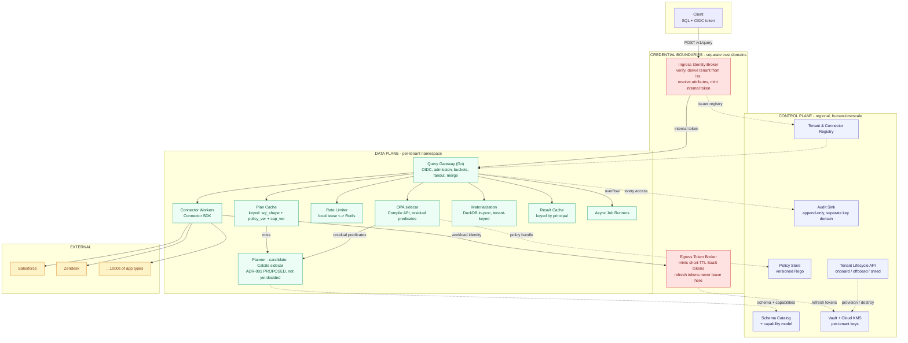
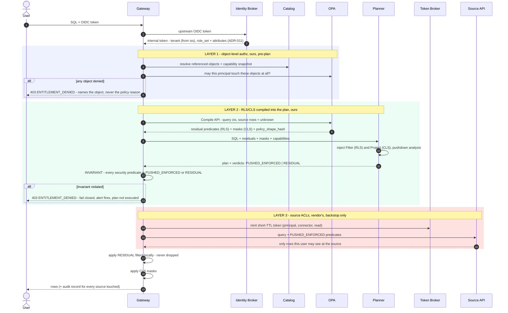
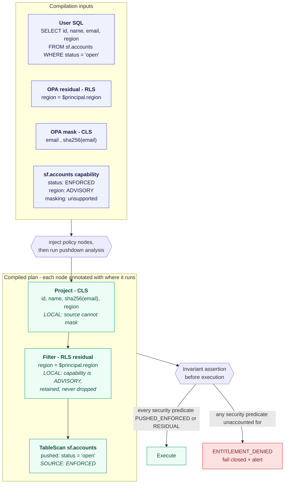

# Universal SQL Across Enterprise Apps - High-Level Design (condensed)

**Status:** Proposed | **Version:** 1.0-lean | **Date:** _(fill)_
**Scenario implemented in prototype:** Salesforce (accounts) JOIN Zendesk (tickets)

> Condensed companion to the full `DESIGN.md`. Same eleven decisions, same numbers, same
> rejections - trimmed to the argument each needs and no more. Where this document and the
> full one could ever diverge, the full `DESIGN.md` is canonical; this one exists to be read
> in fifteen minutes, not ninety. Rejected alternatives with their strongest steelman case are
> in `REJECTED_ALTERNATIVES.md`, not repeated here.

---

## 0. Executive summary

**Problem.** SQL across 1,000s of SaaS apps, executed live against source APIs on behalf of
the calling user, under that user's own permissions. 10M users, 1k QPS, P95 < 1.5 s, hard
multi-tenancy.

**The five decisions that carry the design.**

1. **Entitlements are three layers, ours first** (ADR-002). Object authz at admission, tenant
   policy compiled into the plan, source ACLs as a backstop that can only ever *narrow*.
2. **Policy compiles into the plan** via OPA partial evaluation - residuals become `Filter`
   and `Project` nodes before compilation, never post-filtering (ADR-002).
3. **Tenant is derived from the verified issuer, never from a claim** (ADR-011).
4. **Joins are semi-join rewrites first**, ephemeral in-process DuckDB second, with their own
   SLO (ADR-007).
5. **Terraform owns static infra; an API owns tenant lifecycle** (ADR-008). A plan/apply cycle
   has no latency bound tight enough to gate crypto-shredding (ADR-010), which has to
   complete in seconds.

**The one number I would measure first.** `result_cache_hit_ratio` against distinct principal
count. Per-user delegated tokens make entitlements correct essentially for free, but force
per-principal cache keys and collapse locality. The capacity model assumes 30%; at 10%,
connector quota - not our fleet - becomes the binding constraint. Measured in M2 (Section 5.3).

**Three decisions I would reverse on evidence.**

| Decision | Flip when |
|---|---|
| Planner runtime (ADR-001) - left open, decided by an M1 spike | Criteria in the ADR; the prototype's Go planner is already evidence |
| Per-principal caching (ADR-002) | `result_cache_hit_ratio` < 15% -> tenant snapshots or a mirrored permission graph |
| Ingress token exchange (ADR-011) | Exchange > 10% of P50 -> direct federation |

**What I deliberately did not build, and why.** Crypto-shredding, the Calcite sidecar,
distributed rate limiting, and token exchange are designed but not prototyped - none is
observable at two connectors and one node, and all four are infrastructure rather than the
mechanisms this design stakes a claim on. The prototype instead proves the three things a
reviewer cannot assume: the residual invariant catches a lying connector, the plan cache does
not leak across roles, and the semi-join rewrite cuts probe calls ~30x. Scope was chosen to
maximize proof per hour, not surface area.

---

## 1. Scope, assumptions, non-goals

**Building:** a federated query layer - SQL in, rows out, executed on demand against live
SaaS APIs on behalf of the calling user, under that user's own source-side permissions.

**Assumptions (if false, see Section 12):**

| # | Assumption | Drives |
|---|---|---|
| A1 | Connectors expose per-user delegated OAuth, not just service accounts | Source ACLs as our entitlement backstop (ADR-002) |
| A2 | Average result payload ~100 KB (100 MB/s / 1k QPS) | Egress, buffer, materialization sizing (Section 5) |
| A3 | ~70% of queries are single-source with full predicate pushdown | The P95 < 1.5 s SLO is scoped to these |
| A4 | Connector p95 latency 200-800 ms; a long tail exceeds 2 s | Timeout, partial-result, async design (ADR-009) |
| A5 | Tenants tolerate seconds-to-minutes staleness for most queries | Caching viable at all (ADR-005) |

**Non-goals for v1:** DML, DDL, window functions, CTEs, subqueries, cross-tenant queries,
joins wider than two sources, persistent copies of customer data.

**SQL surface:**

```sql
SELECT <projection>
FROM <connector>.<table> [ JOIN <connector>.<table> ON <equi-predicate> ]
WHERE <conjunctive predicates>
[ ORDER BY <col> [ASC|DESC] ] [ LIMIT n ] [ OFFSET n | CURSOR '<opaque>' ]
```

Conjunctive `WHERE` only. Disjunctions across sources are rejected at plan time
(`UNSUPPORTED_PREDICATE`) rather than silently degraded into a full scan - a full scan of a
SaaS API is a quota incident, not a slow query.

---

## 2. Architecture

**Plane separation rule:** anything in the per-request latency path is data plane. The
planner is per-request, therefore data plane, despite the intuition that "planning" sounds
like control-plane work (a self-correction - see Appendix A).

| Control plane (human timescale) | Data plane (request timescale) |
|---|---|
| Tenant & connector registry, schema catalog | Query Gateway, Query Planner |
| Policy store (authoring/versioning) | Policy Decision sidecar (OPA, partial eval) |
| Secrets & KMS key lifecycle | Connector workers, rate-limit enforcement |
| Audit sink, residency tags | Materialization runtime, async job runners, result cache |
| Tenant lifecycle API (ADR-008) | - |

**One exception.** The **Egress Token Broker** is in the egress path (data plane by the rule
above) but holds refresh tokens, which must never reach data-plane workloads. It runs as its
own trust domain - a credential boundary, not a scaling boundary.



**Request path, condensed** (`L1`/`L2`/`L3` = the three authorization layers of ADR-002; full
step-by-step sequence diagram is in `DESIGN.md` Section 2.3):

1. Identity Broker verifies the token's signature, derives tenant from `iss`, resolves
   roles/attributes, mints an internal token (ADR-011).
2. Gateway does **L1** object authz (may this principal touch these tables/columns at all?),
   then admission control.
3. Gateway calls OPA's Compile API for **L2** residuals + masks; on a plan-cache miss, the
   planner injects them as `Filter`/`Project` nodes and emits per-predicate pushdown verdicts.
4. Gateway binds principal params, asserts the residual invariant (fail closed), reserves
   rate-limit tokens, mints short-TTL SaaS tokens via the Token Broker.
5. Parallel fanout to connectors - **L3** is the source's own ACLs, a backstop that can only
   narrow. Residual (`ADVISORY`) filters and CLS masks are applied locally.
6. Join (if any) runs in-process DuckDB, build side = smaller relation. Audit record written.
   Response carries `rows + freshness_ms + rate_limit_status + trace_id`.

---

## 3. Architecture Decision Records

Each ADR: options actually in contention, the decision, the costs accepted, and the signal
that would flip it. Full steelman case for every rejected option is in
`REJECTED_ALTERNATIVES.md` - not duplicated here.

---

### ADR-001 - Planner runtime and placement

**Status:** PROPOSED - deferred to a two-week spike in M1 | **Contested:** high

The required capabilities are firm; the tool is not. Any candidate must provide: per-predicate
pushdown verdicts (`ENFORCED`/`ADVISORY`), residual provenance through optimization, filter/
projection injection before serialization, a serializable plan form (cache key + audit), and
p99 planning under 30 ms.

| Option | Rejected because |
|---|---|
| Trino / Starburst | Connector model targets JDBC/object storage, not SaaS REST with pagination/rate limits/OAuth refresh. Credentials are catalog-scoped, cutting against per-principal delegated OAuth. No per-tenant isolation without a cluster each. No rate-limit governance concept. |
| Steampipe / Postgres FDW | Single-tenant by construction. FDW pushdown is coarse - no per-predicate `ENFORCED`/`ADVISORY` contract. |
| **DataFusion (Rust)** - closest runner-up | Team-capability, not merit: no Rust depth on the team shape (Section 10), and "no second runtime" only holds if the *gateway* is also Rust - it isn't. |
| Go-native parser (vitess/pg_query_go) | Gives an AST, not an optimizer. We'd own correctness of capability-aware pushdown and residual tracking, the security-critical part. |
| GraalVM native-image Calcite | Native-image needs closed-world compilation, which fights Calcite's reflection - but only if the *executor* needs it too; we only need the *planner*. **Open spike question, not a settled rejection** - this is why ADR-001 itself is Proposed rather than Accepted. |
| Velox | Execution engine, not a planner - solves a problem we don't have. |
| Spark | Batch scheduler. Never a candidate at 500 ms P50. |

**Leading candidate (not yet a decision):** Calcite as an out-of-process sidecar, gRPC
transport, Substrait plan IR, fronted by the parameterized plan cache (ADR-003).

**Consequences we'd accept if confirmed.** Two runtimes in the build/image/on-call rotation.
Extra hop adds ~2-5 ms P50 and a worse tail; JVM GC pauses land directly in the synchronous
request path, so "Go isolates us from GC" is false - the plan cache is the real mitigation
(target ≤10% miss traffic reaching the sidecar). Cold pods plan slowly; pre-warm and exclude
the first N requests/pod from SLO accounting. Substrait doesn't cover every Calcite rel node;
uncovered plans fall back to a capped private extension type.

**Attribution before migration.** "Switch to DataFusion" is two decisions, not one: swapping
the sidecar runtime removes GC but keeps the hop; removing the hop needs a Rust gateway. A
gRPC round trip on loopback carrying a few-KB plan is sub-millisecond against a ~250 ms
connector call - the probable finding is that neither runtime is the constraint and cache hit
ratio is the lever, which is what Section 5.3 concludes independently.

**Decided by:** end of M1, by the planner owner, on spike evidence. The prototype ships an
in-process Go planner - sufficient for the v1 surface, and itself evidence for that option.

**Revisit if.** Plan cache hit ratio < 95% sustained; sidecar contributes > 15% of P95; a third
Substrait extension type is needed; we hire Rust depth.

---

### ADR-002 - Entitlement enforcement: mechanism and placement

**Status:** Accepted | **Contested:** high

**Context.** RLS/CLS derived from *both* source permissions and tenant policy, computed at
plan time - the brief's hardest requirement.

| Option | Rejected because |
|---|---|
| Post-filter results in Go (as the strategy) | Rows leave the source and enter our memory before being discarded - that's the leak, plus wasted quota. Kept as a *bounded fallback* (the `ADVISORY` residual path is exactly this), rejected only as the default. |
| Inject into the compiled Substrait plan | Substrait uses positional field refs; rewriting a binary plan by position fails silently under column reordering. |
| OPA as a policy blob store | Wastes OPA - the planner then reimplements Rego semantics itself. |
| Zanzibar (OpenFGA/SpiceDB) | Deferred, not dead - A1 lets source ACLs enforce themselves, so we don't need a mirrored tuple store. Revisit hard if A1 breaks. |
| Cedar | Comparable expressiveness and its own RFC 0095 uses residual-to-SQL as the motivating example - but both its partial evaluators sit behind experimental crate features, and the untyped one can return ill-typed residuals it can't safely simplify. OPA's Compile API is GA. Revisit when `tpe` stabilizes. |
| Sampling the runtime verification filter | A security control that runs 10% of the time lets a lying connector through 90% of the time. Not a control if it's probabilistic. |
| Pushing security predicates to `ADVISORY` connectors as an optimization | Safe against *under*-filtering (the common case), not *over*-filtering - an `ADVISORY` source silently dropping entitled rows is undetectable without a control fetch. We pay the bandwidth, keep the certainty. |
| Conformance tests instead of runtime verification | Catches our-code bugs at introduction, blind to vendor-side drift between runs. We run both, not either. |

**Decision.** Three layers, 1 and 2 ours and unconditional, 3 the source's and a backstop only.

1. **Tenant policy compiles into the plan** via OPA's Compile API (partial evaluation).
   Residuals become `Filter` (RLS) nodes, masks become `Project` (CLS) nodes, before Substrait
   compilation. This is the literal answer to "document how policies compile into plans."
2. **Object-level authorization at the gateway**, pre-plan: may this principal query this
   connector/table/column at all? Denied with `ENTITLEMENT_DENIED`.
3. **Source permissions as a final backstop** - the user's own delegated grant, so vendor ACLs
   apply natively, current by construction. This only ever *narrows* what 1-2 already allowed.



**The capability vocabulary.** Declared per `(table, column, operator)`, a claim *we* make and
prove with conformance tests - never self-reported by a connector at runtime.

| Label | Meaning | Pushed? | Local filter expects to drop |
|---|---|---|---|
| `ENFORCED` | Source *will* apply it; no violating row returns | Yes | **Zero** - non-zero means the connector diverged => fail closed |
| `ADVISORY` | Usually reduces volume, not trusted for correctness | Yes, as optimization only | Some - normal |
| *absent* | No filter exists | No | As many as needed |

**The runtime verification filter - a second mechanism.** The plan-time invariant catches
planner bugs; it does **not** catch a connector that declares `ENFORCED` and then ignores it -
that plan satisfies the invariant perfectly. So every `PUSHED_ENFORCED` **security** predicate
is re-applied locally after fetch. A trustworthy connector drops zero rows; any non-zero count
means the connector lied, and we fail closed. The realistic failure isn't vendor dishonesty:
it's our own connector sending `?region=EMEA` where the API expects `?filter[region]=EMEA`,
and most REST frameworks silently ignore unknown params and return the unfiltered set.

| Metric | Expected value | Meaning |
|---|---|---|
| `residual_filter_rows_dropped` | non-zero, steady | Normal cost of the `ADVISORY` path |
| `enforced_predicate_violations_total` | **must be zero** | A connector lied. Page immediately. |

**How a policy becomes plan nodes** - one predicate the source enforces, one it doesn't, one
mask it can't express:



`region` is the case worth studying: a **security** predicate the connector declares
`ADVISORY`, so pushing it would be unsafe but dropping it would leak. It's pushed nowhere and
retained as a local `Filter` above the scan - the price of correctness against a connector we
cannot trust to filter.

**Token custody.** Clients never see a SaaS token; only OIDC to us. Refresh tokens live in the
control plane's secrets layer (Vault, tenant KEK-wrapped), never the data plane. The egress
token broker mints short-TTL access tokens, memory-only, never logged/cached/traced. Highest-
risk connectors use the stronger variant: the worker never holds the bearer token at all - the
broker attaches credentials and performs the call itself.

**The result cache key, precisely.** `(tenant_id, principal_id, connector, table, sorted output
columns, sorted bound filter values)`. Our own RLS/CLS don't force this - a residual filter
re-applies on every read regardless of cache state, so two principals sharing a *role* never
leak past layers 1-2 through a shared entry. Principal has to be in the key because of **layer
3**: with per-user delegated OAuth, the source applies its *own* sharing rules under the
calling principal's own token, and those can differ per user for an identical query (e.g.
Salesforce record ownership - per-user, not per-role). A cache keyed coarser than principal
defeats that narrowing: a broader-access principal's cached rows served to a narrower one is a
real leak through the cache, not through the plan. This is also why `role_set_hash` (ADR-003's
key for the *plan* cache) isn't sufficient here - the plan cache can key on role because our
own RLS/CLS is role-derived and deterministic; layer 3 answers to the individual.

**Consequences we accept.**
- **Caching collapses.** Per-user tokens force per-principal result-cache keys, so hit ratio
  falls with users-per-tenant. This is the central tension in the whole system - entitlements,
  freshness, cache, and quota are one problem. Section 5 sizes it.
- Credential blast radius is bounded (short TTLs, per-purpose scoping, anomaly detection,
  kill switch) but not zero - a compromised worker can request tokens for active sessions
  during the compromise window. Still strictly better than one omnipotent service account.
- Residual local filtering costs CPU/memory on rows we then discard; over-projection (fetching
  columns only needed for a local predicate/mask) is a consequence of both filter paths.
- Connectors without delegated-token support fall back to service-account + explicit mirrored
  policy, with layer 3 absent entirely - which is exactly why layers 1-2 are never optional.

**Revisit if.** ≥30% of connectors lack delegated OAuth; per-principal cache hit ratio < 20%.

---

### ADR-003 - Plan caching and cache key

**Status:** Accepted | **Contested:** medium

**Context.** ADR-001's latency argument depends on a high hit ratio, and a plan carries policy
- those two facts conflict.

| Option | Rejected because |
|---|---|
| No plan cache | Pays JVM planning every request; the sidecar becomes indefensible. With the prototype's ~1 ms Go planner this is nearly the right answer - built anyway for the correctness lesson, since it also covers the result cache. |
| Key on SQL text alone | **Security defect** - a plan built under a privileged policy served to an unprivileged user. |
| Key on `(sql, user)` | Safe, hit ratio ~0 at 10M users. |
| **Parameterized cache** ← chosen | - |

**Decision.** Cache the DAG with parameter slots (`WHERE region = $principal.region`), bind
principal context at execution. Key:

```
(sql_shape_hash, tenant_id, policy_version, policy_shape_hash,
 connector_capability_version, role_set_hash)
```

Every component is load-bearing: a new column mask makes the DAG *structurally* wrong
(`policy_shape_hash`); two roles need different plan shapes (`role_set_hash`); capability
changes alter pushdown verdicts (`connector_capability_version`). Policy writes publish an
invalidation event; a 30 s TTL is a backstop against missed ones.

**What this is actually for, ranked honestly:** (1) tail-latency containment - GC pauses and
pathological plans hit only the miss population; (2) audit determinism - a cached plan's hash
in the audit trail proves what executed under which policy version; (3) fleet cost, ~2-3x, not
the order of magnitude an earlier draft claimed (Appendix A). Not a meaningful mean-latency
win: ~25 ms of a ~270 ms query is ~9%.

**Topology.** Per-pod LRU (no RTT, cold on scale-out) backed by a shared Redis tier holding
serialized plan blobs (~1 ms) - without it, autoscaling/rolling deploys reset hit ratio to
zero exactly when load is highest.

**Consequences we accept.** Attribute cache invalidation *is* plan cache invalidation (a role
change must flush both, or a stale plan carries stale entitlements). Cache key cardinality
grows with distinct role sets, not users - a tenant with pathological per-user roles degrades
toward the `(sql, user)` case. Invalidation is eventually consistent within the TTL window.

**Revisit if.** Hit ratio < 95% (the P95 trap - Section 5.2); a tenant exceeds N distinct role
sets; any incident traced to invalidation lag.

---

### ADR-004 - Connector strategy: build vs. buy

**Status:** Accepted | **Contested:** high

**Context.** The target is 1,000s of app types. An engineering lead's job is to answer whether
we build this.

| Option | Rejected because |
|---|---|
| Build all | 1,000 connectors against unversioned vendor APIs isn't a 6-month program - it's the whole company. Schema drift alone consumes the team. |
| Buy all (Merge/Nango/Paragon/Airbyte) | Unified-API vendors normalize to a lowest-common-denominator schema, rarely exposing per-field pushdown or per-user delegated auth - both load-bearing here. Buying everything means fetching wide and filtering locally, breaking quota *and* the entitlement model. |
| **Hybrid, split by whether pushdown matters** ← chosen | - |

**Decision. Build** (~10-20 connectors) where pushdown, delegated OAuth, rate-limit semantics,
and watermark support determine whether we hit SLOs at all - Salesforce, Zendesk, Jira,
GitHub, Google Workspace, Slack, Notion. **Buy** the long tail via a unified-API vendor behind
our own Connector SDK interface, so the vendor is an implementation detail of one `Connector`.

**Deployment and versioning.** The Connector SDK is a wire contract (gRPC or plain HTTP+JSON),
not a compiled-in language interface - a connector is its own deployable service, in whichever
language fits, registered in the control-plane catalog. That's what makes "connectors are
versioned" and fast onboarding real: no gateway rebuild per connector, and the same conformance
suite gates promotion regardless of who authored it.

**Consequences we accept.** The wire-protocol boundary adds a network hop per call, a version
registry, and a per-connector deploy pipeline instead of one release train - accepted because
it's what makes independent onboarding and versioning possible. Two connector tiers with
different capability ceilings, visible in admin UX and the catalog - long-tail connectors
advertise fewer `ENFORCED` predicates and do more residual local filtering, with looser SLOs.
Vendor pricing/limits/outages become ours, mitigated (not eliminated) by the SDK boundary.

**Revisit if.** Vendor per-call pricing exceeds build cost at our volume; >25% of tenant
queries hit long-tail connectors and suffer for it; connector count and update cadence stay
low enough (near the ~10-20 build tier) that the RPC boundary is overhead without payoff.

---

### ADR-005 - Freshness: watermark capability ladder

**Status:** Accepted | **Contested:** medium

**Context.** Avoid materially stale data, honor `max_staleness`, without burning rate-limit
budget - the constraint that makes this hard.

| Option | Rejected because |
|---|---|
| Centralized streaming lake / CDC | Violates on-demand federated execution; centralizing tenant data makes crypto-shredding (ADR-010) far harder. We reject the *cross-tenant centralized* lake, not per-tenant bounded snapshots (which the brief does list, and which stay available for quota-hostile connectors under the same tenant key and shred path). |
| `SELECT MAX(updated_at)` probes | **Self-correction, withdrawn.** SaaS REST APIs don't accept SQL. Also blind to hard deletes - an update-timestamp watermark leaves a deleted record visible in cache indefinitely. |

**Decision.** A four-rung capability ladder, declared per connector in the catalog:

| Rung | Mechanism | Cost | Delete-safe |
|---|---|---|---|
| 1 | Native `ETag`/`If-Modified-Since` | 1 call, 304 on hit | Yes |
| 2 | Change/event feed or cursor API | 1 call | Yes |
| 3 | `updated_after` filter + 1-row watermark | 1 call | **No** - pair with periodic full refresh |
| 4 | None - TTL only | 0 calls | No |

**Quota accounting.** A rung-1/2/3 probe **spends a rate-limit token**, charged to the same
bucket as a data fetch and visible in `rate_limit_status`. Freshness that silently consumes
quota is a quota leak with good PR.

`max_staleness` semantics: within TTL → serve cached. Outside TTL → probe at the connector's
best rung; unchanged → serve cached and reset TTL; changed or rung-4 → live fetch. If a probe
would exceed budget → `STALE_DATA` with actual age, so the caller decides.

**Consequences we accept.** Rung-3/4 connectors can omit deletions for up to the full-refresh
interval, disclosed in the catalog and per-query in `freshness_ms`. Under pressure we degrade
to TTL-only and say so via `STALE_DATA` rather than silently.

**Revisit if.** Deletion-visibility complaints from any tenant; probe traffic > 15% of budget.

---

### ADR-006 - Rate limiting and multi-tenant fairness

**Status:** Accepted | **Contested:** medium

| Option | Rejected because |
|---|---|
| In-memory per-pod buckets | **Self-correction** - N autoscaled pods means the effective limit is Nx configured. Failure mode is the connector banning our API key, a cross-tenant outage. |
| Redis on every decision | Correct accounting, but an RTT on every request and shared fate with Redis. |
| Envoy ratelimit service | Solid, but doesn't model per-connector budgets shared across sync *and* async paths. |
| **Local lease ↔ Redis reconciliation** ← chosen | - |

**Decision.** Three enforcement layers: (1) **token buckets** per `(connector, tenant, user)`,
Redis-backed, leased in slices to each pod, reconciled async - steady state costs no RTT;
(2) **concurrency semaphores** per connector/tenant, bounding in-flight work, which is what
actually protects a source; (3) **bounded fair queues + admission control**, since semaphores
alone don't stop a tenant queuing behind its own backlog - the queue is how we allocate the
scarce upstream-connector-concurrency resource fairly.

**Redis failure policy.** On unavailability, **fail closed to the last known local lease** -
no new budget issued. Fail-open risks a connector-wide ban affecting every tenant.

**Overflow.** `429` + `Retry-After` naming the connector/window/async option. With
`Prefer: respond-async`, enqueued to job runners, returns `202` + poll URL.

**Consequences we accept.** Leasing wastes unused slices - we run at ~85-90% of true budget,
a tuning knob trading utilization against Redis load.

**Revisit if.** Utilization < 80%; any connector ban incident; queue wait dominates P95.

---

### ADR-007 - Join strategy

**Status:** Accepted | **Contested:** medium

**Decision.** Two-tier, chosen by the planner from cardinality estimates and capability. This
applies even when both tables share a connector - the capability model has no notion of join
pushdown, so `sf.accounts JOIN sf.opportunities` gets the same treatment as a cross-app join.

| Option | Rejected because |
|---|---|
| Naive dual full fetch | 505 calls vs. 17 on our fixture - only competitive at poor selectivity, where the semi-join loses too. |
| Container per join (DuckDB) | Cold start alone can consume the entire 1.5 s P95 budget. |
| ClickHouse | It's a server with a lifecycle; we need a join engine creatable/destroyable in milliseconds inside the request. Flips if materialized volumes outgrow one node. |
| Spill to disk on memory exhaustion | Trades a fast failure for a slow one inside a 1.5 s budget, and creates an encrypted-temp-storage obligation for data that shouldn't persist. We reject with `RESULT_TOO_LARGE` + a cardinality estimate instead. |
| Native join pushdown for same-source joins (e.g. SOQL relationship subqueries) | Genuinely faster when both tables share a connector, but adds a second per-connector capability dimension ("which join shapes can this source push down") for every connector - real scope against 1,000s of app types, most without an equivalent. Revisit if same-source joins dominate volume. |

1. **Federated on the fly (preferred) - semi-join rewrite.** Fetch the smaller side, push its
   join keys into the larger side as an `IN` predicate. **The reduction equals join-key
   selectivity on the probe side, and nothing else** - on our fixture (500 accounts, 50,000
   tickets, 2.4% selectivity), 505 → 17 calls (29.7x). At low selectivity it saves nothing and
   adds chunking overhead. Adaptive fallback (probe the first chunk, measure, abandon if poor)
   needs catalog statistics we don't have yet.
2. **Short-lived materialization (fallback).** In-process DuckDB, explicit `memory_limit`, temp
   dir on tenant-encrypted ephemeral storage, reset after every query.

**Consequences we accept.** Cross-app joins get their own SLO - **P95 < 4 s**, separate from
the 1.5 s single-source target (folding them in would be dishonest measurement). Materialized
volumes incur egress cost and a residency obligation federated execution avoids.

**Revisit if.** > 20% of joins fall back to materialization; memory rejections become a common
support burden.

**Open question: `LIMIT`/`OFFSET`.** Listed in the SQL surface (Section 1), not designed past
the grammar, and not implemented - the prototype silently ignores either if present, a gap
rather than a considered cut. Two questions, likely different answers: (1) single-source
pushdown (stop paginating once `LIMIT+OFFSET` rows are in hand) is a real win, worth folding
`Limit`/`Offset` into the result cache key *on that path only*, since the fetched bytes then
genuinely differ per value; (2) pushing `LIMIT` into a cross-app join is unsound (you don't
know which build rows survive the join until you've joined), so the join path can only
truncate post-join - `LIMIT` gives it **zero execution-cost relief**, worst on a skewed join.
The keys must therefore diverge too: single-source folds `Limit`/`Offset` in, join-side leaves
it out (those fetches are byte-identical regardless of the final `LIMIT`, so keying on it
would fragment the cache for nothing). The sharper unresolved risk isn't `LIMIT` at all - it's
that `RESULT_TOO_LARGE`, this ADR's own memory guardrail against a skewed join, was specified
above and never built. *Revisit if:* `LIMIT`/`OFFSET` is requested, or a skewed join causes an
incident - whichever comes first decides which half gets built.

---

### ADR-008 - Tenant lifecycle: Terraform vs. Control Plane API

**Status:** Accepted | **Contested:** low-medium

**Decision.** Terraform owns **static infrastructure**; a Control Plane API owns **tenant
lifecycle**.

| Option | Rejected because |
|---|---|
| `terraform apply` per tenant onboard/offboard | Doesn't scale to hundreds of customers; makes off-boarding latency a function of a plan/apply cycle; crypto-shredding cannot be gated on Terraform state. |

`/global-control-plane` and `/shared-data-plane` are Terraform. `/tenant-resources` is
Terraform **only for single-tenant deployments** (a dedicated VPC/cluster). Multi-tenant
onboarding - namespace, KMS key, quota, policy binding, residency tag - is API-driven and
completes in seconds. Both deployment modes run the *same* module/Helm charts, parameterized;
only Terraform variables differ.

**Consequences we accept.** Two provisioning paths to keep behaviorally identical, needing a
conformance test. Single-tenant customers still carry per-customer Terraform state.

---

### ADR-009 - Streaming, timeouts, and partial results

**Status:** Accepted | **Contested:** medium

| Option | Rejected because |
|---|---|
| Chunked transfer + status code | Once bytes are on the wire the HTTP status is already sent - a mid-stream `SOURCE_TIMEOUT` can't surface as an error status. |
| HTTP trailers | Correct in spec, inconsistently supported by intermediaries. |

**Decision. NDJSON with a terminal metadata frame.** Rows stream as they arrive; the final
frame always carries status, `freshness_ms`, `rate_limit_status`, `trace_id`, and
`partial: true|false` with per-source detail. A truncated stream without the terminal frame is
a failure, not a short result.

**Two execution paths, stated plainly:** **streaming** (single-source pushdown, rows flow
immediately) vs. **buffered** (joins, `ORDER BY`, aggregation, residual filtering - all
blocking, nothing streams). Claiming "we stream results as they arrive" without this
distinction is wrong for every query with a join or a sort - this was itself a self-correction
(Appendix A).

Timeouts budget top-down: request → per-source → per-page, so one slow page can't consume the
whole request. A source exceeding budget is cancelled; partial rows retained where valid
(streaming path only); terminal frame reports `SOURCE_TIMEOUT` for that source.

**Consequences we accept.** Clients need a slightly smarter reader than "parse one JSON body."
Partial results only exist on the streaming path - joins return the error instead.

---

### ADR-010 - Keys, crypto-shredding, and the audit conflict

**Status:** Accepted | **Contested:** medium

**Decision.** Two-level envelope encryption: per-tenant **KEK** in cloud KMS wrapping
per-object **DEKs**. Off-boarding destroys DEKs and **disables the KEK / revokes all grants
immediately**, then schedules KEK destruction.

**Why "instantly destroy the KMS key" is wrong (self-correction).** AWS KMS enforces a 7-30
day waiting period; GCP a comparable scheduled-destruction window - you cannot destroy a key
on demand. What you *can* do instantly is disable it and revoke grants, rendering every DEK
unwrappable and all ciphertext unreadable within seconds; scheduled destruction completes
async. Same effect, correct mechanism.

**The conflict nobody mentions.** Crypto-shredding a tenant destroys their data - but the same
requirements demand audit logs/access trails that must survive off-boarding for compliance.
Shredding the tenant key would shred the proof we handled their data correctly.

| Option | Rejected because |
|---|---|
| Shred audit under the tenant key | Destroys the record proving we handled the tenant's data correctly - the compliance obligation that survives off-boarding. |

**Resolution.** Audit records live in a **separate key domain**, not covered by the tenant
shred. Tenant-identifying fields inside audit records are **tokenized**, not tenant-key
encrypted. Off-boarding destroys the token↔identity mapping: the trail survives as a complete,
verifiable record of *what happened*, while re-association with a named individual is
destroyed.

**Also on off-boarding.** Cancel in-flight jobs, drain async queues, invalidate plan/result
caches, revoke connector OAuth grants, emit a completion attestation.

**Consequences we accept.** The audit key domain is a residual data footprint after shredding,
documented explicitly. Break-glass access to it requires two-person approval and is itself
audited.

---

### ADR-011 - Identity, tenant derivation, and attribute resolution

**Status:** Accepted | **Contested:** high

**Context.** The gateway receives an OIDC token from a *customer's* IdP. Policy evaluation
(ADR-002) needs principal attributes, and the plan cache key (ADR-003) is partly derived from
them. Where those attributes come from decides whether the entitlement chain is trustworthy.

| Option | Rejected because |
|---|---|
| Trust token claims (`tenant_id`, `roles`, `region` straight from the token) | **Security defect.** A trusted `tenant_id` claim is a cross-tenant read - anyone who can mint a token, including a customer's own IdP admin, can assert `tenant_id: t_competitor`, and OPA evaluates it faithfully. Group claims are also unreliable at scale (Entra emits GUIDs, drops the list past ~200 groups). Custom claims like `region` are rarely present. Claims can't be revoked short of expiry. |
| Direct federation | Viable and simpler, but every downstream component must tolerate per-IdP claim quirks forever. **Kept as fallback** for compliance regimes that forbid re-issuing identity. |
| mTLS / client certificates | Wrong ergonomics for end users; carries no attributes. |
| **Ingress token exchange (RFC 8693)** ← chosen | - |

**Decision.** Admission is three steps, then an exchange: (1) **verify** signature against
JWKS pinned per registered issuer, validate `aud`/`exp`/`nbf`, confirm `iss` maps to exactly
one tenant; (2) **derive tenant from the verified `iss`**, never a claim; (3) **resolve
attributes** - roles from the tenant's group→role map, other attributes from the authoritative
owner declared *per attribute* in tenant config (which may be the IdP, or a source system -
e.g. `region` may live in Salesforce, not the IdP). Then **exchange** the upstream token for
one we mint, carrying a normalized claim contract every downstream component reads.

**Naming.** This is the **ingress identity broker** - distinct from the **egress token
broker** of ADR-002, which mints SaaS credentials. Opposite directions; easy to conflate.

**Consequences we accept.** Authorization staleness becomes an explicit SLO (attribute cache
TTL 60 s, published, alertable, with synchronous invalidation for urgent revocation) rather
than an accident of token lifetime. Attributes resolved from source systems spend that
source's rate-limit budget, on a separate cache/budget line so a login storm can't starve
queries. A directory outage degrades to cached attributes until TTL, then fails closed with
`PRINCIPAL_UNRESOLVED`. **`role_set_hash` is computed from resolved attributes, so attribute
cache invalidation is plan cache invalidation** (ADR-003) - a role change must flush both.
We now operate an issuer: signing key rotation and JWKS publication become our problem.

**Revisit if.** Exchange contributes > 10% of P50; a tenant needs an attribute the exchange
can't normalize; a compliance regime requires direct federation.

---

## 4. Security, isolation, compliance

**Threat model (STRIDE), condensed:**

| Threat | Key vector | Mitigation |
|---|---|---|
| Spoofing | A customer IdP admin asserting `tenant_id: t_competitor` | Tenant derived from verified `iss`, never a claim (ADR-011); per-issuer JWKS pinning; mTLS + SPIFFE internally |
| Tampering | Modified plan in transit; policy bundle substitution | Plans over mTLS gRPC only; OPA bundles signed and verified before load |
| Repudiation | Tenant disputes a cross-system access | Append-only audit: principal, tenant, connector, predicate digest, `policy_version`, `attribute_source`, residency tag, `trace_id` - separate key domain (ADR-010) |
| Information disclosure | RLS bypass via a dropped predicate; cross-tenant plan cache bleed | The `ENFORCED`/residual invariant (ADR-002); `policy_shape_hash` + `role_set_hash` in the cache key (ADR-003); predicate digests, never literals, in logs |
| Denial of service | Fanout amplification; cache stampede; one tenant exhausting shared quota | Admission control + bounded fair queues (ADR-006); singleflight on cache fill; per-tenant budgets |
| Elevation of privilege | Stale plan carrying superseded policy; connector token reuse | Policy-version invalidation + 30 s TTL backstop; delegated tokens scoped per principal, never cached across principals |

**Pen-test priority targets:** plan cache key collision, residual-filter bypass via a lying
connector, audit completeness across off-boarding.

**Isolation.** Namespace per tenant, `NetworkPolicy` default-deny; per-tenant KMS keys
(ADR-010); per-tenant storage prefixes with SSE-KMS; optional single-tenant clusters
(ADR-008); mTLS everywhere.

**Residency.** Every tenant carries a residency tag, enforced at job placement, materialization
(DuckDB temp storage bound in-region - an obligation ADR-007's fallback path creates that
federated execution avoids), and audit routing. A plan crossing a residency boundary is
rejected at plan time with `RESIDENCY_VIOLATION`, not caught at execution.

---

## 5. Capacity and performance sizing

**Baseline.** 100 MB/s / 1,000 QPS → ~100 KB average result payload (A2).

| Query class | Share | Mean service time |
|---|---|---|
| Cache hit | 30% | 20 ms |
| Single-source, pushdown, plan-cache hit | 55% | 270 ms |
| Cross-app join | 15% | 600 ms |

Weighted mean **W ≈ 245 ms**. By Little's Law, **L = 1,000 × 0.245 ≈ 245 concurrent queries.**

| Resource | Derivation | Size |
|---|---|---|
| Gateway pods | I/O-bound Go, ~100 QPS/pod at 4 vCPU/8 GB | 20-24 pods, 3 AZs |
| Planner sidecars | 10% miss × 1,000 QPS, Calcite ~25 ms → L≈2.5 | 4-6 pods, floored by HA not load. Uncached: ~10-12 pods - the cache saves ~2-3x fleet, not an order of magnitude |
| Connector concurrency | ~935 calls/s at p95 0.8 s → L≈748 | ~750 concurrent outbound, per-connector semaphore |
| Materialization memory | 150 QPS × 0.6 s × 256 MB | ~23 GB fleet-wide, capped 8 joins/pod |
| Redis | Lease reconciliation, ~500 ops/s | Single 3-node cluster, under-utilized |
| Network | 100 MB/s egress ≈ 800 Mbps + connector ingest | Budget 2 Gbps sustained |

**The percentile trap.** At a 90% plan-cache hit ratio, the *miss population is the P95* - by
definition the 95th-percentile request is a miss, so planner latency lands in the SLO
undiminished. Keeping the planner out of P95 needs ≥95% hit, realistically ~98%.

**The sensitivity that matters (Section 5.3).** The 30% cache hit ratio is the weakest number
here, because ADR-002's per-principal keying means hit ratio degrades as users-per-tenant
grows.

| Cache hit ratio | Mean W | Concurrency L | Connector calls/s |
|---|---|---|---|
| 30% (planned) | 245 ms | 245 | ~935 |
| 10% (pessimistic) | 308 ms | 308 | ~1,200 |
| 0% (worst case) | 320 ms | 320 | ~1,300 |

Concurrency is tolerant (moves 30%). **Connector call volume is not**, and connector quota is
a hard external ceiling we cannot autoscale past. If hit ratio lands at 10%, the binding
constraint becomes vendor rate limits, forcing negotiated quota increases or the tenant-scoped
snapshot path (ADR-005). **This is the single most important number to measure, in M2.**

**Autoscaling/backpressure.** HPA on in-flight-requests-per-pod, not CPU (I/O-bound workload).
Scale-out on queue-depth p95 > 50 ms; 10-min stabilization window against thrash. Backpressure
propagates inward: connector semaphore saturation → fair queue → admission control → `429`.
Overload sheds the *newest* low-priority work first - shedding an in-flight query that already
spent connector budget wastes the quota twice.

---

## 6. SLOs and error budget

| SLI | Target | Scope |
|---|---|---|
| Gateway availability | 99.9% monthly (~43 min) | Excludes upstream source faults |
| Latency, single-source pushdown | P50 < 500 ms, P95 < 1.5 s | As specified |
| Latency, cross-app join | P95 < 4 s | Separate SLI (ADR-007) |
| Freshness accuracy | 99% within declared `max_staleness` | Per connector rung |

We depend on OPA, Redis, Postgres, a JVM sidecar, and third-party APIs individually less
available than 99.9% - a naive serial calculation makes 99.9% unachievable. So: **upstream
source faults are excluded from the availability SLI**, surfaced instead as typed errors
(`SOURCE_TIMEOUT`, `CONNECTOR_AUTH_FAILED`) naming the source. Internal dependencies are *not*
excluded - Redis fails closed to local leases (ADR-006), the plan cache degrades to direct
planning rather than erroring.

**Error budget policy.** < 50% consumed → normal velocity. > 50% → no non-critical config
changes to the query path. > 75% → feature freeze, reliability work only. Exhausted → freeze +
written review. Per-pod warmup exclusions (ADR-001) capped at 0.1% of requests, audited
monthly.

---

## 7. Error vocabulary and UX

| Code | HTTP | Meaning | Message must contain |
|---|---|---|---|
| `RATE_LIMIT_EXHAUSTED` | 429 | Budget spent | Connector, window, reset time, `Retry-After`, async instructions |
| `STALE_DATA` | 200 | Served outside `max_staleness`, probe would exceed budget | Actual age, why, how to force a live fetch |
| `ENTITLEMENT_DENIED` | 403 | Policy or source ACL denied | Which resource; never *why* in policy terms |
| `SOURCE_TIMEOUT` | 200 + terminal frame | A source exceeded its budget | Which source, partial-result status |
| `UNSUPPORTED_PREDICATE` | 400 | Plan would require a full scan | Which predicate, suggested rewrite |
| `RESULT_TOO_LARGE` | 400 | Materialization would exceed guardrail | Estimated cardinality, suggested narrowing |
| `CONNECTOR_AUTH_FAILED` | 502 | Token refresh failed / grant revoked | Connector, re-consent link |
| `SCHEMA_DRIFT` | 409 | Source schema changed under a pinned version | Field, old vs new, connector version to upgrade to |
| `PRINCIPAL_UNRESOLVED` | 503 | Attribute resolution failed, cache expired - fail closed | Which attribute, owning system, retry guidance |
| `RESIDENCY_VIOLATION` | 403 | Plan would move data across a boundary | Which tag, which step |

Every response - success or failure - returns `freshness_ms`, `rate_limit_status`, `trace_id`.
Every message names what to do, not just what broke.

---

## 8. Deployment and operations

**IaC/CD.** Terraform: `/global-control-plane`, `/shared-data-plane`, `/tenant-resources`
(single-tenant only - ADR-008). Identical Helm charts across modes. Argo Rollouts canary
5%→25%→50%→100%, each step gated on a Prometheus analysis template. Automatic rollback on
P95 > 1.5 s, error rate > 1%, or **`ENTITLEMENT_DENIED` rate deviating from baseline** - the
last one is a correctness canary, not a performance one, and the one worth having.

**DR/BCP.**

| Component | Strategy | RPO | RTO |
|---|---|---|---|
| Control plane (Postgres) | Multi-AZ + cross-region async replica, PITR | 5 min | 30 min |
| Data plane | Stateless, multi-AZ active/active | 0 | < 10 min |
| Materialization | Ephemeral by design | N/A | N/A |
| Audit sink | Cross-region replicated, append-only | 0 (sync) | 15 min |
| Secrets/KMS | Cloud-managed multi-region | 0 | < 5 min |

Region strategy: active/passive for v1 - active/active is deferred because per-tenant
residency tags (Section 4.3) make global routing a compliance problem, not just a traffic one.

**Runbooks (condensed).** *Rate-limit flood* - identify the tenant via per-tenant counters,
reduce its lease slice, escalate to vendor only if the budget itself is wrong. *Connector auth
failure* - distinguish expired refresh token (re-consent) from revoked grant (never auto-retry
- it accelerates lockout) from vendor outage. *Cache stampede* - singleflight should prevent
it; if it fires, look for synchronized TTL expiry, apply jitter. *Off-boarding verification* -
run the attestation check: DEKs destroyed, KEK disabled, grants revoked, jobs cancelled,
caches invalidated, audit tokens unmapped.

**Cost guardrails.** Attributed per tenant per query (connector calls, egress bytes,
materialization GB-seconds, planner CPU-ms). Alerts at 50/80/100% of monthly budget; at 100%
the tenant is throttled, not cut off. **Levers, by impact:** (1) raise cache hit ratio - but
it fights ADR-002, the real tension; (2) semi-join rewrites (ADR-007); (3) freshness rung
upgrades turning fetches into 304s; (4) async reroute moving peak load into troughs.

---

## 9. Observability

**Traces (OpenTelemetry).** One span per stage: `gateway.admission` → `policy.compile` →
`plan.cache` → `plan.build` → `ratelimit.reserve` → `connector.fetch` (one child per source,
tagged connector/version/page-count/304-or-not) → `residual.filter` → `join.execute` →
`response.emit`. `connector.fetch` is the span that matters - it's what proves the SLO is
dominated by external latency, not our own overhead.

**Metrics (Prometheus).** `query_duration_seconds` (by class, tenant),
`connector_request_duration_seconds` (by connector, version, outcome), `plan_cache_hit_ratio`,
`rate_limit_budget_remaining`, `entitlement_denials_total`, `freshness_age_seconds`,
`materialization_memory_bytes`, `attribute_resolution_duration_seconds`,
`attribute_cache_age_seconds` (ADR-011's authorization-staleness SLO),
`residual_filter_rows_dropped` (expected non-zero), **`enforced_predicate_violations_total`**
(must be zero - the real alarm).

**`result_cache_hit_ratio` is derived, not stored.** The raw signal is a counter,
`result_cache_requests_total{tenant, connector, outcome}` (`outcome` = `hit`/`miss`), and the
ratio is a PromQL `rate()` over it - `sum(rate(...{outcome="hit"}[5m])) / sum(rate(...[5m]))` -
so every consumer (an alert, a dashboard, the Section 5.3 M2 measurement) picks its own window
over one signal instead of us baking in the wrong one. `principal` lives in the *cache key*
(above) but not the metric label - a per-principal Prometheus label at 10M users is a
cardinality explosion the cache key doesn't have to worry about, since it's an in-memory map
key, not a metric series.

**Logs.** Structured, `trace_id` on every line, predicate **digests, never literals** - query
predicates contain customer data.

**The dashboard screenshot to submit:** a single trace of the cross-app join showing
`connector.fetch` spans for both sources. What it proves: the fanout is genuinely parallel,
our own overhead is a small fraction of wall-clock, and the SLO is bounded by external
latency - the same argument Section 5 makes numerically.

---

## 10. Six-month execution plan

**First two weeks - validate, unblock, decide, no architecture.** Confirm delegated per-user
OAuth actually works against Salesforce/Zendesk sandboxes (days 1-2 - if A1 fails, the
entitlement model's shape changes). Sample query-shape repetition from any existing telemetry
- this is the Section 5.3 number, and every capacity/cost figure moves with it (3-4). Confirm
real team headcount vs. reqs (5) - M1 scope is fiction until this is known; I'd rather cut M1
scope on day 5 than miss M2 with a full team's plan and half a team. Book the external
security review now - 6-8 week lead time (6-7). Open vendor conversations on rate-limit
ceilings and unified-API pricing (8-10). Walking skeleton in CI with the connector conformance
suite as the first test (11-14).

**How decisions get made after this document.** Any engineer opens an ADR; two days for
written comment, then the owning engineer decides - I decide only on ties or cross-team cost.
I'd expect **ADR-001, ADR-004, ADR-005** to get reopened (I hold them weakly or they're
judgment calls with no data yet); I'd defend **ADR-002 and ADR-011** hard - both are security
invariants, and relitigating them mid-build costs more than any design gain.

**Team shape:** EM (1), Backend (3 - gateway+ratelimit / planner+policy / connector SDK),
Infra (1), Security (1), QA (1), Product (0.5), DX (0.5). The backend split is by *seam*, not
feature, so the `ENFORCED`/`ADVISORY` capability contract between planner and SDK has an owner
on both sides from day one - it's the interface most likely to rot.

**Milestones:**

| M | Focus | Exit criteria |
|---|---|---|
| **M1** | Connector SDK v0; Salesforce + Zendesk; entitlement skeleton; identity broker (JWKS verify + issuer→tenant + attributes, ADR-011); `SELECT/WHERE/LIMIT`; rate-limit guardrails | Live single-tenant demo; SDK conformance passes both connectors; a forged `tenant_id` claim is ignored; an invalid/expired signature is rejected before tenant derivation |
| **M2** | Planner + pushdown; plan cache; freshness rungs 1-3; NDJSON streaming (single-source); per-tenant KMS; Tenant Lifecycle API v0 (ADR-008); crypto-shred disable+revoke (ADR-010); token exchange (ADR-011) | **P95 < 1.8 s** single-source; **plan cache hit > 95%**; **`result_cache_hit_ratio` measured against real traffic - the most important output of M2**; trace shows connector time; tenant onboarded via API in <10s |
| **M3** | Policy DSL via OPA partial eval; async overflow; full error vocabulary; audit trail; first buy-tier connector (ADR-004) | RLS/CLS: 0 leaks across 50 adversarial cases; plan-time invariant **and** runtime verification filter both tested; buy-tier connector passes the same SDK conformance suite |
| **M4** | Autoscaling; materialization (ADR-007); Helm/Terraform complete; DR basics | 1k QPS sustained 60s within SLO; join P95 < 4 s; `RESULT_TOO_LARGE` fires correctly; a slow join source returns `SOURCE_TIMEOUT` outright, not a partial (ADR-009) |
| **M5** | Multi-tenant hardening; fairness; audit/alerts; cost guardrails | Tenant A at 10x budget doesn't degrade tenant B's P95 by >10%; cost attribution accurate within 5%; off-boarding attestation passes |
| **M6** | GA criteria; chaos drills; security review; onboarding playbook | Chaos (Redis loss, connector 429 flood, planner pod loss) degrades gracefully; external security review, no criticals; connector onboarded by an outsider using only docs |

**Sequencing rationale.** Entitlements (M3) land after the planner (M2) because policy
compiles into plans - building it twice would be worse. Tenant Lifecycle and crypto-shred land
in M2, not M5, because M5's own exit criteria already assumes off-boarding attestation exists.
The riskiest measurement (cache hit ratio) is pulled to M2 because it can invalidate the
capacity model.

**Risk register (top five):**

| Risk | Mitigation | Trigger |
|---|---|---|
| Result cache hit ratio far below 30% | Measure in M2, not M5; fallbacks: tenant snapshots, negotiated quota, semi-join rewrites | < 15% in M2 |
| Connector capability variability | Capability model degrades gracefully; tiers visible in UX | > 30% of predicates land `ADVISORY` |
| Quota exhaustion / vendor ban | Fail-closed leases; per-tenant budgets | Any ban, or budget > 80% sustained |
| Schema drift breaking pinned connectors | Versioned connectors; nightly contract tests | Any drift reaching production |
| Delegated OAuth unavailable on key connectors | Service-account fallback + mirrored policy | ≥2 of 10 built connectors lack it |

**Budget, order of magnitude.** ~$4-5k/month compute, ~$1k observability, and **egress
dominates everything else**: 100 MB/s sustained ≈ 260 TB/month ≈ $13-23k, but at a realistic
20% duty cycle ≈ $3-5k. Call it **~$12-20k/month excluding the unified-API vendor**. The
number that matters isn't the total - egress and vendor calls both scale with cache miss rate,
so Section 5.3 sets the budget as well as the architecture.

---

## 11. Requirements traceability

*Canonical - the README carries the same decision-register table, trimmed. If they diverge,
this one is correct.*

| ADR | Requirement (trimmed) | Rejected (for the final design) | Built (prototype) |
|---|---|---|---|
| **001** Planner (PROPOSED) | Capability discovery, pushdown, join plan, spill decision | Trino; DataFusion; Steampipe/FDW; Go-native parser; GraalVM Calcite; Velox; Spark | **n/a** - in-process Go planner is itself spike evidence |
| **002** Entitlements | RLS/CLS from source perms + tenant policy; document plan compilation | Post-filter in Go; inject into Substrait; OPA as blob store; Zanzibar; Cedar; sampled verification; pushing security predicates to `ADVISORY` | **Mostly** - injection, invariant, verification real; OPA + delegated OAuth mocked |
| **003** Plan cache | *(no direct requirement)* | No cache; key on SQL text; key on `(sql, user)` | **Yes** |
| **004** Build vs buy | Capability model, auth/refresh, pagination, error codes | Build all; buy all | **No** - both connectors mocked |
| **005** Freshness | Avoid stale data; per-query staleness hints; honor rate limits | Centralized CDC/lake; `MAX(updated_at)` probes | **Partial** - rungs 1 &amp; 4 + `max_staleness` |
| **006** Rate limits | Token buckets/concurrency pools; head-of-line avoidance | In-memory per-pod buckets; Redis on every decision; Envoy ratelimit | **Partial** - single-node bucket, 429, async reroute |
| **007** Joins | Federated vs. materialization; spill when necessary | Naive dual full fetch; container-per-join DuckDB; ClickHouse; disk spill; native same-source pushdown | **Partial** - semi-join yes, DuckDB no |
| **008** Tenant lifecycle | Multi/single-tenant, no code changes; instant off-boarding | `terraform apply` per tenant | **No** |
| **009** Streaming | Timeouts and partial results for slow sources | Chunked transfer + status code; HTTP trailers | **At risk** |
| **010** Crypto-shred | Per-tenant keys; automated shredding; audit trails | "Instantly destroy the KMS key"; shred audit under tenant key | **No** |
| **011** Identity | OIDC AuthN, policy AuthZ; token → scopes/roles → RLS/CLS | Trust token claims; direct federation (kept as fallback); mTLS | **Partial** - issuer→tenant real, signature mocked |

**Two patterns.** ADR-003 is the only entry with no requirement behind it, fully built, while
ADR-001 - the decision it partly serves - is not: its *latency* case depends on an expensive
planner; its *correctness* case (a bug class that also covers the result and attribute caches)
does not. Every unbuilt ADR (001, 004, 008, 010) maps to an *infrastructure* requirement -
planner runtime, vendor contract, Terraform, a KMS call; every fully built one maps to
*behavior under adversarial conditions*. We built what a reviewer cannot take on faith.

**Everything else the brief asks for, addressed but not requiring a recorded decision:** SQL
surface (§1), scale/latency/availability sizing (§5-6), autoscaling and cost guardrails (§5.4,
§8.4), IaC/canary/rollback (§8.1), isolation and residency (§4.2-4.3), STRIDE threat model and
pen-test readiness (§4.1), DR/BCP (§8.2), runbooks (§8.3), secrets/KMS/rotation (§4.2,
ADR-010), OTel/Prometheus/structured logs (§9), error vocabulary (§7), six-month plan (§10),
and the bonus asks - cost levers, chaos plan, predicate-pushdown creativity (§8.4, §10, ADR-007).

---

## 12. Decisions we are least confident about

**1. The planner runtime (ADR-001 + ADR-003).** Formally deferred - the only ADR still
Proposed. DataFusion was the closest runner-up, rejected on team capability, not merit. The
plan cache exists only to make a JVM sidecar viable, so a low hit ratio wouldn't mean "tune
the cache," it would mean ADR-001 was wrong. *Flip if:* hit ratio < 95% sustained, or sidecar
> 15% of P95.

**2. Per-principal caching vs. hit ratio (ADR-002 ↔ Section 5.3).** Delegated tokens give
correct, always-current entitlements essentially for free, but destroy cache locality. If real
traffic lands near 10%, connector quota - not our fleet - becomes binding, forcing tenant
snapshots or a mirrored permission graph (Zanzibar). *Flip if:* `result_cache_hit_ratio` < 15%
in M2. **This is the single most consequential unknown in the design.**

**3. Build-vs-buy split (ADR-004).** The 10-20/long-tail line is a judgment call with no data
yet. *Flip if:* >25% of tenant queries hit long-tail connectors and suffer measurably, or
vendor per-call pricing exceeds build cost at our volume.

**4. Token exchange vs. direct federation (ADR-011).** Exchange gives one claim contract
everywhere at the cost of an extra hop and operating our own issuer. Chosen for the
1000s-of-app-types case; at 10 customers it would be over-built. *Flip if:* exchange exceeds
10% of P50, or a compliance regime forbids re-issuing identity.

**5. `LIMIT`/`OFFSET` (ADR-007).** Genuinely undecided, not just unbuilt - listed in the SQL
surface, silently ignored by the prototype. Pushdown is a clean win for single-source queries;
pushing into a cross-app join is unsound, so `LIMIT` gives the join path no cost relief no
matter how it's built. The bigger gap isn't `LIMIT` - it's that `RESULT_TOO_LARGE`, ADR-007's
own guardrail against a skewed join exhausting memory, was never implemented. *Flip (build it)
if:* `LIMIT`/`OFFSET` is requested, or a skewed join causes an incident.

---

## Appendix A - What changed from earlier drafts (condensed)

Full interview-prep detail, with the strongest case for each corrected position, is in
`REJECTED_ALTERNATIVES.md`.

| Earlier position | Now | Why |
|---|---|---|
| Calcite planner labelled Control Plane | Data Plane | It's per-request, in the latency path |
| `SELECT MAX(updated_at)` probes | Four-rung ladder (ADR-005) | REST APIs don't take SQL; blind to hard deletes |
| OPA as a policy blob store | Compile API partial evaluation (ADR-002) | Residuals translate directly into `Filter`/`Project` nodes |
| "Instantly destroy the KMS key" | Disable + revoke now, destroy on schedule (ADR-010) | Cloud KMS enforces mandatory waiting periods |
| In-memory per-pod token buckets | Redis-backed leases, fail-closed (ADR-006) | N pods ⇒ Nx the configured limit ⇒ connector ban |
| "Stream results as they arrive" | Two paths: streaming vs. buffered (ADR-009) | Joins/`ORDER BY`/residual filters are blocking operators |
| Chunked transfer + status code | NDJSON + terminal metadata frame | Status is committed before mid-stream failure is known |
| DuckDB container per join | In-process DuckDB, memory-capped | Container cold start alone can exceed P95 |
| "Plan-time injection = zero leakage" | The `ENFORCED`/residual invariant (ADR-002) | Injection guarantees nothing if a connector ignores a pushed predicate |
| `terraform apply` per tenant | Terraform for static infra + single-tenant; API for lifecycle (ADR-008) | Doesn't scale; can't gate crypto-shredding |
| `tenant_id`/roles/region from claims | Derived from verified `iss` + resolved by the identity broker (ADR-011) | A trusted `tenant_id` claim is a cross-tenant read |
| Trino rejected for "no policy hook" | Rejected on connector model, credential scoping, tenant isolation | Wrong - Trino's `SystemAccessControl` SPI does provide row filters/column masks |
| Cedar rejected for "no partial evaluation" | Rejected on maturity | Wrong - Cedar has partial evaluation; RFC 0095 uses residual-to-SQL as its own example |
| DataFusion credited with "no second runtime" | Corrected: it's Rust, so no-hop needs a Rust gateway too | The language and planner choices are one decision |
| Plan-cache saving stated as ~25x | ~2-3x, floored by HA not load | Arithmetic error - concurrent ops conflated with pod count |
| Plan-cache hit-ratio target 90% | 95% | At 90%, the miss population *is* the P95 |
