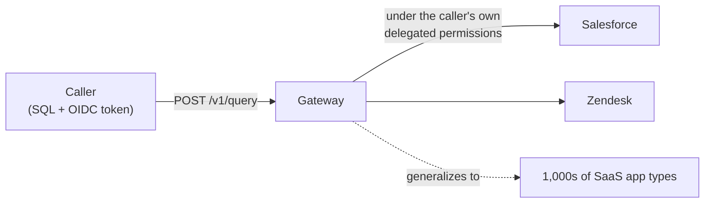
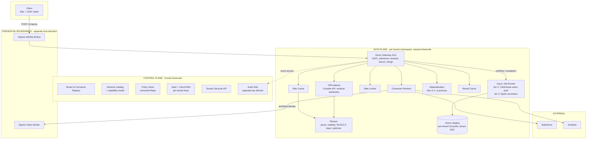

# Universal SQL Across Enterprise Apps — High-Level Design

**Read time:** ~5 min. This is the map, not the territory — every diagram and claim here is
expanded, sourced, and status-checked in [`DESIGN.md`](./DESIGN.md) (~35 min, condensed) and
[`DESIGN_FULL.md`](./DESIGN_FULL.md) (~90 min, canonical). [`CODE_MAP.md`](./CODE_MAP.md) is
where a decision here lands in actual code. If a sentence in this file and a sentence in one of
those disagrees, those are right and this file is stale — file it as a bug.

**In one paragraph.** SQL in, rows out, executed on demand against live SaaS APIs under the
calling user's own source-side permissions — not a copy, not a cache pretending to be the
source of truth. Three enforcement layers stand between a query and a row of someone else's
data. A four-rung freshness ladder decides when a cached answer is good enough without ever
spending API quota silently. A four-tier execution ladder routes a join to wherever its
estimated size actually fits, from an in-process merge to a distributed shuffle. Every number
in the design is derived from Little's Law backwards from a concurrency target, not asserted.

---

## 1. System context

One SQL surface over many independent, differently-shaped REST APIs. The gateway never becomes
a second source of truth — every query is a live fetch (or a short-TTL cache of one), never a
replicated warehouse a client queries instead of the real system.

---

## 2. Component architecture

Full diagram with every edge and the schema/capability/policy read paths:
[`DESIGN.md §4`](./DESIGN.md#4-architecture).

**Two credential boundaries that never see each other's data:**

| | Ingress Identity Broker | Egress Token Broker |
|---|---|---|
| Direction | Inbound — who is calling us | Outbound — who we call *as* |
| Produces | Normalized internal token | Short-TTL SaaS token, memory-only |

**Tiers 0–1 are in-process; tiers 2–3 are separate, standing compute** — a warm ClickHouse pool
and a serverless Spark account, both fed by S3 staging, which is why they're their own row
rather than something inside the gateway pod.

---

## 3. Request path, at a glance

One `POST /v1/query`, seven stages, all fail-closed on ambiguity rather than best-effort:

| # | Stage | Decides |
|---|---|---|
| 1 | **Identity** | Tenant from the verified issuer, never a claim. No credential → 401, not a default role |
| 2 | **L1 — object authz** | May this role touch this table at all? Rejected before any catalog or planner work |
| 3 | **Plan (or cache hit)** | RLS/CLS residuals injected as plan nodes (L2). A plan-time invariant re-checks this on *every* request, cache hits included |
| 4 | **Freshness** | Per side: within budget → serve cached, no outbound call; stale → probe or fetch live, always spending real quota, never a silent free check |
| 5 | **Execute** | Single scan, or the semi-join cascade across N sides, routed to a tier by an estimated working set |
| 6 | **Verify (L3)** | Every predicate a connector claimed to enforce is re-checked against the rows that came back — a connector that lied fails the request, not just the row |
| 7 | **Respond** | Rows, masked (CLS), plus `freshness_ms` / `rate_limit_status` / `trace_id` on every response |

Full call-order table with the exact symbol at each stage: [`CODE_MAP.md`](./CODE_MAP.md#the-request-path-in-call-order).

---

## 4. The join escalation ladder

The most distinctive piece of this design: a join is never "small" or "big" by table count —
it's routed by a cost-based estimate of its actual working set, computed at plan time.

| Tier | Fits when | Mechanism |
|---|---|---|
| **0. Single-table** | No join | Straight connector fetch |
| **1. In-process (DuckDB)** | Working set fits the gateway pod | Semi-join rewrite first (fetch the smaller side, chunk its keys into the larger side as an `IN` predicate — two independent, easily-conflated reductions: fewer calls, fewer rows), then a real join engine, one instance per query |
| **2. Shared warm pool (ClickHouse)** | Exceeds the pod, fits one node's memory | Async; input staged as encrypted Parquet on S3; one job at a time per node |
| **3. Serverless (Spark)** | Needs real distributed shuffle | Async; ephemeral executors, one tenant per job; cost is the only ceiling |

Tiers 2–3 share a staging mechanism but diverge sharply on tenant isolation: tier 2 reuses one
physical node across different tenants' jobs sequentially, so isolation is serialization plus a
verified reset between jobs and short-TTL, per-query cloud credentials — never a node-wide,
long-lived grant. Tier 3's isolation is by construction: fresh executors per job, destroyed at
teardown, nothing to reset. Full mechanism, alternatives considered (fresh-container-per-job,
microVMs, logical/ACL isolation, confidential computing, dedicated nodes), and why each one was
or wasn't chosen: [`DESIGN_FULL.md` ADR-007, "Tenant isolation for tier 2/3 async
jobs"](./DESIGN_FULL.md#adr-007---join-strategy-a-four-tier-escalation-ladder).

---

## 5. Built vs. proposed

This project is explicit that a design doc and a running system are different claims. At the
ADR level:

| Built and tested against real HTTP round trips | Designed, not built |
|---|---|
| Go planner, capability-aware pushdown, N-way semi-join cascade (tiers 0–1, DuckDB behind a build tag) | Calcite/Substrait planner (ADR-001) |
| RLS/CLS injection + plan-time invariant + runtime verification filter (ADR-002) | Real OPA engine, delegated OAuth |
| Parameterized, role-isolated plan cache (ADR-003) | Shared Redis tier for plan + result cache |
| Freshness rungs 1 (ETag) and 4 (TTL) (ADR-005) | Rungs 2 (cursor/replica) and 3 (watermark) |
| Single-node rate-limit bucket, `429`, async reroute (ADR-006) | Redis-backed leases, semaphores, fair queues |
| Tenant derivation from verified `iss`, 401/503 split (ADR-011) | JWKS signature verification |
| Real OTel trace + 2 of ~10 Prometheus metrics | The rest of §11's metrics; an access-log audit trail |
| — | Real Salesforce/Zendesk connectors (both mocked today), tier 2/3 (ClickHouse/Spark), tenant lifecycle API, per-tenant KMS + crypto-shred |

Full requirement-by-requirement table, functional and non-functional, every row sourced:
[`DESIGN.md §1`](./DESIGN.md#1-thp-requirement-coverage).

---

## 6. Where to go next

| Question | Go to |
|---|---|
| "Why this decision and not that one?" | [`DESIGN.md` §5, the eleven ADRs](./DESIGN.md#5-the-eleven-decisions) |
| "What did you actually consider and turn down?" | [`REJECTED_ALTERNATIVES.md`](./REJECTED_ALTERNATIVES.md) |
| "Where does this live in code?" | [`CODE_MAP.md`](./CODE_MAP.md) |
| "Does the capacity math hold up?" | [`DESIGN.md` §6](./DESIGN.md#6-capacity-and-performance) |
| "Can I run this myself?" | [`README.md`](./README.md) quickstart + appendix |
| "What's the weakest part of this design?" | [`DESIGN.md` §13, decisions we're least confident about](./DESIGN.md#13-decisions-we-are-least-confident-about) |
