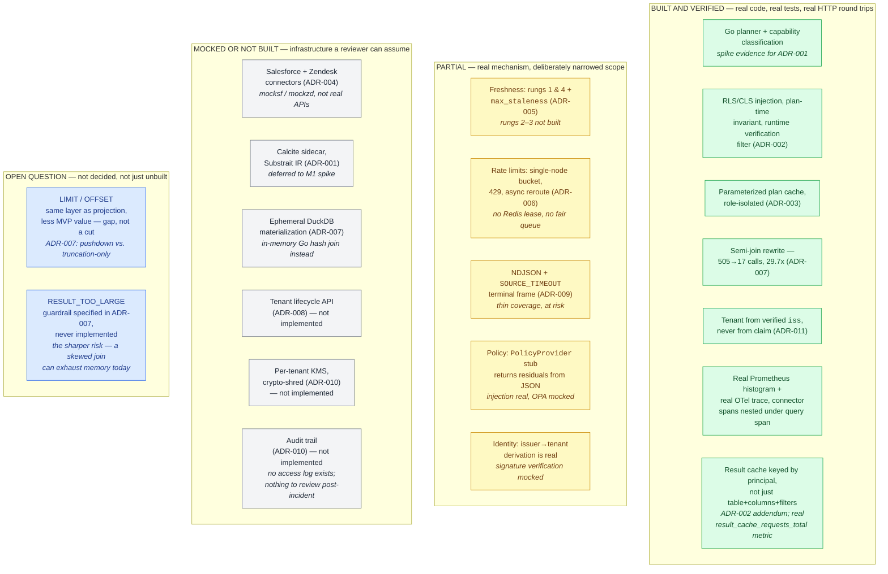

# Universal SQL Across Enterprise Apps

A federated SQL gateway over Salesforce + Zendesk, generalizing to 1,000s of SaaS app types.
One cross-app query, end-to-end: auth, entitlement checks, rate-limit handling, freshness
control. This file is a 5-minute orientation - depth lives elsewhere:

| File | For |
|---|---|
| [`DESIGN.md`](./DESIGN.md) | 25-minute design read - all 11 ADRs, both capability ladders, capacity math |
| [`DESIGN_FULL.md`](./DESIGN_FULL.md) | Full canonical design - worked derivations, rejected alternatives, sequence diagrams |
| [`DESIGN_LESS.md`](./DESIGN_LESS.md) | Same content as `DESIGN_FULL.md`, denser prose, shorter than it |
| [`REJECTED_ALTERNATIVES.md`](./REJECTED_ALTERNATIVES.md) | Every option seriously considered and turned down |
| [`IMPLEMENTATION_PLAN.md`](./IMPLEMENTATION_PLAN.md) | The TDD build log, cycle by cycle |

---

## Quickstart

```bash
docker compose --profile core --profile mocks up -d # gateway + 2 mock SaaS sources
go test ./... # 30 tests, ~1s
docker compose --profile testing run --rm k6 # load test: 500 req/s for 60s
```

The demo that matters - the same SQL under two identities:

```bash
# Support agent: RLS restricts to their region, email is masked
curl -s localhost:8080/v1/query \
 -H "Authorization: Bearer $(cat testdata/tokens/dana.jwt)" \
 -d '{"sql":"SELECT id, name, email, region FROM sf.accounts","max_staleness":"60s"}' | jq

# Admin: no region filter, email in clear
curl -s localhost:8080/v1/query \
 -H "Authorization: Bearer $(cat testdata/tokens/root.jwt)" \
 -d '{"sql":"SELECT id, name, email, region FROM sf.accounts","max_staleness":"60s"}' | jq
```

Every response carries `freshness_ms`, `rate_limit_status`, `trace_id`. Rate-limit exhaustion,
async reroute, and the freshness cold/warm/revalidated states are all reproducible with one
command each - ask, or see `DESIGN_FULL.md`'s recreate section for the full list.

---

## MVP status at a glance

Same eleven ADRs, grouped by how real the prototype's version of each is - not by ADR number,
since "partial" hides very different kinds of partial.



**What it proves.** Green is exactly the mechanisms a reviewer would otherwise take on faith -
security and correctness, not infrastructure. Grey is every ADR whose unbuilt half is
infrastructure (a JVM sidecar, a KMS call, a Terraform-replacing API) - never a security
mechanism; that split is deliberate, not a shortfall. Blue is a hole in the v1 SQL surface
itself, surfaced by review rather than designed around - see `DESIGN.md`'s Decision register
(ADR-007) and least-confident-decisions section.

---

## One dashboard, one trace

`jaeger_1.png` - a cross-app join trace: fanout to both connectors runs in parallel, and the
merge step is visibly the only serial cost. `prom_1.png` / `prom_2.png` - request-duration
histogram and rate-limit budget remaining, by connector and tenant. What each proves: the SLO is
dominated by external connector latency, not our own overhead - the whole basis for excluding
upstream source faults from the availability SLI (`DESIGN.md`, SLO section).

---

## Rationale in one paragraph

Three enforcement layers for entitlements (object auth, policy-compiled RLS/CLS, source ACLs as
backstop, plus a runtime filter that catches a connector lying about its own capability), a
freshness ladder that never spends rate-limit quota silently, and a four-tier join ladder
(in-memory → DuckDB → on-demand ClickHouse → Spark serverless) sized by a cost estimate, never
by table count. Every "partial" or "not built" item above is a named, deliberate scope cut with
its own reasoning in `DESIGN.md` - not a silent gap. Full trade-off discussion, all rejected
alternatives, and the six-month execution plan: `DESIGN.md` → `DESIGN_FULL.md`.
