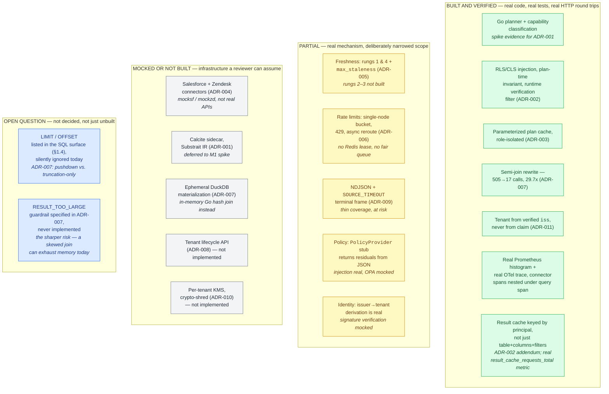

# Universal SQL Across Enterprise Apps

A federated SQL layer over SaaS applications. SQL in, rows out, executed live against source
APIs on behalf of the calling user, under that user's own permissions.

| Artifact | What it is |
|---|---|
| [`DESIGN.md`](./DESIGN.md) | High-level design + 11 ADRs, capacity model, threat model, six-month plan. Start at Section 0. Canonical - if it and the condensed version below ever disagree, this one is right. |
| [`DESIGN_LESS.md`](./DESIGN_LESS.md) | Same eleven decisions, same numbers, same rejections, condensed to a fifteen-minute read. Read this first if you don't have ninety minutes. |
| [`REJECTED_ALTERNATIVES.md`](./REJECTED_ALTERNATIVES.md) | Every option considered and turned down across the eleven ADRs, with the strongest real case for each one and why it lost anyway. |
| [`IMPLEMENTATION_PLAN.md`](./IMPLEMENTATION_PLAN.md) | TDD cycle plan the prototype was built from |
| This repo | Prototype: one cross-app query end-to-end - Salesforce JOIN Zendesk |
| [Afterthought](#afterthought-the-conformance-gate-is-provenance-blind) *(section below)* | The one thing building the prototype surfaced that the design hadn't anticipated: the conformance gate never checks who *wrote* a connector - which opens a third option in ADR-004's build-vs-buy split. |

**Scenario:** accounts JOIN tickets, with entitlement enforcement, rate-limit handling, and a
freshness control.

---

## Quickstart

```bash
docker compose --profile core --profile mocks up -d # gateway + 2 mock SaaS sources
go test ./... # 30 tests, ~1s
docker compose --profile testing run --rm k6 # load test: 500 req/s for 60s
```

Then try the demo that matters - the same SQL under two identities:

```bash
# Support agent: RLS restricts to their region, email is masked
curl -s localhost:8080/v1/query \
 -H "Authorization: Bearer $(cat testdata/tokens/dana.jwt)" \
 -d '{"sql":"SELECT id, name, email, region FROM sf.accounts","max_staleness":"60s"}' | jq

# Admin: no region filter, email in clear
curl -s localhost:8080/v1/query \
 -H "Authorization: Bearer $(cat testdata/tokens/root.jwt)" \
 -d '{"sql":"SELECT id, name, email, region FROM sf.accounts","max_staleness":"60s"}' | jq
```

Every response carries `freshness_ms`, `rate_limit_status`, and `trace_id`.

### Recreate: async reroute

`Prefer: respond-async` (previously only provable by reading `TestAsyncReroute`). It doesn't
require actually exhausting a connector's budget first - the header reroutes to the in-memory job
queue on request, the same path a client would fall back to after a `429 RATE_LIMIT_EXHAUSTED`
(see the next section for that path itself).

```bash
POLL_URL=$(curl -s localhost:8080/v1/query \
 -H "Authorization: Bearer $(cat testdata/tokens/dana.jwt)" \
 -H "Prefer: respond-async" \
 -d '{"sql":"SELECT id FROM sf.accounts"}' | jq -r .poll_url)
echo "$POLL_URL"
# /v1/jobs/job-1

curl -s "localhost:8080$POLL_URL" | jq
# {
#   "done": true,
#   "result": {
#     "columns": ["id"],
#     "rows": [...],
#     "freshness_ms": 0,
#     "rate_limit_status": {"sf": "unlimited"},
#     "trace_id": "..."
#   }
# }
```

If `done` is `false` on the first poll, the job hasn't finished yet - re-run the second `curl`.
The async job is an in-memory map with no real queue (`internal/server/server.go`'s `asyncJob`),
so this resolves near-instantly against a mock; the poll contract itself is what
`TestAsyncReroute` proves with `require.Eventually`.

### Recreate: rate-limit exhaustion

`docker-compose.yml`'s `gateway` service runs with no `--sf-limit`/`--zd-limit` flag, i.e.
unlimited - the flag exists (`cmd/gateway/main.go`) but the default stack never sets it, so a
`429` never happens against the plain quickstart. Run a second gateway locally instead, pointed
at the same two mocks (their ports are already exposed to the host by `docker-compose.yml`),
with a budget low enough to hit:

```bash
docker compose --profile mocks up -d   # just the two mocks - the compose gateway can stay up too
go run ./cmd/gateway --addr :8090 --sf-url http://localhost:8081 --zd-url http://localhost:8082 --sf-limit 3 &

for i in 1 2 3 4; do
  curl -s -D - -o /dev/null localhost:8090/v1/query \
    -H "Authorization: Bearer $(cat testdata/tokens/dana.jwt)" \
    -d '{"sql":"SELECT id FROM sf.accounts"}' | grep -iE "^HTTP|Retry-After"
done
kill %1   # stop the gateway instance started above
```

```
HTTP/1.1 200 OK
HTTP/1.1 200 OK
HTTP/1.1 200 OK
HTTP/1.1 429 Too Many Requests
Retry-After: 1
```

A budget of 3 lets exactly 3 calls through - `rate_limit_status.sf` in each body counts down
`"2"` -> `"1"` -> `"0"` across them - and the 4th gets `429` + `Retry-After: 1` + an `error.code`
of `RATE_LIMIT_EXHAUSTED` naming the connector and suggesting `Prefer: respond-async`. The same
`429` `TestRateLimitExhausted` proves in-process.

### Recreate: freshness control

Same query, same principal, `max_staleness` set. Three states, not two - and which one a "first"
call actually shows you depends on whether the gateway process already has a cache entry for this
exact `(principal, table, columns, filters)` signature, since that cache lives for the process's
whole lifetime, not per-request. Against a gateway you haven't touched yet you'll see the first
two; against a long-lived one (the Docker stack, or one you've already been experimenting
against) you may land straight on the third instead of the first - that's not a bug, see below.

**1. Cold** - nothing cached yet, so `meta` is absent entirely (`resultOutcome` only sets it when
a cache hit, a revalidation, or a join applies):

```bash
curl -s localhost:8080/v1/query \
 -H "Authorization: Bearer $(cat testdata/tokens/dana.jwt)" \
 -d '{"sql":"SELECT id FROM sf.accounts","max_staleness":"60s"}' | jq '{freshness_ms, meta}'
# { "freshness_ms": 0, "meta": null }
```

**2. Warm** - the same call again, immediately, within the 60s window - served from memory, `sf`
never touched:

```bash
curl -s localhost:8080/v1/query \
 -H "Authorization: Bearer $(cat testdata/tokens/dana.jwt)" \
 -d '{"sql":"SELECT id FROM sf.accounts","max_staleness":"60s"}' | jq '{freshness_ms, meta}'
# { "freshness_ms": 24, "meta": {"cache_hit": true} }
```

`freshness_ms` here is however many milliseconds elapsed between the two curls - small and
non-zero, not a fixed number.

**3. Stale, but unchanged** - `max_staleness` isn't part of the cache key (only table/columns/
filters/principal are), so the *same* entry from step 1-2 can be re-asked against a shorter
budget once enough real time has passed. Wait past the previous entry's age, then ask with a
tight `max_staleness`:

```bash
sleep 2
curl -s localhost:8080/v1/query \
 -H "Authorization: Bearer $(cat testdata/tokens/dana.jwt)" \
 -d '{"sql":"SELECT id FROM sf.accounts","max_staleness":"1s"}' | jq '{freshness_ms, meta}'
# { "freshness_ms": 0, "meta": {"revalidated": true} }
```

This is the state you land on by accident if you just re-run step 1 after the entry has aged past
60s on a gateway you've already exercised - the cache issues a conditional `If-None-Match` instead
of a plain fetch, `sf`'s data hasn't actually changed, and it comes back `304`. `cache_hit` is
omitted (`omitempty`, and it's `false` here - this wasn't served from memory, a real conditional
request went out) while `revalidated: true` is the point worth noticing: ADR-005's "a conditional
request is a request" made concrete. The connector still saw a call and the rate-limit budget
still moved, even though no new bytes came back. `TestMaxStalenessServesCache` proves states 1-2
in-process; `TestETagRevalidationSpendsBudget` proves state 3's budget accounting.

---

## Ten-minute reviewer path

If you only have ten minutes, read in this order - everything else in this README is
reference material you can skip.

1. [The decision register](#decision-register) below - eleven decisions, what each rejected,
   what was built
2. `DESIGN.md` Section 0 - five decisions, three I'd reverse, the one number to measure
3. `go test ./... -run 'LyingConnector|PlanCacheDoesNotLeak' -v` - the two security claims
4. `DESIGN.md` ADR-002 and its two diagrams - how policy becomes plan nodes
5. [The measurement table](#measured-the-number-the-design-is-least-sure-about) below - the
   assumption the capacity model rests on
6. `DESIGN.md` Section 12 - what I'm least sure of, and what would change my mind
7. [The afterthought](#afterthought-the-conformance-gate-is-provenance-blind) below - what
   building it surfaced that the design hadn't anticipated, and where I'd take it next

---

## What this prototype proves

Four tests carry the submission. Each exists because it demonstrates a claim in `DESIGN.md`
that a reviewer would otherwise have to take on faith.

| Test | Claim it proves | Design ref |
|---|---|---|
| `TestLyingConnectorFailsClosed` | A connector that declares a predicate `ENFORCED` and then ignores it is **caught at runtime** and fails closed - RLS survives a connector whose behaviour diverges from its declaration | ADR-002 |
| `TestPlanCacheDoesNotLeakAcrossRoles` | Caching a query plan *before* policy injection is a privilege-escalation vector; the composite cache key prevents it. Built even though the in-process planner is cheap - the bug class covers the result cache too | ADR-003 |
| `TestSemiJoinReducesProbeCalls` | Cross-app join rewritten as a semi-join: **505 -> 17 total connector calls (29.7x)** on a fixture with 2.4% join-key selectivity. The ratio *is* selectivity - see ADR-007 for where the rewrite loses | ADR-007 |
| `TestTenantDerivedFromIssuerNotClaim` | A token asserting `tenant_id: t_evilcorp` resolves to `t_acme`, because tenant comes from the verified issuer and the claim is never read | ADR-011 |

Run just these:

```bash
go test ./... -run 'LyingConnector|PlanCacheDoesNotLeak|SemiJoin|TenantDerived' -v
```

### The lying-connector test, specifically

`ENFORCED` means *we* assert the source applies the predicate - a claim proven by conformance
tests, never self-reported by a connector. The realistic failure isn't vendor dishonesty: it's
our own connector sending `?region=EMEA` where the API expects `?filter[region]=EMEA`, and
most REST frameworks **silently ignore unknown query parameters** and return the unfiltered
set. An RLS filter that appears pushed, does nothing, and leaks the full table with a 200.

So every `PUSHED_ENFORCED` security predicate is re-applied locally after fetch. A trustworthy
connector drops zero rows. Two metrics, opposite expectations:

- `residual_filter_rows_dropped` - expected non-zero (cost of the `ADVISORY` path)
- `enforced_predicate_violations_total` - **must be zero**; non-zero means page someone

---

## Decision register

Every contested call, the requirement that forced it, the alternatives rejected, and whether
the prototype builds it. Requirement text is quoted from the brief, trimmed to the operative
clause - full text and the remaining-requirements checklist are in
[`DESIGN.md` Section 11](./DESIGN.md#11-requirements-traceability), which is canonical.

| ADR | Requirement (verbatim) | Why it exists | Rejected (for the final design) | Built (prototype) |
|---|---|---|---|---|
| **001** Planner **(PROPOSED)** | *"capability discovery, predicate/column pushdown, join plan, cost/freshness hints, spill to materialization"* | Something must turn SQL into a capability-aware pushdown plan; the choice fixes runtime, latency floor, and plan IR. **Deliberately left open** - the required capabilities are fixed, the tool is chosen by measurement in M1. | Trino; DataFusion; Steampipe/FDW; Go-native parser; GraalVM-native Calcite; Spark | **n/a** - prototype uses an in-process Go planner, which is itself spike evidence |
| **002** Entitlements | *"row/column-level security (RLS/CLS) based on source permissions and tenant policy"*; *"Document how policies are compiled into query plans"* | The brief's hardest requirement; three layers, partial evaluation, `ENFORCED`/`ADVISORY`, and verification all fall out of it. | Post-filter in Go; inject into compiled Substrait; OPA as blob store; Zanzibar/OpenFGA; Cedar | **Mostly** - injection, invariant, verification real; OPA + delegated OAuth mocked |
| **003** Plan cache | *(none - nearest is "cache hit ratios" under sizing math)* | Anything derived from policy and then cached inherits the policy's version; a naive plan cache is therefore a privilege-escalation vector. Also amortizes planning **if** ADR-001 stays expensive. | No cache; key on SQL text alone; key on `(sql, user)` | **Yes** |
| **004** Build vs buy | *"capability model (tables/fields/ops/limits), auth/token refresh, pagination, concurrency contracts, standardized error codes"* | 1000s of app types cannot be hand-built in six months; splitting by whether pushdown determines the SLO is the call the brief invites. | Build all; buy all (Merge/Nango/Airbyte) | **No** - both connectors mocked |
| **005** Freshness | *"avoid materially stale data vs. sources; allow per-query staleness hints"*; *"Freshness controls honoring rate limits"* | Freshness must not spend the quota queries need, and SaaS change-detection varies too widely for one mechanism. | Centralized CDC / data lake; `SELECT MAX(updated_at)` probes | **Partial** - rungs 1 & 4 + `max_staleness` |
| **006** Rate limits | *"token buckets/concurrency pools per connector/tenant/user"*; *"head-of-line blocking avoidance"* | Quota is a hard external ceiling shared across tenants; one tenant must not spend another's budget or queue behind its own backlog. | In-memory per-pod buckets; Redis on every decision; Envoy ratelimit | **Partial** - single-node bucket, 429, async reroute |
| **007** Joins | *"federated on the fly vs. short-lived materialization"*; *"spill to materialization when necessary"* | Cross-app joins are the product's reason to exist but cannot be pushed to any single source. | Container-per-join DuckDB; ClickHouse; naive dual full fetch | **Partial** - semi-join yes, DuckDB no |
| **008** Tenant lifecycle | *"multi-tenant and single-tenant supported without code changes"*; *"org off-boarding triggers crypto-shred and job cancellation"* | Both deployment modes and instant off-boarding cannot hold if onboarding runs through `terraform apply`. | `terraform apply` per tenant | **No** |
| **009** Streaming | *"support timeouts and partial results for slow sources"* | Once bytes are on the wire the HTTP status is committed, so partial results need a format that can report failure after success began. | Chunked transfer + status code; HTTP trailers | **At risk** |
| **010** Crypto-shred | *"per-tenant keys; automated org off-boarding and crypto-shredding"*; *"audit logs, access trails"* | Off-boarding must render data unreadable immediately despite KMS destruction delays, which collides with the audit retention the same brief demands. | "Instantly destroy the KMS key"; shred audit under the tenant key | **No** |
| **011** Identity | *"AuthN via OIDC, AuthZ via policy"*; *"user token -> scopes/roles -> RLS/CLS"* | Policy needs principal attributes, and reading them from claims makes `tenant_id` forgeable and roles unreliable at enterprise scale. | Trust token claims; direct federation; mTLS / client certs | **Partial** - issuer->tenant real, signature mocked |

**Two patterns.** ADR-003 is the only entry with no requirement behind it, and is fully built
while ADR-001 - the decision it partly serves - is not: its *latency* justification depends on
an expensive planner, its *correctness* justification does not, and policy-derived caching is a
bug class that also covers the result cache. And every unbuilt ADR (001, 004, 008, 010) maps to
a requirement about **infrastructure** - a planner runtime, a vendor contract, Terraform, a KMS
call - while every fully built one maps to a requirement about **behaviour under adversarial
conditions**. We built what a reviewer cannot take on faith.

---

## Measured: the number the design is least sure about

`DESIGN.md` Section 5.3 calls per-principal cache hit ratio "the single most consequential unknown."
Per-user delegated tokens make entitlements correct essentially for free, but force
per-principal cache keys and collapse locality. The capacity model assumes 30%.

The k6 script is parameterized by distinct principal count so this is measured, not assumed.
Every run below is **500 req/s sustained for 60s (30,001 requests), 0 failures**, against the
Docker stack, with the gateway restarted between runs so a warm cache can't inflate the next:

```bash
docker compose --profile core --profile mocks up -d
docker compose --profile testing run --rm -e PRINCIPALS=100 k6   # then 1000, then 10000
```

| Distinct principals | `result_cache_hit_ratio` | Connector calls (of 30,001 requests) | p95 latency |
|---|---|---|---|
| 1 | 99.99% | 3 | 398 µs |
| 100 | 99.33% | 200 | 420 µs |
| 1,000 | 93.33% | 2,000 | 491 µs |
| 10,000 | 33.33% | 20,000 | 713 µs |

Connector calls track distinct principals exactly - `principals x 2` in every row, because each
principal misses once on its first fetch and once more when its 30s `max_staleness` expires
midway through the 60s run. That's the whole mechanism DESIGN.md Section 5.3 worries about,
reproduced directly: hit ratio is a function of how many distinct cache keys a fixed request
volume has to cover, and per-principal keying (ADR-002) is what makes principal count - not
query variety - the thing driving it.

**Cross-checked three ways.** k6 computes the ratio client-side from each response's
`meta.cache_hit`; the gateway independently reports `result_cache_requests_total{outcome}`; and
`connector_request_duration_seconds_count` counts actual outbound fetches. For the 10,000-principal
run all three agree exactly - 10,001 hits, 20,000 misses, 20,000 connector calls - so the ratio
isn't an artifact of how the load generator happens to count.

**What it means:** hit ratio holds up well past where the capacity model's 30% assumption sits,
but *only while principal count stays small relative to request volume*. At 10,000 principals
against 30,001 requests it falls to 33% - and p95 latency rises 398 µs -> 713 µs in step with it,
because a miss is an actual connector call. That is the degradation path Section 5.3 predicts,
visible in two independent signals at once. At real scale (10M users) principal count dominates
request volume by orders of magnitude, so connector quota - not our fleet - becomes the binding
constraint, and quota is not something we can autoscale past. That would trigger the ADR-005
tenant-snapshot path, and it is why this measurement sits in M2 rather than M5.

**Caveat on the latency figures.** Sub-millisecond p95 against in-process Go mocks on one host
says nothing about the 1.5s SLO, which is dominated by real SaaS API latency (A4: 200-800 ms).
What the p95 column is good for is the *shape* - it moves with miss rate - not the magnitude.

**Found while measuring this, not before.** Building this table surfaced a real bug: two
requests sharing a cached plan (same SQL shape, different WHERE-clause literal) were silently
serving whichever literal built the plan, for every request after the first - the plan cache's
own hit-ratio pressure (the point of caching at all) triggered it on any two same-shaped,
differently-valued queries. `$principal.<attr>` values were already resolved lazily per call
(Cycle 7, ADR-003); ordinary literals were not, until this table required varying one and
noticing the connector never saw the second value. Fixed by resolving literals the same lazy
way - see `TestPlanCacheDoesNotStaleBindLiteralValues` in `internal/exec`.

---

## Key trade-offs

The short version. Full reasoning, with alternatives rejected, is in the ADRs.

- **Per-user delegated OAuth over a service account** (ADR-002) - source ACLs enforce
 themselves and are always current, at the cost of per-principal cache keys and a collapsed
 hit ratio. This one trade-off drives the capacity model, the cost model, and the top risk.
- **Policy compiled into the plan, not post-filtered** (ADR-002) - rows never leave the source
 unfiltered where the connector can be trusted to filter. The `ADVISORY` tier is an
 acknowledged partial exception, monitored rather than pretended away.
- **Semi-join before materialization** (ADR-007) - turns the join into a filter, cutting total
 connector calls 505 -> 17 on our fixture. That 29.7x is the join key's selectivity on the
 probe side (2.4% here), not a property of the technique: at low selectivity it saves nothing
 and adds chunking overhead. Falls back to an in-process join when the probe source can't
 accept an `IN` list.
- **Freshness probes spend rate-limit budget** (ADR-005) - a conditional request is a request.
 Freshness that silently consumes quota is a quota leak with good PR.
- **Cross-app joins get their own SLO** (ADR-007) - P95 < 4 s, separate from the 1.5 s
 single-source target, because the brief scopes that target to predicate-pushdown queries and
 folding joins in would be dishonest measurement.

---

## Deliberate divergences from DESIGN.md

The prototype does not implement everything the design specifies. These are scoping decisions,
not omissions - each is infrastructure a reviewer can reasonably assume, and none is
observable at two connectors on one node.

| Designed | Prototype | Why |
|---|---|---|
| Calcite sidecar, Substrait IR (ADR-001) | In-process Go planner | Calcite buys capability-aware planning across *heterogeneous connectors at scale*. At n=2 that problem doesn't exist, so no amount of time spent would demonstrate its value. |
| OPA Compile API partial evaluation (ADR-002) | `PolicyProvider` returns residuals from JSON | The **injection** mechanism is real - residuals become `Filter`/`Project` nodes. Only the evaluator is stubbed, behind an interface built for exactly this swap. |
| Ingress token exchange, JWKS verification (ADR-011) | Unverified parse; **issuer->tenant derivation is real** | Signature verification is library work. The security property - tenant from `iss`, never from a claim - is the part worth demonstrating and it survives the mock. |
| Redis-leased token buckets (ADR-006) | Single-node in-memory bucket | ADR-006 explains why this **does not survive horizontal scaling**: N pods means Nx the configured limit, and the failure mode is the connector banning our API key. |
| Per-tenant KMS, crypto-shredding (ADR-010) | Not implemented | Nothing observable at one node. The valuable part of ADR-010 is the conflict between shredding and audit retention - a design insight a prototype can't demonstrate. |
| Ephemeral DuckDB materialization (ADR-007) | In-memory Go hash join | Also sidesteps the tenant-encrypted temp storage ADR-007 requires. |

**One thing the prototype taught us about the design.** A ~250-line Go planner handled the
entire v1 SQL surface cleanly. That is weak but real evidence for `DESIGN.md` Section 12's first open
question - that the Calcite sidecar may be over-built and in-process DataFusion is the better
call. The design was updated to say so rather than the prototype being written to agree with it.

---

## MVP status at a glance

The two tables above, as a picture. Same eleven ADRs, grouped by how real the prototype's
version of each decision is - not by ADR number, since "partial" hides very different kinds
of partial.



**What it proves.** The green lane is exactly the four tests in the "What this prototype
proves" table above, plus the observability work: mechanisms a reviewer would otherwise have
to take on faith. The grey lane is every ADR whose unbuilt half is infrastructure - a JVM
sidecar, a KMS call, a Terraform-replacing API - never a security or correctness mechanism.
That split is deliberate, not a shortfall: see "Two patterns" above. The blue lane is a
different kind of gap than either - not a deliberate scope cut like the grey lane (nothing
here was decided against), and not a narrowed-but-real mechanism like the yellow lane: it's a
hole in the v1 SQL surface itself, surfaced by review rather than designed around, and left
open on purpose rather than guessed at - see `DESIGN.md` ADR-007 and Section 12, item 5.

---

## Afterthought: the conformance gate is provenance-blind

Not a claim the prototype set out to test, but the clearest thing building it surfaced.
`TestLyingConnectorFailsClosed` never asks *who wrote the connector*. It asks whether the rows
that came back still satisfy the predicate we believed we pushed. A connector fails that check
identically whether a human wrote it, a vendor shipped it, or a code generator emitted it.
ADR-002 states this as a principle - capabilities are "claims *we* make about a connector and
prove with conformance tests, never values a connector self-reports" - but implementing it is
what makes the consequence concrete: **the connector's author is not a variable the safety
argument depends on.**

That reframes ADR-004. If the gate doesn't care about provenance, "build vs. buy" is missing a
third option - a fine-tuned model drafting connectors against the Connector SDK, promoted only
on passing the same suite. It competes with *buy*, not build, and on buy's specific weakness:
unified-API vendors normalize away per-field pushdown and per-user delegated auth, the two
properties ADR-002 and Section 5 lean on hardest. Three places it would fit, in the order I'd
try them:

1. **Capability discovery** - draft the `ENFORCED`/`ADVISORY` map from an API spec. The best
   first target, because the output is declarative data rather than executable code and the
   gate that validates it already exists. `testdata/catalog/sf.accounts.json` is a handful of
   hand-written lines for one table; the per-connector authoring cost at n=1,000 is visible
   from n=2.
2. **Schema-drift triage** - diff spec versions, classify breaking vs. additive, draft the
   patch. This attacks the cost ADR-004 treats as decisive: "schema drift alone would consume
   the team."
3. **Request translation** - plan -> SOQL/GraphQL/REST/ES DSL, placed *after* policy injection
   and residual assignment so the model is handed dispositions already decided and never makes
   a security decision itself.

**What this prototype does and doesn't support.** Only item 1 has evidence here. Both mocks
speak one generic HTTP shape (`internal/connector/httpsource.go`), so this build never faced
dialect translation and never saw a schema change - items 2 and 3 are extrapolation from
problems it didn't have to solve, not findings from ones it did.

**And the honest catch.** The verification such a tier would need - asserting the generated
query's predicate set exactly matches the plan's, metamorphic invariants over query pairs,
differential validation against a fetch-everything control - is not LLM-specific. It would
catch a hand-written connector's off-by-one just as readily. It doesn't exist here because at
n=2 human review was doing that job implicitly and unmeasurably. The generation question
surfaces a verification gap that already exists; it doesn't create one.

---

## Fixture notes

Two fixtures are deliberately hostile or pessimistic. Both look like modelling errors if you
don't know why.

- **`sf.region` is declared `ADVISORY`** in `testdata/catalog/sf.accounts.json`. Real
 Salesforce enforces a `WHERE Region__c = 'EMEA'` perfectly well; we declare it advisory so
 the residual-filter path is exercised. `zd.organization_id` is `ENFORCED`, so a single trace
 shows both paths - one predicate filtered at source, one filtered locally, both verified.
- **`testdata/tokens/dana.jwt` asserts `tenant_id: t_evilcorp`.** Deliberate. The system
 resolves `t_acme` from the registered issuer and never reads the claim.

---

## Layout

```
cmd/{gateway,mocksf,mockzd} # gateway + two mock SaaS sources
internal/
 identity/ catalog/ policy/ plan/ plancache/
 exec/ ratelimit/ freshness/ connector/ obs/
test/acceptance/ # black-box, through HTTP
testdata/{catalog,policy,tokens}/
k6/load.js # parameterized by principal count
Dockerfile docker-compose.yml prometheus.yml
```

## Error vocabulary

`ENTITLEMENT_DENIED`, `RATE_LIMIT_EXHAUSTED` (+ `Retry-After`, async hint), `STALE_DATA`,
`SOURCE_TIMEOUT`, `UNSUPPORTED_PREDICATE`, `RESULT_TOO_LARGE`, `CONNECTOR_AUTH_FAILED`,
`SCHEMA_DRIFT`, `PRINCIPAL_UNRESOLVED`, `RESIDENCY_VIOLATION`

Every message names what to do, not just what broke. Full table in `DESIGN.md` Section 7.

## Observability

A real Prometheus endpoint and a real trace, not in-process approximations of either. Full
step-by-step instructions for taking both submission screenshots are below; this part explains
what's actually real and which test proves it, so the walkthrough isn't taken on faith either.

**The metrics.** `GET /metrics` on the gateway is a genuine `prometheus/client_golang` registry,
not the in-memory `obs.Observe`/`obs.Gather` pair the test suite also uses (that one exists so
tests can assert "a sample was recorded" without a real registry in the loop - both are fed from
the same call sites, so neither can drift from what actually happened). Two metrics live there:

- `connector_request_duration_seconds` - a proper histogram (buckets, `_sum`, `_count`), labeled
  by `connector` and `outcome`, plus the Go runtime metrics the client library exposes for free.
  Proved real by `TestConnectorDurationMetric` (`test/acceptance/obs_test.go`).
- `result_cache_requests_total{connector,outcome}` - a counter, `outcome` = `hit` (served from
  the freshness/result cache, no outbound call) or `miss` (a live or conditional fetch was
  made). `result_cache_hit_ratio` is derived from this via PromQL `rate()`, not stored directly -
  see `DESIGN.md`'s ADR-002 addendum for why. Proved real by `TestResultCacheHitRatioMetric`, and
  its cache-key correctness (principal isolation, not just table+columns+filters) by
  `TestFreshnessCacheIsolatedByPrincipal`.

**The trace.** `trace_id` in every response (and the `X-Trace-Id` header the connector receives)
*is* a real OpenTelemetry trace id, not a random string that merely looks like one - the gateway
starts a `gateway.query` span per request and a child `connector.fetch` span per connector call
(`internal/freshness`), exported over OTLP/HTTP to Jaeger's all-in-one image. For the cross-app
join, the same trace shows *two* `connector.fetch` children (build side, then each probe chunk)
under one `gateway.query` span - the semi-join's call reduction, visible as spans, not just a
log line. `TestTraceIDPropagates` proves the id `sf` actually receives on `X-Trace-Id` is the
same one the gateway returns to its caller, independent of whether a collector is even running -
tracing degrades gracefully to a no-op tracer when `--otlp-endpoint` is unset (the default for
`go test`, and for the plain `go run ./cmd/gateway` quickstart), so the id is still real and
still propagated, just not exported anywhere.

### Getting the two screenshots

Both screenshots come off the same running stack. Start it once, generate traffic, take both.

**Step 1 - start everything, including the observability profile.**

```bash
docker compose --profile core --profile mocks --profile observability up -d --build
```

This starts the gateway, both mocks, Prometheus (scraping the gateway every 5s, `prometheus.yml`),
and Jaeger's all-in-one image (UI on `16686`, OTLP intake on `4318`, wired via
`--otlp-endpoint jaeger:4318` in the gateway's compose command - present even when this profile
isn't running, since the exporter connects lazily and an absent Jaeger just logs, never blocks).
Give it a few seconds, then confirm the gateway is up:

```bash
curl -s -o /dev/null -w "%{http_code}\n" localhost:8080/metrics # expect 200
```

**Step 2 - generate traffic to graph and trace.** A few single-source queries (for the metrics
graph and a real hit/miss ratio) and one cross-app join (for a trace worth screenshotting - two
`connector.fetch` children instead of one):

```bash
for i in $(seq 1 5); do
  curl -s localhost:8080/v1/query \
    -H "Authorization: Bearer $(cat testdata/tokens/dana.jwt)" \
    -d '{"sql":"SELECT id FROM sf.accounts","max_staleness":"60s"}' > /dev/null
done

cat > /tmp/join.json <<'EOF'
{"sql":"SELECT a.name, t.subject FROM sf.accounts a JOIN zd.tickets t ON t.organization_id = a.external_id WHERE t.status = 'open'"}
EOF
curl -s localhost:8080/v1/query \
  -H "Authorization: Bearer $(cat testdata/tokens/root.jwt)" \
  -d @/tmp/join.json | jq -r .trace_id
```

Keep the printed `trace_id` from that last command - you'll paste it into Jaeger in Step 4.
(Using a file for the join query sidesteps shell-quoting issues with the nested single quotes
around `'open'` - a one-line `curl -d '...'` with embedded quotes is easy to mistype in a way
that silently truncates the SQL before the `JOIN`, which looks like a working query but returns
the wrong thing. The `max_staleness` on the loop queries means the 2nd-5th are real cache hits,
not just repeats - worth pointing out if `result_cache_requests_total` comes up.)

**Step 3 - Prometheus screenshot.**

1. Open `http://localhost:9090/graph` in a browser.
2. Query `connector_request_duration_seconds_count`, press *Execute*, switch to the *Graph* tab.
   You should see series labeled by `connector` and `outcome`, stepping up with Step 2's traffic.
   (Swap in `result_cache_requests_total` to graph hit/miss instead - both are real series.)
3. Widen the time range (top right) if the default window is too tight to show the steps.
4. Screenshot the graph tab. This is the metrics screenshot - real connector call volume,
   scraped from the gateway's own `/metrics`, not a number typed into a doc.

**Step 4 - Jaeger screenshot.**

1. Open `http://localhost:16686` in a browser.
2. Paste the join query's `trace_id` from Step 2 directly into the search box at the top (or:
   set *Service* to `emathp-gateway`, click *Find Traces*, and pick the most recent one - it'll
   be the join, since it's the last query issued).
3. Click into the trace. You should see a waterfall: one `gateway.query` span at the top, with
   **two** `connector.fetch` children nested under it (the join's build-side fetch and its
   probe-side fetch), each with its own duration.
4. Screenshot the waterfall. This is the trace screenshot - the semi-join's two-connector
   fanout, visible as spans with real durations, not a log line asserting it happened.

**What the pair proves together.** The metrics show call volume (and now cache hit/miss) are
real and observable; the trace shows *where the time inside one request actually went*, and that
a cross-app join really does fan out to two connectors under one root span - the same claim
Section 5's capacity model makes numerically, here shown as spans a reviewer can click on.

---

## Evidence: the connector SDK against a real mock (Cycle 5)

Everything below is a real HTTP round trip against `cmd/mocksf` (built from `go build -o
mocksf ./cmd/mocksf`), not a unit test asserting internal state. The point is the same one
Section 9 makes about the trace screenshot: showing the behavior beats describing it.

Start it with the defaults (250 rows, page-size 100, `status` enforced - `cmd/mocksf/main.go`
always sets that last one regardless of flags):

```
$ ./mocksf &
```

**Pagination** - 250 rows requested at `page-size=100` come back as three pages, the last one
short, each carrying an explicit `has_more` rather than the client having to guess from a
row count:

```
$ curl -s "http://localhost:8081/accounts?fields=id&offset=0"   | jq '{count: (.rows | length), has_more}'
{ "count": 100, "has_more": true }
$ curl -s "http://localhost:8081/accounts?fields=id&offset=100" | jq '{count: (.rows | length), has_more}'
{ "count": 100, "has_more": true }
$ curl -s "http://localhost:8081/accounts?fields=id&offset=200" | jq '{count: (.rows | length), has_more}'
{ "count": 50, "has_more": false }
```

`go test ./internal/connector/... -run TestConnectorPaginationAndETag -v`:

```
=== RUN   TestConnectorPaginationAndETag
--- PASS: TestConnectorPaginationAndETag (0.00s)
```

`connector.HTTPSource.Fetch` hides this pagination entirely - it made one call to `exec`,
three calls to the mock, matching the call-count assertion in the test.

**ETag / `If-None-Match` -> 304** - a conditional re-request with the ETag the mock just
issued gets a 304, not a re-fetch of the full body:

```
$ ETAG=$(curl -sI "http://localhost:8081/accounts" | grep -i '^etag' | tr -d '\r' | sed 's/.*: //')
$ echo $ETAG
7eaf965187fa89ec
$ curl -s -o /dev/null -w "%{http_code}\n" -H "If-None-Match: $ETAG" "http://localhost:8081/accounts"
304
```

**An enforced predicate actually filters** - `status` is declared `ENFORCED` by default, and
a value no row has returns zero rows, not the whole table:

```
$ curl -s "http://localhost:8081/accounts?fields=id,status&status=closed" | jq '.rows | length'
0
```

**The lying connector** - `--lie-about region` declares `region` `ENFORCED` (so our planner
would push a security predicate to it) and then ignores the filter it claims to apply. This
needs a second mock instance with different flags, so stop the first one before starting it -
same port, same "address already in use" failure as the Docker one earlier if you don't:

```
$ kill %1   # or: pkill -f mocksf - stop the instance started above, it's still on :8081
$ mocksf --rows 10 --lie-about region &
$ curl -s "http://localhost:8081/accounts?fields=id,region&region=nonexistent-region" | jq '.rows | length'
10
```

Ten rows for a value nothing matches is exactly the failure `TestLyingConnectorFailsClosed`
(Cycle 6) exists to catch - the plan-time invariant has no way to see this, because the
predicate *was* legitimately pushed to a connector that claimed to enforce it. Only the
runtime verification filter, re-applying the predicate locally after fetch, notices the row
count didn't drop to zero.
