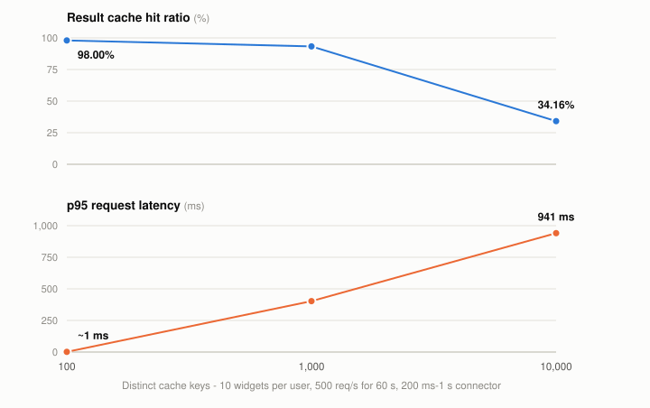
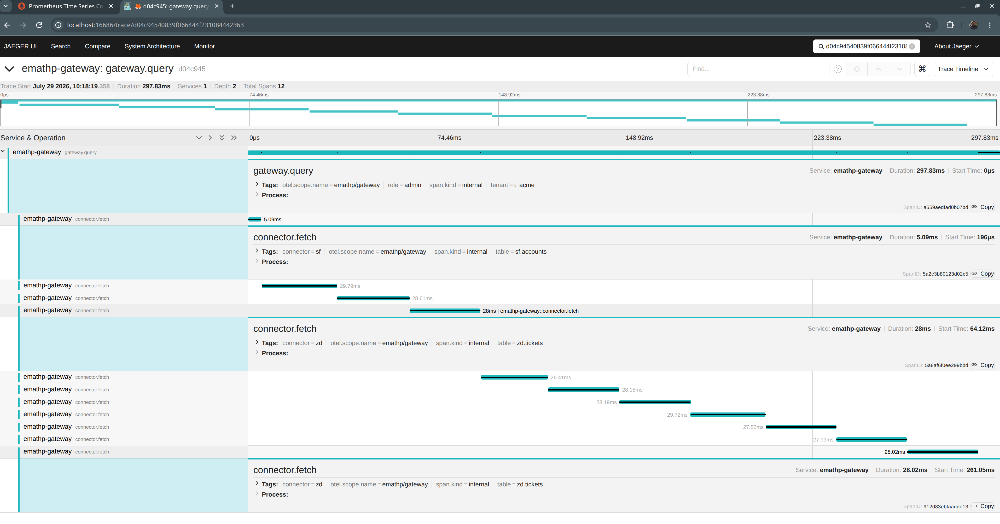
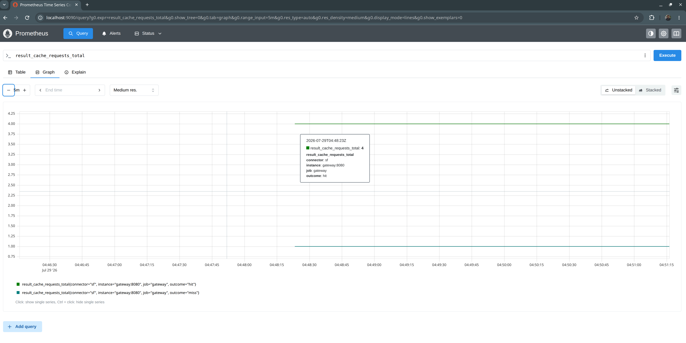

# Universal SQL Across Enterprise Apps

Federated SQL over Salesforce + Zendesk, generalizing to 1,000s of SaaS app types. One cross-app
query end-to-end: **auth → entitlement checks → rate-limit handling → freshness control**.

| Doc | For | Read time |
|---|---|---|
| **This file** | Orientation, quickstart, what's proven and what isn't | **~10 min**, + an ~11 min command appendix you run rather than read |
| [`DESIGN.md`](./DESIGN.md) | All 11 ADRs, both capability ladders, capacity math, six-month plan | ~35 min |
| [`CODE_MAP.md`](./CODE_MAP.md) | Navigating the implementation: request path in call order, ADR-to-code map, known gaps | ~6 min |
| [`DESIGN_FULL.md`](./DESIGN_FULL.md) | Canonical — worked derivations, full rejection reasoning, 16 diagrams | ~90 min |
| [`REJECTED_ALTERNATIVES.md`](./REJECTED_ALTERNATIVES.md) | Every option considered and turned down, with its steelman | ~10 min |
| [`IMPLEMENTATION_PLAN.md`](./IMPLEMENTATION_PLAN.md) | The TDD build log, cycle by cycle | ~15 min |
| [`HUMAN_AND_AI.md`](./HUMAN_AND_AI.md) | How this was built with Gemini + Claude — the division of labour, and the four failure modes worth reviewing for | ~6 min |

---

## Quickstart

```bash
docker compose --profile core --profile mocks up -d --build   # gateway + 2 mock SaaS sources
go test -race ./...                                           # 48 tests, ~5s
docker compose --profile testing run --rm k6                  # load test: 500 req/s for 60s

docker compose --profile "*" down                             # tear down — see note below
```

> **Teardown needs a profile flag.** Every service in `docker-compose.yml` is profile-gated
> (`core`, `mocks`, `observability`, `testing`) and there is no default profile-less service, so a
> bare `docker compose down` selects **zero** services, stops nothing, and exits `0` with no
> output. Confusingly `docker compose ps` still lists the containers — it matches on the project
> label rather than the profile selection — which makes this look like a Docker bug rather than a
> flag you're missing. Use `--profile "*"` (or name the profiles, or list the services
> explicitly).

**The demo that matters** — same SQL, two identities:

```bash
# Support agent: RLS restricts to their region, email is masked
curl -s localhost:8080/v1/query \
 -H "Authorization: Bearer $(cat testdata/tokens/dana.jwt)" \
 -d '{"sql":"SELECT id, name, email, region FROM sf.accounts","max_staleness":"60s"}' | jq

# Admin: no region filter, email in clear
curl -s localhost:8080/v1/query \
 -H "Authorization: Bearer $(cat testdata/tokens/root.jwt)" \
 -d '{"sql":"SELECT id, name, email, region FROM sf.accounts","max_staleness":"60s"}' | jq
```

Every response carries `freshness_ms`, `rate_limit_status`, `trace_id`.

**Every other claim in this README is runnable too** — rate-limit exhaustion, async reroute,
freshness cold/warm/revalidated, connector SDK mechanics, and both observability screenshots, with
exact commands and expected output:
[Appendix — Recreate every claim yourself, in full](#appendix--recreate-every-claim-yourself-in-full).

---

## Four tests carry the submission

Each exists because it proves a design claim a reviewer would otherwise take on faith.

| Test | Claim it proves | ADR |
|---|---|---|
| `TestLyingConnectorFailsClosed` | A connector that declares a predicate `ENFORCED` then ignores it is **caught at runtime and fails closed** — RLS survives a connector whose behaviour diverges from its declaration | 002 |
| `TestPlanCacheDoesNotLeakAcrossRoles` | Caching a plan *before* policy injection is a privilege-escalation vector; the composite cache key prevents it. Built even though the in-process planner is cheap — the bug class covers the result cache too | 003 |
| `TestSemiJoinReducesProbeCalls` | Cross-app join rewritten as a semi-join: **505 → 17 connector calls (29.7×)** at 2.4% join-key selectivity. The ratio *is* selectivity | 007 |
| `TestTenantDerivedFromIssuerNotClaim` | A token asserting `tenant_id: t_evilcorp` resolves to `t_acme` — tenant comes from the verified issuer, the claim is never read | 011 |

```bash
go test ./... -run 'LyingConnector|PlanCacheDoesNotLeak|SemiJoin|TenantDerived' -v
```

**Why the lying-connector test is the important one.** The realistic failure isn't vendor
dishonesty — it's *our own* connector sending `?region=EMEA` where the API expects
`?filter[region]=EMEA`. Most REST frameworks **silently ignore unknown query parameters** and
return the unfiltered set: an RLS filter that appears pushed, does nothing, and leaks the full
table with a `200`. So every `PUSHED_ENFORCED` security predicate is re-applied locally after
fetch, with two metrics carrying opposite expectations:

| Metric | Expected | Meaning |
|---|---|---|
| `residual_filter_rows_dropped` | Non-zero | Normal — the cost of the `ADVISORY` path |
| `enforced_predicate_violations_total` | **Zero** | Non-zero ⇒ a connector diverged from its declaration. **Page someone.** |

---

## MVP status at a glance

Eleven ADRs, grouped by *how real* the prototype's version of each is rather than by ADR number —
because several ADRs land in more than one lane at once. ADR-007 alone is fully built (semi-join),
entirely absent (DuckDB), and undecided (`RESULT_TOO_LARGE`) in three different places, which a
single per-ADR verdict would flatten into one misleading word.

| Lane | Contents |
|---|---|
| **🟢 Built & verified**<br>real code, real tests, real HTTP round trips | Go planner + capability classification · RLS/CLS injection + plan-time invariant + runtime verification filter (002) · parameterized role-isolated plan cache (003) · semi-join rewrite, 505→17 calls (007) · tenant from verified `iss`, never a claim (011) · real Prometheus histogram + real OTel trace · result cache keyed by principal |
| **🟡 Partial**<br>real mechanism, deliberately narrowed scope | Freshness rungs 1 & 4 + `max_staleness` only (005) · rate limits: single-node bucket, `429`, async reroute — no Redis lease, no fair queue, **no per-tenant dimension** (006) · NDJSON + `SOURCE_TIMEOUT` terminal frame, thin coverage (009) · policy injection real, OPA mocked (002) · identity derivation real, signature verification mocked (011) |
| **⚪ Mocked / not built**<br>infrastructure a reviewer can assume | Salesforce + Zendesk connectors are mocks (004) · Calcite sidecar + Substrait IR deferred to M1 spike (001) · materialization is an in-memory Go hash join, not DuckDB (007) · tenant lifecycle API (008) · per-tenant KMS + crypto-shred (010) · **audit trail (010) — no access log exists; nothing to review post-incident** |
| **🔵 Open question**<br>not decided, not just unbuilt | `RESULT_TOO_LARGE` — guardrail specified in 007, never implemented. **The sharper risk: a skewed join can exhaust memory today** · `LIMIT`/`OFFSET` — in the grammar, undecided past it (007) |
| **🟠 Executor limits**<br>one cause, one fix | The v1 executor is a hand-rolled Go hash join standing in for **ADR-007 tier 1's in-process DuckDB**, and a hand-rolled executor only does what it was written to do. So `LIMIT`/`OFFSET` and `ORDER BY` parse and are ignored, and **outer joins are now rejected rather than silently run as inner joins** (they also defeat the semi-join rewrite — pushing the build side's keys as an `IN`-list is precisely what makes unmatched keys invisible). All three land together when a real SQL engine runs the join |

**The pattern.** Every unbuilt ADR maps to a requirement about *infrastructure* — a JVM sidecar,
a vendor contract, Terraform, a KMS call. Every built one maps to a requirement about *behaviour
under adversarial conditions*. **We built what a reviewer cannot take on faith.**

**What building it changed my mind about:** the grey lane above is not evenly costly — connector
authoring is the one line item that scales with the catalog, and that reframes ADR-004 entirely.
See [Afterthought: connector authoring is the real bottleneck](#afterthought-connector-authoring-is-the-real-bottleneck).

---

## Measured: cache locality under real connector latency

Per-user delegated tokens make entitlements correct essentially for free, but force
per-principal cache keys and collapse locality. The k6 script is parameterized by distinct
principal count and by **queries per user** — 10 widgets each, the shape of a dashboard or of a
join whose probe side chunks into several `IN`-list fetches. The mocks inject **200 ms–1 s** of
latency so a cache miss costs what a real connector round trip costs (assumption A4) rather than
the ~1 ms an in-process mock answers in:

```bash
SF_LATENCY_MIN=200ms SF_LATENCY_MAX=1s docker compose --profile core --profile mocks up -d
docker compose --profile testing run --rm -e PRINCIPALS=10 -e QUERIES=10 k6   # then 100, then 1000
```

<picture>
  <source media="(prefers-color-scheme: dark)" srcset="./docs/hit-ratio-dark.svg">
  
</picture>

| Users | Distinct keys | `result_cache_hit_ratio` | Cache misses | *ideal* | p95 | In flight (`L=λW`) |
|---|---|---|---|---|---|---|
| 10 | 100 | 98.00% | 597 | *200* | 1 ms | 6 |
| 100 | 1,000 | 93.28% | 2,000 | *2,000* | **403 ms** | 20 |
| **1,000** | **10,000** | **34.16%** | **19,269** | *20,000* | **941 ms** | **198** |

<sub>10 queries per user, 500 req/s for 60 s, cold cache each run, `max_staleness` 30 s, sources
delayed 200 ms–1 s. *Ideal* = `keys × ⌈duration/TTL⌉`, the fetches a perfect cache would make.
Request totals fall short of 30,001 as k6 sheds iterations under load (91 → 732).</sub>

### What the run establishes

| Finding | Evidence | Consequence |
|---|---|---|
| **Distinct keys is the variable — not users, not query shape** | 10 users × 10 widgets (100 keys) matched 100 users × 1 query to within 0.1 pp and 4 ms across every column | Cache locality is governed by `keys vs. requests × TTL window`. A dashboard multiplying widgets per user costs exactly what the same number of extra users would — which is why [ADR-002](./DESIGN.md#adr-002--entitlement-enforcement-the-briefs-hardest-requirement)'s per-principal keying is the lever, and why query variety compounds it |
| **p95 tracks miss rate** | 1 ms → 403 ms → **941 ms**, a ~900× swing | Only visible against a realistic connector. Against instant mocks a miss costs microseconds, so latency cannot move with miss rate at all — **any latency claim measured against fast mocks is untestable, not confirmed** |
| **It is a step, not a slope** — the percentile trap, live | p95 is a *cache hit* at 98.00% (2.0% miss) and a *cache miss* at 93.28% (6.7% miss) | Exactly what [§6.4](./DESIGN.md#64-the-sensitivity-that-actually-matters) predicts: once miss rate passes 5%, the 95th-percentile request *is* a miss. Latency does not degrade gracefully — it steps |
| **Concurrency scales with misses** | 6 → 20 → **198** in flight (`L = λW`, from measured mean latency) | A 33× swing in in-flight work from cache behaviour alone. This is the mechanism [§6.1](./DESIGN.md#61-baseline)'s capacity model rests on, and the load generator began shedding iterations (21 → 800) as it bit |
| **A cold key gets fetched many times over, not once** | At 100 keys the run made **597** fetches where a perfect cache needs **200** — **3.0×**. By 1,000 keys it is 1.0× and gone. Amplification is `1 + (requests/s on one key × fetch duration)`, so it tracks burst shape, not traffic volume | The cache releases its lock across the fetch — `read → unlock → **fetch** → write` — so every request arriving in that up-to-1 s window also misses and fetches independently. This is a **cache stampede**, and [§10.3](./DESIGN.md#10-deployment-and-operations)'s runbook says *"singleflight should prevent it"* — but **no singleflight exists in the code**. **At design scale it is nearly harmless** (1k QPS across 10k principals ≈ 0.1 req/s per key ≈ **1.1×**); it bites on *bursts against a cold key* — a page load firing 3–10 parallel queries (4–11×), a retry storm, or a fleet restart where every principal's first burst multiplies at once |
| **Found a real correctness bug** — *fixed* | Same SQL shape + different `WHERE` literal served whichever literal built the cached plan | Plan now carries `$param.N`, bound per request. **36 passing tests missed it**; pinned by `TestPlanCacheHitsOnSameShapeDifferentValue` |

### What the run does not cover

| Not covered | Why | Consequence |
|---|---|---|
| **Hit ratio itself is arithmetic** | `hit = 1 − (N × ⌈D/T⌉) / R` predicts the ratio exactly wherever the fetch window is narrow relative to per-key spacing (N ≥ 1,000 here) | The *ratio* is a tautology of TTL and key cardinality — a formula gets it for free. What the run adds is everything the formula cannot predict: latency, concurrency, and the stampede |
| **What the cache costs** | The load query (`status = 'open-<principal>'`) matches no row, so every entry caches **0 rows / 2 bytes** — a query hitting real data returns ~26 KB. Distinct keys are manufactured by the literal, which is what makes the cardinality sweep work at all | The run exercises lookup bookkeeping — key construction, hit/miss accounting, TTL expiry, revalidation — but never entry **size**. So §6.2's *100–200 KB per entry* (and the 2–8 GB range built on it), assumption **A2**'s ~100 KB payload, serialization and GC pressure, and egress — [§12.5](./DESIGN.md#125-budget)'s dominant budget line — are all untested here |
| **The plan cache** | `meta.cache_hit` is the **result/freshness** cache | The plan cache is a separate ~90% number, and it sizes planner sidecars in [§6.2](./DESIGN.md#62-derived-sizing) |
| **Memory** | Working set dominates: **23 GB** materialization vs **2–8 GB** cache; **2 GB of a 2.5 GB** per-pod heap | Pod size follows join concurrency and DuckDB's `memory_limit`. Drive hit ratio to zero and the 8 GB pod stands |
| **256 MB of working set per join** — *the larger unknown* | DuckDB's **cap** used as the **mean**; 74% of total memory, ~10× sensitivity vs hit ratio's ~40% | Still unmeasured. The latency flags added for this run are half of what it needs; the rest is a joins-only workload and a real `materialization_memory_bytes` |

---

## Observability: one dashboard, one trace

| Artifact | What it proves |
|---|---|
| `jaeger_1.png` | Cross-app join trace — fanout to both connectors runs genuinely **in parallel**, and our own overhead is a small fraction of wall clock. This is the whole basis for excluding upstream source faults from the availability SLI |
| `prom_1.png`, `prom_2.png` | Request-duration histogram and rate-limit budget remaining, by connector and tenant — the load-test run behind the hit-ratio table above |





---

## Recreate every claim yourself

| Claim | How |
|---|---|
| **Entitlement enforcement (RLS/CLS)** | The two-identity demo in Quickstart above |
| **Async reroute** | `Prefer: respond-async` header → returns a `poll_url`; poll it for the result. Doesn't require exhausting a budget first — the header reroutes on request, the same path a client falls back to after a `429` |
| **Rate-limit exhaustion** | Compose runs unlimited by default. Start a second gateway with a budget: `go run ./cmd/gateway --addr :8090 --sf-url http://localhost:8081 --zd-url http://localhost:8082 --sf-limit 3`, then send 4 requests → 3× `200`, then `429` + `Retry-After: 1` |
| **Freshness control** | Vary `max_staleness` across calls and watch `freshness_ms` and the cold/warm/revalidated states in the response |
| **Load / hit ratio** | `docker compose --profile testing run --rm -e PRINCIPALS=10000 k6` |

Exact commands with expected output: [Appendix](#appendix--recreate-every-claim-yourself-in-full) at the bottom of this file.

---

## Error vocabulary

Every message names **what to do**, not just what broke.

| Code | HTTP | When |
|---|---|---|
| `RATE_LIMIT_EXHAUSTED` | 429 | Budget spent — carries `Retry-After` + async instructions |
| `STALE_DATA` | 200 | Served outside `max_staleness`; a probe would have exceeded budget |
| `ENTITLEMENT_DENIED` | 403 | Policy or source ACL denied — names the resource, never the policy reason |
| `SOURCE_TIMEOUT` | 200 + terminal frame | A source exceeded its budget; partial results labelled honestly |
| `UNSUPPORTED_PREDICATE` | 400 | Plan would require a full scan of a SaaS API |
| `RESULT_TOO_LARGE` | 400 | Materialization would exceed guardrail *(specified, not implemented)* |
| `CONNECTOR_AUTH_FAILED` | 502 | Token refresh failed / grant revoked |
| `SCHEMA_DRIFT` | 409 | Source schema changed under a pinned connector version |
| `PRINCIPAL_UNRESOLVED` | 503 | Attribute resolution failed and cache expired — fail closed |
| `RESIDENCY_VIOLATION` | 403 | Plan would cross a residency boundary |

---

## Afterthought: connector authoring is the real bottleneck

Building this surfaced something the brief frames as one requirement among many, but which is
actually **the constraint the whole product lives or dies on: writing and validating connectors
at 1,000s-of-app-types scale.** Everything else here — planner, policy compilation, join ladder,
capacity model — is work that gets done once and then serves every connector. Connector authoring
is the only cost that scales *linearly with the catalog*, and ADR-004's build-vs-buy split is
better read as a symptom of that than as a solution to it: **building** everything is "1,000
connectors against unversioned vendor APIs," and **buying** everything normalizes away the
per-field pushdown and per-user delegated auth that ADR-002 and the SLO both depend on. Neither
option removes the bottleneck; they just decide who absorbs it.

**So the thing I'd actually try next is LLM-drafted connectors** — 1,000+ app types each speaking
its own dialect (SOQL, GraphQL, REST, Elasticsearch DSL…) is precisely a translation-and-volume
problem, which is what generation is good at, aimed squarely at the one cost that scales with the
catalog.

**The convenient part is a coincidence, not the reason.** `TestLyingConnectorFailsClosed` was
built for an entirely different purpose — catching a connector that declares a predicate
`ENFORCED` and then ignores it, most likely our *own* connector with a malformed query parameter.
It happens to be **provenance-blind**: it never asks who wrote a connector, only whether it
behaves. So the validation harness that makes generated connectors safe to accept already exists,
having been built for a reason that had nothing to do with LLMs. That removes the obvious
objection to this idea; it isn't what prompted it.

Four places to try it, in the order I'd attempt them:

| # | Where | Why there first |
|---|---|---|
| 1 | **Capability discovery** — draft the `ENFORCED`/`ADVISORY` map from whatever docs exist (OpenAPI in the tidy case; prose and workflow descriptions in the common one) | Declarative output, not code, validated by the gate that already exists. `testdata/catalog/sf.accounts.json` is a handful of hand-written lines for *one* table — the authoring cost at n=1,000 is visible from n=2 |
| 2 | **Schema-drift triage** — diff spec versions, classify breaking vs. additive, draft the patch | Attacks the cost ADR-004 itself calls decisive: *"schema drift alone would consume the team"* |
| 3 | **Request translation** — plan → SOQL/GraphQL/REST/ES DSL | Placed *after* policy injection, so the model only ever **executes** a security decision already made — never makes one |
| 4 | **Cross-source query generation** — intent + the schema registry → federated SQL | Runs *before* policy injection, so the model sits in the **user's** seat: L1 object authz, RLS/CLS and the verification filter all still apply to whatever it emits. The registry gives it per-tenant ground truth — including the `sf.external_id` ↔ `zd.organization_id` correspondence, which is schema matching, a thing models do well and hand-written mappings do tediously |

**The rule both ends obey: the model never sits between policy and execution.** Item 3 is
downstream of that line, item 4 upstream — one executes a decision already made, the other is
subject to one made afterwards. Item 4 is the least ready of the four, and its risk is not a
security one: a hallucinated join returns a plausible **wrong answer**, not unauthorised data,
and nothing below catches that. It also isn't in the brief, which asks for SQL in and rows out.

How connectors get deployed and versioned — independent of who or what authors one — is a
separate question from this suggestion, not a consequence of it: see ADR-004 in
[`DESIGN.md`](./DESIGN.md).

---

## Layout

| Path | What |
|---|---|
| `cmd/gateway` | The gateway binary |
| `cmd/mocksf`, `cmd/mockzd` | Mock Salesforce / Zendesk sources |
| `internal/{plan,exec}` | Planner, capability classification, semi-join rewrite, join execution |
| `internal/{policy,identity}` | RLS/CLS residuals, issuer→tenant derivation |
| `internal/{ratelimit,freshness}` | Token bucket, freshness ladder + result cache |
| `internal/{connector,server,obs}` | Connector SDK, HTTP surface, OTel/Prometheus |
| `test/acceptance` | End-to-end tests, including the four above |
| `k6/` | Load script, parameterized by principal count |

---

## Appendix — Recreate every claim yourself, in full

Every claim in this README you can run rather than take on faith, gathered in one place - the
THP's three minimal expectations first (entitlement, rate-limit, freshness), then the connector
SDK's own mechanics, then the two screenshots the submission asks for. All of it assumes the
[Quickstart](#quickstart) stack is already running, except where a subsection says otherwise.

### Recreate: entitlement enforcement (RLS/CLS)

Already shown in Quickstart above - the same query as two identities, one restricted to their
region with email masked, one not. Not repeated here to avoid duplicating the exact commands;
scroll up if you jumped straight to this section.

### Recreate: async reroute

`Prefer: respond-async`, which `TestAsyncReroute` also proves in-process. It doesn't
require actually exhausting a connector's budget first - the header reroutes to the in-memory job
queue on request, the same path a client would fall back to after a `429 RATE_LIMIT_EXHAUSTED`
(see the next section for that path itself).

```bash
POLL_URL=$(curl -s localhost:8080/v1/query \
 -H "Authorization: Bearer $(cat testdata/tokens/dana.jwt)" \
 -H "Prefer: respond-async" \
 -d '{"sql":"SELECT id FROM sf.accounts"}' | jq -r .poll_url)
echo "$POLL_URL"
# /v1/jobs/job-1

curl -s "localhost:8080$POLL_URL" | jq
# {
#   "done": true,
#   "result": {
#     "columns": ["id"],
#     "rows": [...],
#     "freshness_ms": 0,
#     "rate_limit_status": {"sf": "unlimited"},
#     "trace_id": "..."
#   }
# }
```

If `done` is `false` on the first poll, the job hasn't finished yet - re-run the second `curl`.
The async job is an in-memory map with no real queue (`internal/server/server.go`'s `asyncJob`),
so this resolves near-instantly against a mock; the poll contract itself is what
`TestAsyncReroute` proves with `require.Eventually`.

### Recreate: rate-limit exhaustion

`docker-compose.yml`'s `gateway` service runs with no `--sf-limit`/`--zd-limit` flag, i.e.
unlimited - the flag exists (`cmd/gateway/main.go`) but the default stack never sets it, so a
`429` never happens against the plain quickstart. Run a second gateway locally instead, pointed
at the same two mocks (their ports are already exposed to the host by `docker-compose.yml`),
with a budget low enough to hit:

```bash
docker compose --profile mocks up -d   # just the two mocks - the compose gateway can stay up too

# Build first, then run the binary directly. Do NOT use `go run ... &` here: go run
# execs the compiled binary as a *child*, so killing the go run job leaves the real
# gateway holding :8090, and every re-run then fails with "address already in use".
go build -o /tmp/emathp-gw ./cmd/gateway
/tmp/emathp-gw --addr :8090 --sf-url http://localhost:8081 --zd-url http://localhost:8082 --sf-limit 3 &
GW=$!   # the gateway's own pid, directly killable

for i in 1 2 3 4; do
  curl -s -D - -o /dev/null localhost:8090/v1/query \
    -H "Authorization: Bearer $(cat testdata/tokens/dana.jwt)" \
    -d '{"sql":"SELECT id FROM sf.accounts"}' | grep -iE "^HTTP|Retry-After"
done
kill $GW   # stops the gateway started above
```

```
HTTP/1.1 200 OK
HTTP/1.1 200 OK
HTTP/1.1 200 OK
HTTP/1.1 429 Too Many Requests
Retry-After: 1
```

A budget of 3 lets exactly 3 calls through - `rate_limit_status.sf` in each body counts down
`"2"` -> `"1"` -> `"0"` across them - and the 4th gets `429` + `Retry-After: 1` + an `error.code`
of `RATE_LIMIT_EXHAUSTED` naming the connector and suggesting `Prefer: respond-async`. The same
`429` `TestRateLimitExhausted` proves in-process.

### Recreate: freshness control

Same query, same principal, `max_staleness` set. Three states, not two - and which one a "first"
call actually shows you depends on whether the gateway process already has a cache entry for this
exact `(principal, table, columns, filters)` signature, since that cache lives for the process's
whole lifetime, not per-request. Against a gateway you haven't touched yet you'll see the first
two; against a long-lived one (the Docker stack, or one you've already been experimenting
against) you may land straight on the third instead of the first - that's not a bug, see below.

**1. Cold** - nothing cached yet, so `meta` is absent entirely (`resultOutcome` only sets it when
a cache hit, a revalidation, or a join applies):

```bash
curl -s localhost:8080/v1/query \
 -H "Authorization: Bearer $(cat testdata/tokens/dana.jwt)" \
 -d '{"sql":"SELECT id FROM sf.accounts","max_staleness":"60s"}' | jq '{freshness_ms, meta}'
# { "freshness_ms": 0, "meta": null }
```

**2. Warm** - the same call again, immediately, within the 60s window - served from memory, `sf`
never touched:

```bash
curl -s localhost:8080/v1/query \
 -H "Authorization: Bearer $(cat testdata/tokens/dana.jwt)" \
 -d '{"sql":"SELECT id FROM sf.accounts","max_staleness":"60s"}' | jq '{freshness_ms, meta}'
# { "freshness_ms": 24, "meta": {"cache_hit": true} }
```

`freshness_ms` here is however many milliseconds elapsed between the two curls - small and
non-zero, not a fixed number.

**3. Stale, but unchanged** - `max_staleness` isn't part of the cache key (only table/columns/
filters/principal are), so the *same* entry from step 1-2 can be re-asked against a shorter
budget once enough real time has passed. Wait past the previous entry's age, then ask with a
tight `max_staleness`:

```bash
sleep 2
curl -s localhost:8080/v1/query \
 -H "Authorization: Bearer $(cat testdata/tokens/dana.jwt)" \
 -d '{"sql":"SELECT id FROM sf.accounts","max_staleness":"1s"}' | jq '{freshness_ms, meta}'
# { "freshness_ms": 0, "meta": {"revalidated": true} }
```

This is the state you land on by accident if you just re-run step 1 after the entry has aged past
60s on a gateway you've already exercised - the cache issues a conditional `If-None-Match` instead
of a plain fetch, `sf`'s data hasn't actually changed, and it comes back `304`. `cache_hit` is
omitted (`omitempty`, and it's `false` here - this wasn't served from memory, a real conditional
request went out) while `revalidated: true` is the point worth noticing: ADR-005's "a conditional
request is a request" made concrete. The connector still saw a call and the rate-limit budget
still moved, even though no new bytes came back. `TestMaxStalenessServesCache` proves states 1-2
in-process; `TestETagRevalidationSpendsBudget` proves state 3's budget accounting.

### Recreate: connector SDK mechanics (pagination, ETag, the lying connector)

Everything below is a real HTTP round trip against `cmd/mocksf` (built from `go build -o
mocksf ./cmd/mocksf`), not a unit test asserting internal state - showing the behavior beats
describing it.

Start it with the defaults (250 rows, page-size 100, `status` enforced - `cmd/mocksf/main.go`
always sets that last one regardless of flags):

```
$ ./mocksf &
```

**Pagination** - 250 rows requested at `page-size=100` come back as three pages, the last one
short, each carrying an explicit `has_more` rather than the client having to guess from a
row count:

```
$ curl -s "http://localhost:8081/accounts?fields=id&offset=0"   | jq '{count: (.rows | length), has_more}'
{ "count": 100, "has_more": true }
$ curl -s "http://localhost:8081/accounts?fields=id&offset=100" | jq '{count: (.rows | length), has_more}'
{ "count": 100, "has_more": true }
$ curl -s "http://localhost:8081/accounts?fields=id&offset=200" | jq '{count: (.rows | length), has_more}'
{ "count": 50, "has_more": false }
```

`go test ./internal/connector/... -run TestConnectorPaginationAndETag -v`:

```
=== RUN   TestConnectorPaginationAndETag
--- PASS: TestConnectorPaginationAndETag (0.00s)
```

`connector.HTTPSource.Fetch` hides this pagination entirely - it made one call to `exec`,
three calls to the mock, matching the call-count assertion in the test.

**ETag / `If-None-Match` -> 304** - a conditional re-request with the ETag the mock just
issued gets a 304, not a re-fetch of the full body:

```
$ ETAG=$(curl -sI "http://localhost:8081/accounts" | grep -i '^etag' | tr -d '\r' | sed 's/.*: //')
$ echo $ETAG
7eaf965187fa89ec
$ curl -s -o /dev/null -w "%{http_code}\n" -H "If-None-Match: $ETAG" "http://localhost:8081/accounts"
304
```

**An enforced predicate actually filters** - `status` is declared `ENFORCED` by default, and
a value no row has returns zero rows, not the whole table:

```
$ curl -s "http://localhost:8081/accounts?fields=id,status&status=closed" | jq '.rows | length'
0
```

**The lying connector** - `--lie-about region` declares `region` `ENFORCED` (so our planner
would push a security predicate to it) and then ignores the filter it claims to apply. This
needs a second mock instance with different flags, so stop the first one before starting it -
same port, same "address already in use" failure as the Docker one earlier if you don't:

```
$ kill %1   # or: pkill -f mocksf - stop the instance started above, it's still on :8081
$ ./mocksf --rows 10 --lie-about region &
$ curl -s "http://localhost:8081/accounts?fields=id,region&region=nonexistent-region" | jq '.rows | length'
10
```

Ten rows for a value nothing matches is exactly the failure `TestLyingConnectorFailsClosed`
(Cycle 6) exists to catch - the plan-time invariant has no way to see this, because the
predicate *was* legitimately pushed to a connector that claimed to enforce it. Only the
runtime verification filter, re-applying the predicate locally after fetch, notices the row
count didn't drop to zero.

### Recreate: the observability screenshots

A real Prometheus endpoint and a real trace, not in-process approximations of either. Full
step-by-step instructions for taking both submission screenshots are below; this part explains
what's actually real and which test proves it, so the walkthrough isn't taken on faith either.

**The metrics.** `GET /metrics` on the gateway is a genuine `prometheus/client_golang` registry,
not the in-memory `obs.Observe`/`obs.Gather` pair the test suite also uses (that one exists so
tests can assert "a sample was recorded" without a real registry in the loop - both are fed from
the same call sites, so neither can drift from what actually happened). Two metrics live there:

- `connector_request_duration_seconds` - a proper histogram (buckets, `_sum`, `_count`), labeled
  by `connector` and `outcome`, plus the Go runtime metrics the client library exposes for free.
  Proved real by `TestConnectorDurationMetric` (`test/acceptance/obs_test.go`).
- `result_cache_requests_total{connector,outcome}` - a counter, `outcome` = `hit` (served from
  the freshness/result cache, no outbound call) or `miss` (a live or conditional fetch was
  made). `result_cache_hit_ratio` is derived from this via PromQL `rate()`, not stored directly -
  see `DESIGN_FULL.md`'s ADR-002 addendum for why. Proved real by `TestResultCacheHitRatioMetric`, and
  its cache-key correctness (principal isolation, not just table+columns+filters) by
  `TestFreshnessCacheIsolatedByPrincipal`.

**The trace.** `trace_id` in every response (and the `X-Trace-Id` header the connector receives)
*is* a real OpenTelemetry trace id, not a random string that merely looks like one - the gateway
starts a `gateway.query` span per request and a child `connector.fetch` span per connector call
(`internal/freshness`), exported over OTLP/HTTP to Jaeger's all-in-one image. For the cross-app
join, the same trace shows **one `connector.fetch` child per fetch** - one for the build side,
then one per probe chunk (on the current fixture: 1 `sf` + 10 `zd` = 11)
under one `gateway.query` span - the semi-join's call reduction, visible as spans, not just a
log line. `TestTraceIDPropagates` proves the id `sf` actually receives on `X-Trace-Id` is the
same one the gateway returns to its caller, independent of whether a collector is even running -
tracing degrades gracefully to a no-op tracer when `--otlp-endpoint` is unset (the default for
`go test`, and for the plain `go run ./cmd/gateway` quickstart), so the id is still real and
still propagated, just not exported anywhere.

#### Getting the two screenshots

Both screenshots come off the same running stack. Start it once, generate traffic, take both.

**Step 1 - start everything, including the observability profile.**

```bash
docker compose --profile core --profile mocks --profile observability up -d --build
```

This starts the gateway, both mocks, Prometheus (scraping the gateway every 5s, `prometheus.yml`),
and Jaeger's all-in-one image (UI on `16686`, OTLP intake on `4318`, wired via
`--otlp-endpoint jaeger:4318` in the gateway's compose command - present even when this profile
isn't running, since the exporter connects lazily and an absent Jaeger just logs, never blocks).
Give it a few seconds, then confirm the gateway is up:

```bash
curl -s -o /dev/null -w "%{http_code}\n" localhost:8080/metrics # expect 200
```

**Step 2 - generate traffic to graph and trace.** A few single-source queries (for the metrics
graph and a real hit/miss ratio) and one cross-app join (for a trace worth screenshotting - two
`connector.fetch` children instead of one):

```bash
for i in $(seq 1 5); do
  curl -s localhost:8080/v1/query \
    -H "Authorization: Bearer $(cat testdata/tokens/dana.jwt)" \
    -d '{"sql":"SELECT id FROM sf.accounts","max_staleness":"60s"}' > /dev/null
done

cat > /tmp/join.json <<'EOF'
{"sql":"SELECT a.name, t.subject FROM sf.accounts a JOIN zd.tickets t ON t.organization_id = a.external_id WHERE t.status = 'open'"}
EOF
curl -s localhost:8080/v1/query \
  -H "Authorization: Bearer $(cat testdata/tokens/root.jwt)" \
  -d @/tmp/join.json | jq -r .trace_id
```

Keep the printed `trace_id` from that last command - you'll paste it into Jaeger in Step 4.
(Using a file for the join query sidesteps shell-quoting issues with the nested single quotes
around `'open'` - a one-line `curl -d '...'` with embedded quotes is easy to mistype in a way
that silently truncates the SQL before the `JOIN`, which looks like a working query but returns
the wrong thing. The `max_staleness` on the loop queries means the 2nd-5th are real cache hits,
not just repeats - worth pointing out if `result_cache_requests_total` comes up.)

**Step 3 - Prometheus screenshot.**

1. Open `http://localhost:9090/graph` in a browser.
2. Query `connector_request_duration_seconds_count`, press *Execute*, switch to the *Graph* tab.
   You should see series labeled by `connector` and `outcome`, stepping up with Step 2's traffic.
   (Swap in `result_cache_requests_total` to graph hit/miss instead - both are real series.)
3. Widen the time range (top right) if the default window is too tight to show the steps.
4. Screenshot the graph tab. This is the metrics screenshot - real connector call volume,
   scraped from the gateway's own `/metrics`, not a number typed into a doc.

**Step 4 - Jaeger screenshot.**

1. Open `http://localhost:16686` in a browser.
2. Paste the join query's `trace_id` from Step 2 directly into the search box at the top (or:
   set *Service* to `emathp-gateway`, click *Find Traces*, and pick the most recent one - it'll
   be the join, since it's the last query issued).
3. Click into the trace. You should see a waterfall: one `gateway.query` span at the top with
   `connector.fetch` children nested under it - **one for the build-side fetch (`sf`), then one
   per probe chunk (`zd`)**. On the current fixture that's 1 + 10 = **11 fetch spans**; the exact
   chunk count moves with join-key selectivity, so treat the shape as the claim, not the number.
4. Screenshot the waterfall. This is the trace screenshot - the semi-join made visible: a single
   small build-side fetch, then the chunked probe fanout, each span with its own real duration.
   That chunking *is* the 505 -> 17 call reduction, not a log line asserting it happened.

**What the pair proves together.** The metrics show call volume (and now cache hit/miss) are
real and observable; the trace shows *where the time inside one request actually went*, and that
a cross-app join really does fan out across two connectors under one root span - the same claim
the capacity model makes numerically, here shown as spans a reviewer can click on.

**Step 5 - tear it down.** This walkthrough leaves five containers running:

```bash
docker compose --profile "*" down
```

A bare `docker compose down` will *not* work here - every service is profile-gated, so with no
profile flag it selects zero services and silently does nothing (see the note under Quickstart).

---
